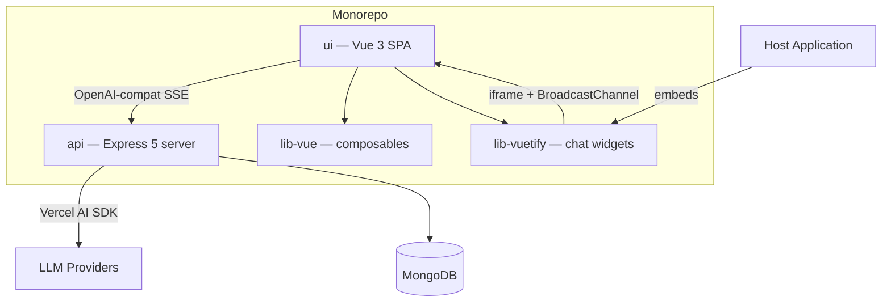
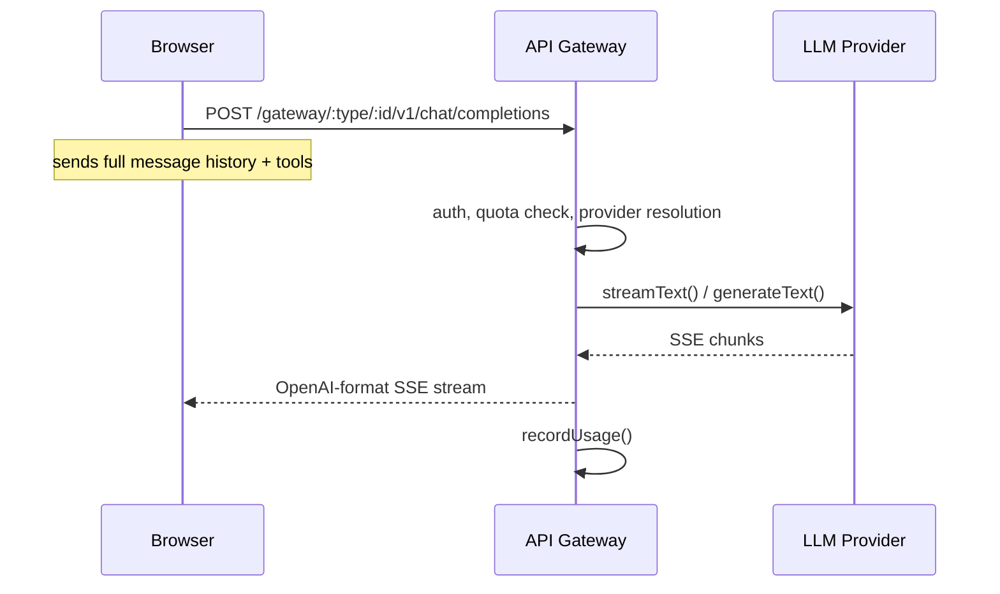
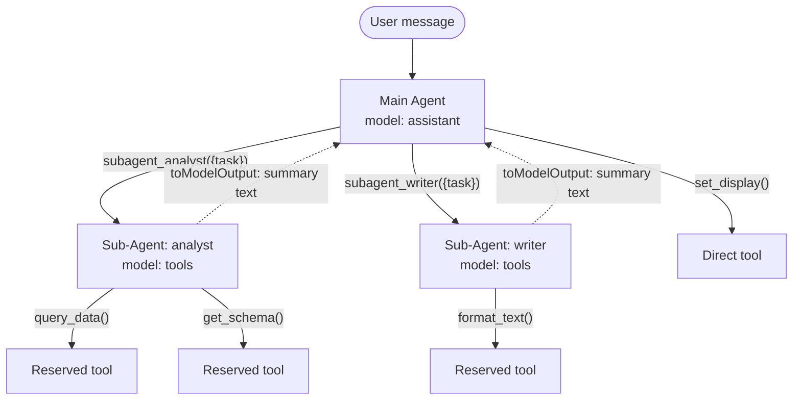
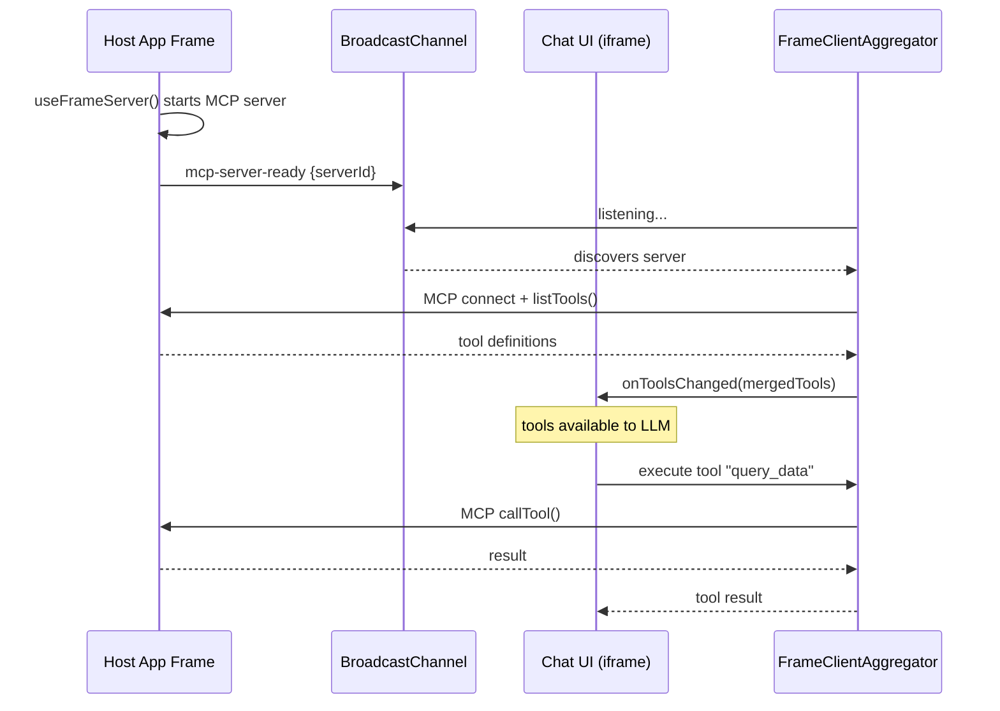
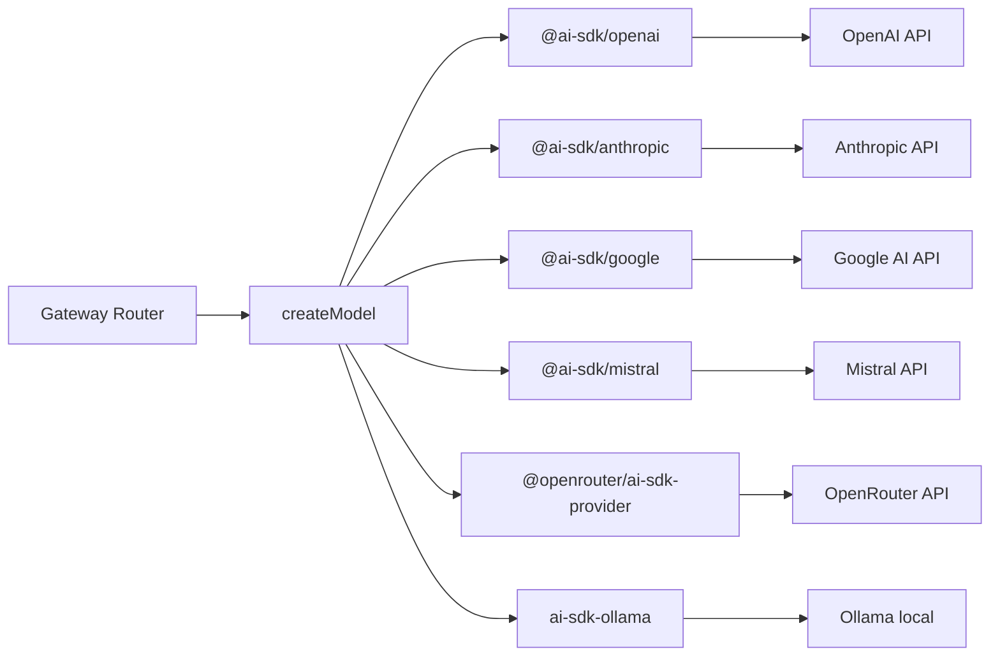
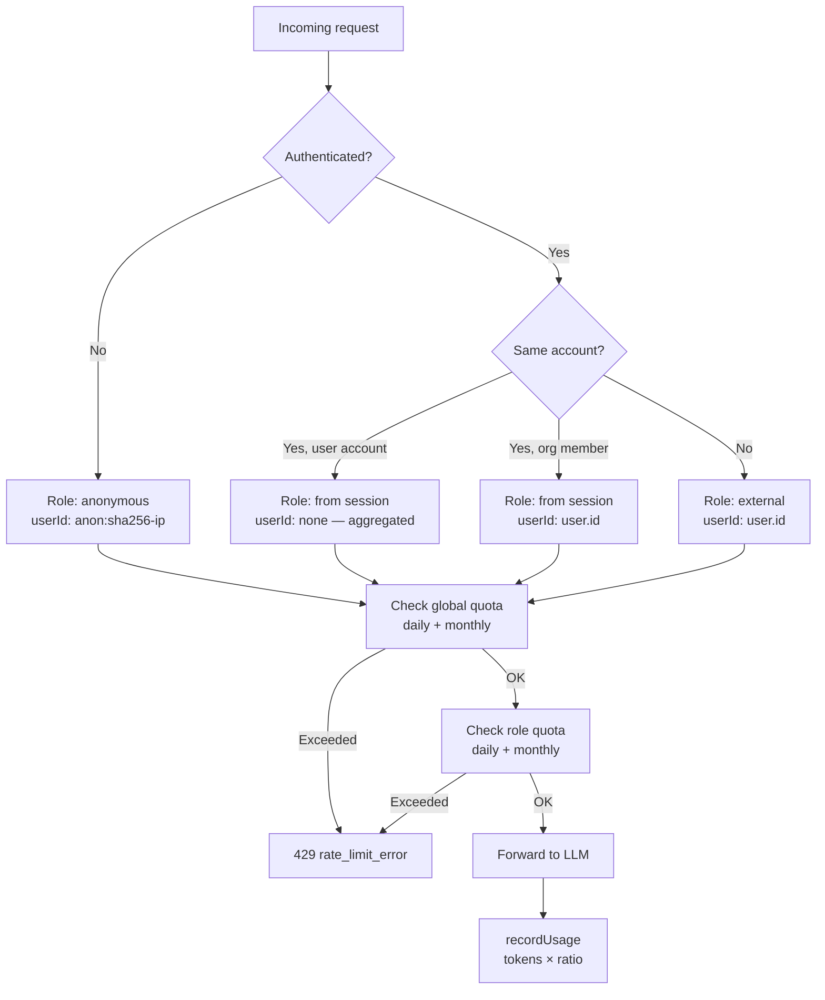
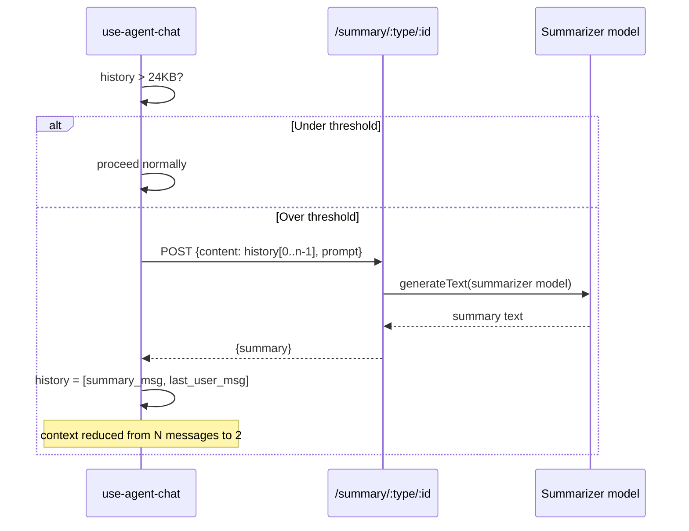
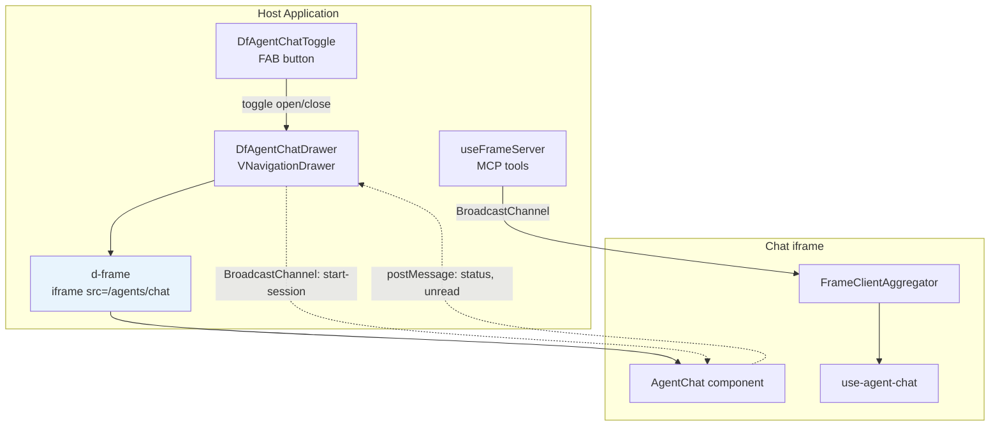
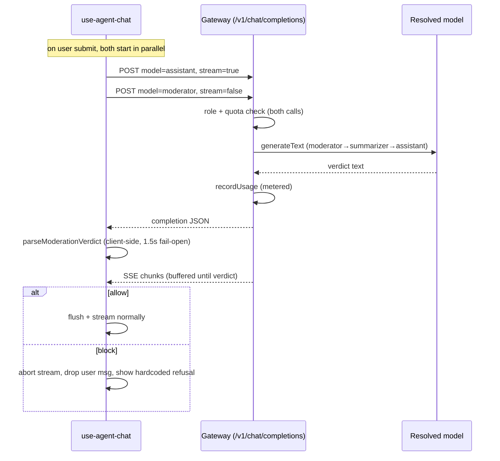
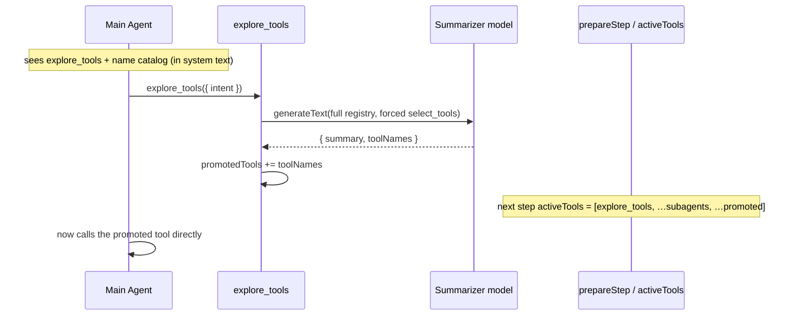

# Architecture

## Overview

**data-fair/agents** is a multi-provider AI chat service with tool-use capabilities, designed to be embedded into data-fair applications. It provides an OpenAI-compatible API gateway, client-side orchestration with sub-agents, and an embeddable chat widget.

| Workspace | Role |
|-----------|------|
| `api/` | Stateless Express server: LLM gateway, settings, usage tracking, summarization |
| `ui/` | Vue 3 + Vuetify 4 SPA: chat interface, tool orchestration, sub-agent rendering |
| `lib-vue/` | Vue composables: MCP tool registration, sub-agent declaration, BroadcastChannel transport |
| `lib-vuetify/` | Embeddable Vuetify components: chat drawer, menu, action button, toggle FAB |

---

## 1. Stateless OpenAI-Compatible Gateway

The API server is a pure **LLM proxy** with no server-side conversation state. Conversations live entirely in the browser.

**Why stateless?** Horizontal scaling with no shared state. Any API instance can handle any request since the full context comes from the client. The trade-off is that conversation management complexity moves to the browser (handled by `use-agent-chat.ts`).

**Error handling:** The gateway is fail-fast — there is no automatic retry or provider fallback. On streaming errors, the server writes an SSE error event and closes the stream. The client surfaces the error to the user, who can re-submit the message.

**Key files:**
- `api/src/gateway/router.ts` — SSE streaming, tool forwarding, usage recording
- `api/src/gateway/operations.ts` — OpenAI ↔ AI SDK message/tool format conversion
- `ui/src/composables/use-agent-chat.ts` — client-side history management

**Model IDs are roles, not model names.** The client requests `assistant`, `tools`, `summarizer`, `evaluator`, or `moderator` — the server resolves which provider/model to use from settings.

---

## 2. Client-Side Orchestration with Sub-Agents

The orchestrator-worker pattern runs **entirely in the browser**. The main agent delegates tasks to sub-agents via pseudo-tools (`subagent_*`), each backed by a `ToolLoopAgent`.

**How it works:**

1. **Registration** — Child components call `useAgentSubAgent()` which registers a `subagent_*` MCP tool with a JSON config (prompt, tool list, model).
2. **Partitioning** — `use-agent-chat.ts` splits tools: sub-agent reserved tools are removed from the main set.
3. **Execution** — Each sub-agent gets a `ToolLoopAgent` instance with its own tool set and system prompt. It runs up to 10 steps autonomously. Sub-agents execute **sequentially** — even if the main agent requests multiple sub-agent calls in one step, they run one after another.
4. **Multi-turn** — History accumulates per sub-agent in a `Map<string, ModelMessage[]>`. Subsequent calls resume the conversation.
5. **Context reduction** — The main agent sees only a compact text summary via `toModelOutput()`. The UI renders the full sub-agent trace in collapsible panels.

**Key files:**
- `lib-vue/use-agent-sub-agent.ts` — Sub-agent registration composable
- `ui/src/composables/use-agent-chat.ts` — ToolLoopAgent wiring, async generator streaming

---

## 3. MCP Tool Discovery via BroadcastChannel

Tools are **decoupled from the chat UI**. MCP servers run in sibling frames and are discovered dynamically through BroadcastChannel.

**Why BroadcastChannel over postMessage?** No parent/child relationship needed — any frame on the same origin can expose tools. Multiple MCP servers are aggregated into a single tool map. Servers can appear and disappear dynamically.

**Key files:**
- `ui/src/transports/frame-client-aggregator.ts` — Discovers servers, connects MCP clients, merges tools
- `ui/src/transports/frame-client-transport.ts` — BroadcastChannel ↔ MCP transport adapter
- `lib-vue/frame-server-transport.ts` — Server-side BroadcastChannel transport
- `lib-vue/use-frame-server.ts` — Composable to expose tools as an MCP server

---

## 4. Multi-Provider AI Abstraction

The system supports **6 LLM providers** through a unified factory built on Vercel AI SDK.

**Settings map 4 roles to concrete models:**

| Role | Purpose | Typical cost ratio |
|------|---------|-------------------|
| `assistant` | Primary conversational model | 1.0 |
| `tools` | Structured data / tool-calling specialist | 0.5 |
| `summarizer` | Context compaction | 0.5 |
| `evaluator` | Quality control / reasoning | 1.0 |
| `moderator` | Input moderation guard (fast/cheap) | 0.5 |

Each owner (user or organization) configures their own providers and model assignments. API keys are **encrypted at rest** (AES-256-CBC) and obfuscated in API responses. Model lists are fetched from provider APIs with **5-minute memoized caching**.

**Key files:**
- `api/src/models/operations.ts` — `createModel()` factory
- `api/src/models/router.ts` — Dynamic model discovery with caching
- `api/src/settings/operations.ts` — API key encryption/obfuscation

---

## 5. Role-Based Token Quotas with Ratio Pricing

Quota enforcement happens at **two levels**: global (account-wide) and per-role (per-user within an account).

**Cost ratios** let cheaper models (summarizer, tools) consume less quota. A request using the summarizer at ratio 0.5 records half the actual token count.

**Storage:** Two MongoDB documents per user×period — one `daily:YYYY-MM-DD`, one `monthly:YYYY-MM`. Atomic `$inc` upserts for concurrent-safe recording.

**Key files:**
- `api/src/usage/service.ts` — `checkQuota()`, `recordUsage()`, `getOwnerUsage()`
- `api/src/auth.ts` — `getEffectiveRole()`, `assertCanUseModel()`
- `api/src/gateway/router.ts` — Quota enforcement in the request path

---

## 6. Conversation History Compaction

When serialized history exceeds **24KB** (~8k tokens, 10-15 turns), it is automatically summarized before the next LLM call.

**The last user message is always preserved verbatim** — only prior history is summarized. This keeps the user's latest intent intact while dramatically reducing context size.

The threshold is overridable via `sessionStorage.setItem('agent-chat-compaction-threshold', ...)` for testing.

**Key files:**
- `ui/src/composables/use-agent-chat.ts` — `compactHistory()`
- `api/src/summary/router.ts` — Server-side summarization endpoint

---

## 7. Embeddable Chat Widget Architecture

The chat UI is designed to be **embedded as an iframe** in any data-fair application. `lib-vuetify` provides ready-made container components: a floating `DfAgentChatDrawer`, a popover `DfAgentChatMenu`, and a flat in-page `DfAgentChatBlock` (always visible, for embedding a custom chat directly in a portal page).

**Communication channels:**
- **BroadcastChannel** — Tool discovery (MCP), session lifecycle (`agent-start-session`, `agent-chat-ready`, ping/pong)
- **postMessage (d-frame)** — Status updates (`agent-status`), unread indicators, tools-changed notifications
- **sessionStorage init-config** — One-shot host→iframe handoff of `systemPrompt` and `title` (keyed by a `?initConfig=<key>` URL param). Replaces URL query params so prompts can be arbitrarily long and stay out of logs/history. See [Embedding Guide §9](./embedding-guide.md#9-initial-configuration-systemprompt--title).

**Singleton composables** (`useAgentChatDrawer`, `useAgentChatMenu`, `useAgentChatBlock`) ensure a single instance across the host app. Drawer/menu open state persists to `localStorage`; the block is always open and persists nothing.

**Key files:**
- `lib-vuetify/DfAgentChatDrawer.vue` — Floating drawer with iframe
- `lib-vuetify/DfAgentChatBlock.vue` — Flat in-page chat (always visible)
- `lib-vuetify/DfAgentChatToggle.vue` — FAB with status indicator
- `lib-vuetify/useAgentChatBase.ts` — Shared BroadcastChannel listener, status tracking, iframe URL resolution
- `lib-vue/agent-init-config.ts` — sessionStorage handoff for systemPrompt/title

---

## 8. Input Moderation Guard

A per-message guard protects the **UI-integrated assistant** from abuse — profanity, prompt-injection attempts, persona/identity override, and out-of-scope requests that deviate from the agent's mission. It is **always on** and runs **concurrently** with the assistant turn, only withholding the first visible output byte; the request itself is never delayed.

**Reuses the gateway.** There is no dedicated moderation endpoint. The client issues a second, non-streaming gateway call with `model: 'moderator'`, which resolves **moderator → summarizer → assistant** server-side (`getModelConfig`). Because it goes through the gateway, moderation inherits the same role checks, quota checks, and usage recording as any other model call — every user message therefore costs two metered calls (moderation + assistant).

**Advisory, not a security boundary.** The gate lives in the client orchestration loop. A direct or anonymous call straight to the gateway's `assistant` model bypasses moderation entirely; that is by design and governed by auth/quotas. The moderation prompt and verdict parser live in the browser (`ui/src/composables/moderation.ts`).

**Fail-open everywhere.** A client-side 1.5s timeout, any transport/HTTP error (including a quota 429 on the moderation call), and any unparseable model output all resolve to `allow`. Moderation never blocks the user on an internal failure.

**Hardcoded refusal.** Blocked messages show a fixed, localized refusal (en/fr) supplied by the chat component; it is not configurable. The model's `category`/`reason` are recorded in the trace but never shown to the user.

**Input only (v1).** The moderator sees the new user message plus the agent mission (system prompt) — not the full history. No output moderation, no tool-result / indirect-injection coverage, no multi-turn jailbreak detection. A block is enforced before any assistant text is shown, but if a turn's first action is a tool call, the tool may already have executed by the time the verdict arrives — moderation does not roll back tool side effects.

**Observable, client-side only.** Every decision — `allow`, `skip` (fail-open), and `block` — is recorded in the session trace (`SessionRecorder.recordModerationDecision`) with the model's `category` and `reason`, viewable in the debug dialog. Tracing is ephemeral and client-only.

**Key files:**
- `api/src/gateway/router.ts` — resolves the `moderator` role and meters the call
- `ui/src/composables/moderation.ts` — moderation prompt + tolerant verdict parser
- `ui/src/composables/use-agent-chat.ts` — parallel gate, withholding the first byte, block → refusal
## 9. Progressive Tool Disclosure (Tool Exploration)

When many tools are registered (or they churn as the user navigates), sending every tool's full schema on every request bloats context and destabilises any prompt cache. An **opt-in** exploration mode replaces "send all tools" with "discover on demand": the assistant sees only a single always-on `explore_tools` tool plus a catalog of tool *names*, and must call `explore_tools` to make the tools it needs callable.

**How it works:**

1. The full tool registry is still passed to `streamText`, but `activeTools` (returned from `prepareStep` each step) gates which tools are exposed to the model. It starts as `[explore_tools, …subAgentNames]`.
2. `explore_tools.execute` runs the **summarizer** model over the full registry, forcing a `select_tools` tool call to get structured `{ summary, toolNames }`. Selected names are validated against the live registry and added to a `promotedTools` set.
3. `prepareStep` reads `promotedTools` live, so a tool promoted at step *N* is callable at step *N+1* — within the same turn, no re-issue.
4. Promotions **clear on history compaction** (and on reset); the name catalog is always present, so re-exploration is cheap.

**Catalog placement.** The tool-name catalog is folded into the **system text** at stream time (not a separate "tail" message) because the gateway hoists all `system`-role messages into the top-level system block and no provider prompt cache is active today. Revisit tail placement if caching is introduced.

**Opt-in & testing.** Gated by `debug` + `sessionStorage.setItem('agent-chat-explore', '1')`, mirroring the tracing toggle — when off, the chat behaves exactly as before (no `explore_tools`, no `prepareStep`). Sub-agent pseudo-tools are always active and unaffected. Gating limits which tools are *advertised*, not a hard execution barrier.

**Key files:**
- `ui/src/composables/tool-exploration.ts` — `createExploreTool()` factory + catalog/promotion helpers
- `ui/src/composables/use-agent-chat.ts` — `promotedTools` set, `prepareStep`/`activeTools`, compaction reset
- `ui/src/components/AgentChat.vue` — the `agent-chat-explore` toggle

See [MCP tool integration §8](./mcp-tool-integration.md#8-progressive-tool-disclosure-exploration-mode) for the detailed mechanism.

---

## Deep-Dive Documents

| Document | What it covers |
|----------|---------------|
| **[Sub-agent orchestration](./subagent-orchestration.md)** | Multi-turn protocol, tool partitioning algorithm, ToolLoopAgent lifecycle, async generator streaming pattern, context reduction via `toModelOutput()`. |
| **[MCP tool integration](./mcp-tool-integration.md)** | End-to-end tool flow from registration (`useAgentTool`) through BroadcastChannel discovery to LLM invocation. Transport protocol details, error handling, dynamic server lifecycle, progressive tool disclosure. |
| **[Embedding guide](./embedding-guide.md)** | How to embed the chat widget in a host app using `lib-vuetify`. Configuration options, BroadcastChannel protocol for session control, tool exposure patterns. |
