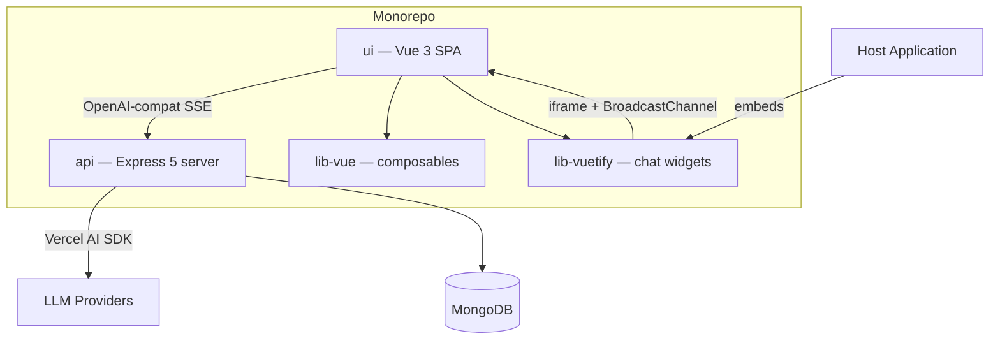
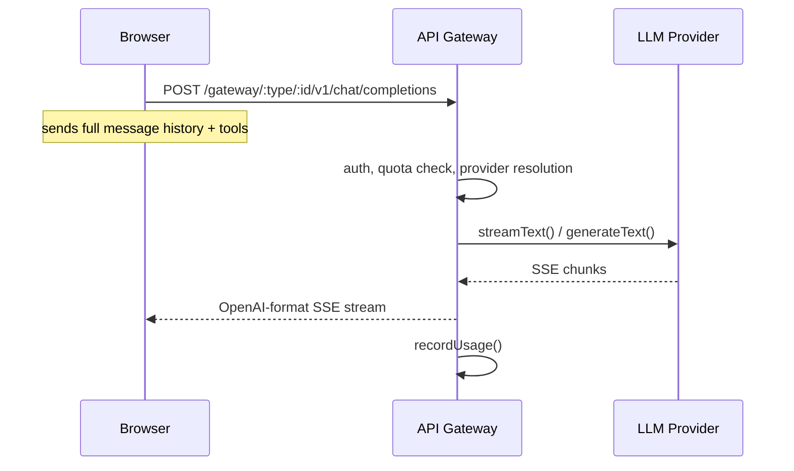
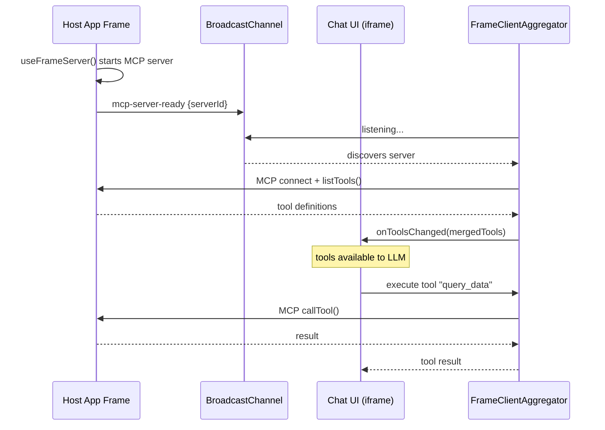
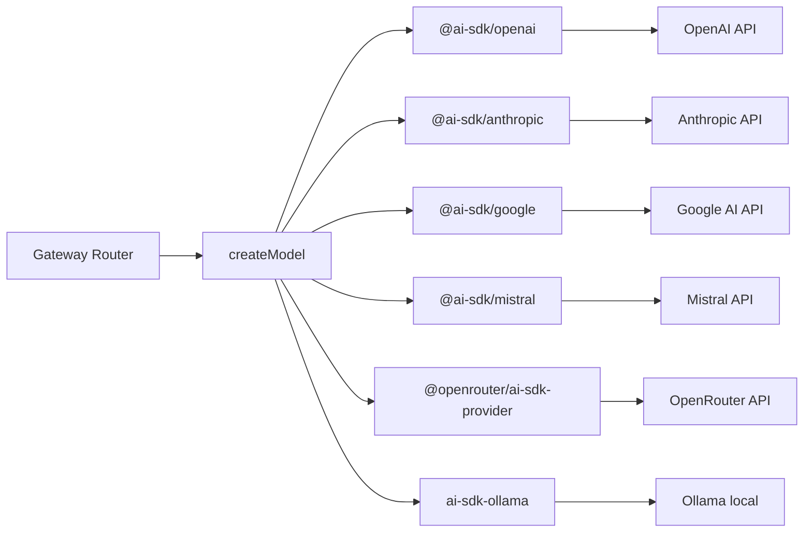
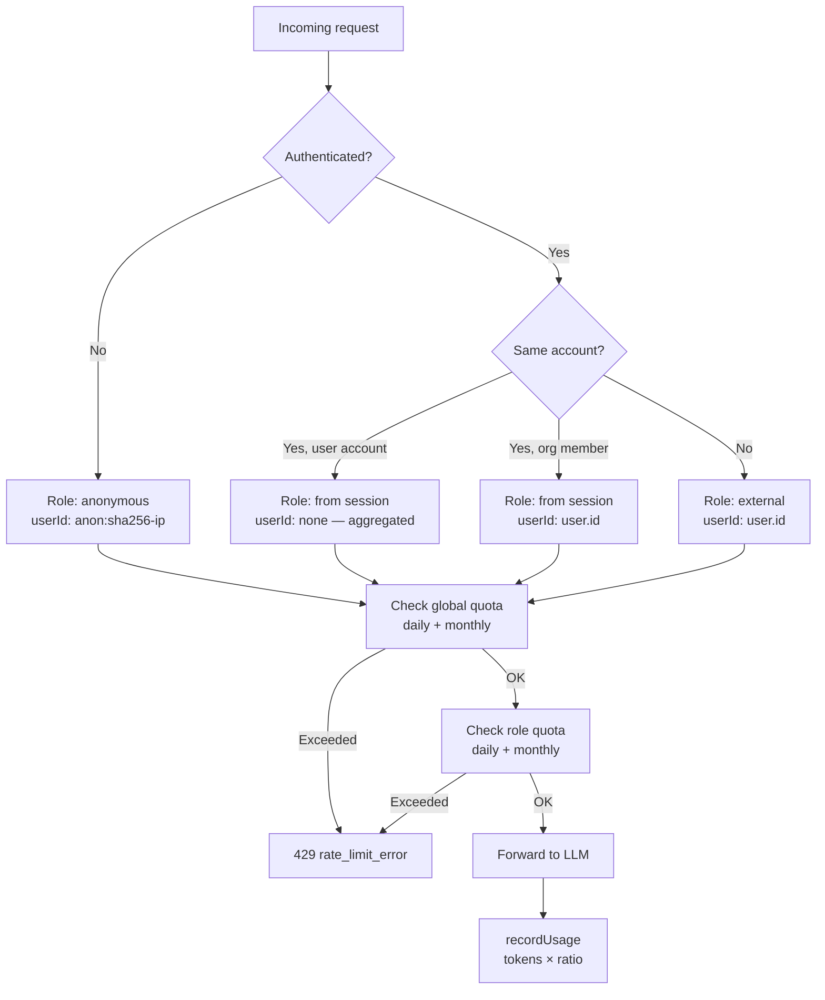
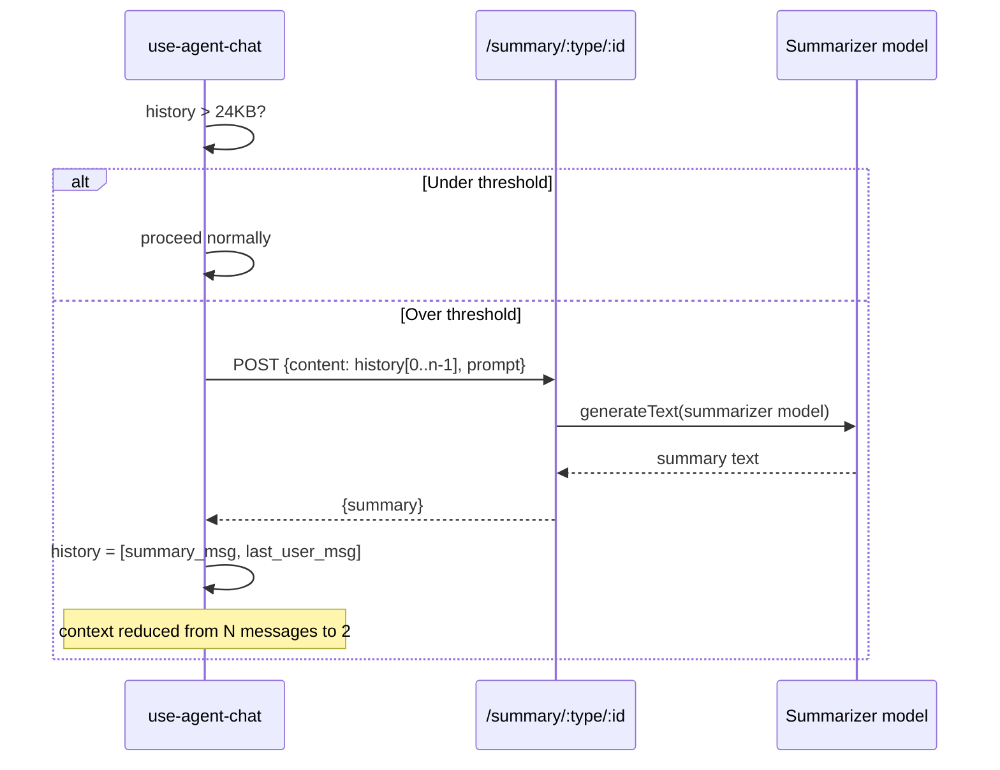
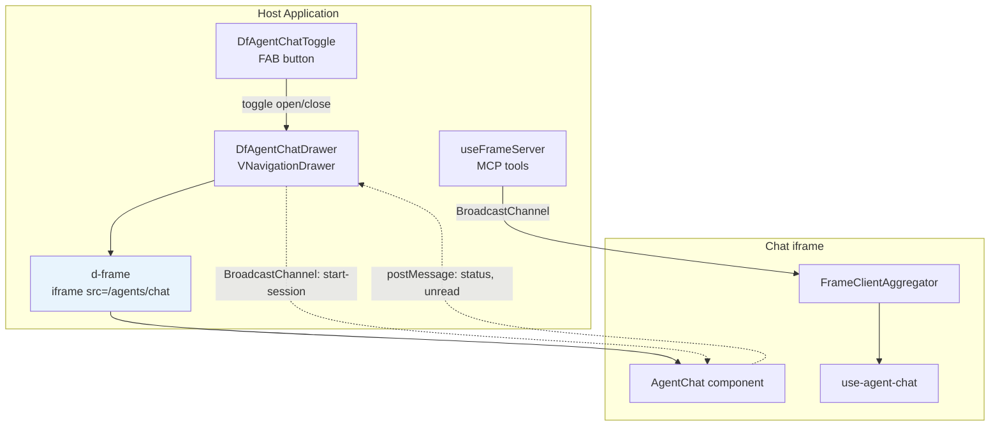

# Architecture

## Overview

**data-fair/agents** is a multi-provider AI chat service with tool-use capabilities, designed to be embedded into data-fair applications. It provides an OpenAI-compatible API gateway, client-side orchestration with sub-agents, and an embeddable chat widget.

| Workspace | Role |
|-----------|------|
| `api/` | Stateless Express server: LLM gateway, settings, usage tracking, summarization |
| `ui/` | Vue 3 + Vuetify 4 SPA: chat interface, tool orchestration, sub-agent rendering |
| `lib-vue/` | Vue composables: MCP tool registration, sub-agent declaration, BroadcastChannel transport |
| `lib-vuetify/` | Embeddable Vuetify components: chat drawer, menu, action button, toggle FAB |

---

## 1. Stateless OpenAI-Compatible Gateway

The API server is a pure **LLM proxy** with no server-side conversation state. Conversations live entirely in the browser.

**Why stateless?** Horizontal scaling with no shared state. Any API instance can handle any request since the full context comes from the client. The trade-off is that conversation management complexity moves to the browser (handled by `use-agent-chat.ts`).

**Error handling:** The gateway is fail-fast — there is no automatic retry or provider fallback. On streaming errors, the server writes an SSE error event and closes the stream. The client surfaces the error to the user, who can re-submit the message.

**Key files:**
- `api/src/gateway/router.ts` — SSE streaming, tool forwarding, usage recording
- `api/src/gateway/operations.ts` — OpenAI ↔ AI SDK message/tool format conversion
- `ui/src/composables/use-agent-chat.ts` — client-side history management

**Model IDs are roles, not model names.** The client requests `assistant`, `tools`, `summarizer`, or `evaluator` — the server resolves which provider/model to use from settings.

---

## 2. Client-Side Orchestration with Sub-Agents

The orchestrator-worker pattern runs **entirely in the browser**. The main agent delegates tasks to sub-agents via pseudo-tools (`subagent_*`), each backed by a `ToolLoopAgent`.

**How it works:**

1. **Registration** — Child components call `useAgentSubAgent()` which registers a `subagent_*` MCP tool with a JSON config (prompt, tool list, model).
2. **Partitioning** — `use-agent-chat.ts` splits tools: sub-agent reserved tools are removed from the main set.
3. **Execution** — Each sub-agent gets a `ToolLoopAgent` instance with its own tool set and system prompt. It runs up to 10 steps autonomously. Sub-agents execute **sequentially** — even if the main agent requests multiple sub-agent calls in one step, they run one after another.
4. **Multi-turn** — History accumulates per sub-agent in a `Map<string, ModelMessage[]>`. Subsequent calls resume the conversation.
5. **Context reduction** — The main agent sees only a compact text summary via `toModelOutput()`. The UI renders the full sub-agent trace in collapsible panels.

**Key files:**
- `lib-vue/use-agent-sub-agent.ts` — Sub-agent registration composable
- `ui/src/composables/use-agent-chat.ts` — ToolLoopAgent wiring, async generator streaming

---

## 3. MCP Tool Discovery via BroadcastChannel

Tools are **decoupled from the chat UI**. MCP servers run in sibling frames and are discovered dynamically through BroadcastChannel.

**Why BroadcastChannel over postMessage?** No parent/child relationship needed — any frame on the same origin can expose tools. Multiple MCP servers are aggregated into a single tool map. Servers can appear and disappear dynamically.

**Key files:**
- `ui/src/transports/frame-client-aggregator.ts` — Discovers servers, connects MCP clients, merges tools
- `ui/src/transports/frame-client-transport.ts` — BroadcastChannel ↔ MCP transport adapter
- `lib-vue/frame-server-transport.ts` — Server-side BroadcastChannel transport
- `lib-vue/use-frame-server.ts` — Composable to expose tools as an MCP server

---

## 4. Multi-Provider AI Abstraction

The system supports **6 LLM providers** through a unified factory built on Vercel AI SDK.

**Settings map 4 roles to concrete models:**

| Role | Purpose | Typical cost ratio |
|------|---------|-------------------|
| `assistant` | Primary conversational model | 1.0 |
| `tools` | Structured data / tool-calling specialist | 0.5 |
| `summarizer` | Context compaction | 0.5 |
| `evaluator` | Quality control / reasoning | 1.0 |

Each owner (user or organization) configures their own providers and model assignments. API keys are **encrypted at rest** (AES-256-CBC) and obfuscated in API responses. Model lists are fetched from provider APIs with **5-minute memoized caching**.

**Key files:**
- `api/src/models/operations.ts` — `createModel()` factory
- `api/src/models/router.ts` — Dynamic model discovery with caching
- `api/src/settings/operations.ts` — API key encryption/obfuscation

---

## 5. Role-Based Token Quotas with Ratio Pricing

Quota enforcement happens at **two levels**: global (account-wide) and per-role (per-user within an account).

**Cost ratios** let cheaper models (summarizer, tools) consume less quota. A request using the summarizer at ratio 0.5 records half the actual token count.

**Storage:** Two MongoDB documents per user×period — one `daily:YYYY-MM-DD`, one `monthly:YYYY-MM`. Atomic `$inc` upserts for concurrent-safe recording.

**Key files:**
- `api/src/usage/service.ts` — `checkQuota()`, `recordUsage()`, `getOwnerUsage()`
- `api/src/auth.ts` — `getEffectiveRole()`, `assertCanUseModel()`
- `api/src/gateway/router.ts` — Quota enforcement in the request path

---

## 6. Conversation History Compaction

When serialized history exceeds **24KB** (~8k tokens, 10-15 turns), it is automatically summarized before the next LLM call.

**The last user message is always preserved verbatim** — only prior history is summarized. This keeps the user's latest intent intact while dramatically reducing context size.

The threshold is overridable via `sessionStorage.setItem('agent-chat-compaction-threshold', ...)` for testing.

**Key files:**
- `ui/src/composables/use-agent-chat.ts` — `compactHistory()`
- `api/src/summary/router.ts` — Server-side summarization endpoint

---

## 7. Embeddable Chat Widget Architecture

The chat UI is designed to be **embedded as an iframe** in any data-fair application. `lib-vuetify` provides ready-made container components.

**Communication channels:**
- **BroadcastChannel** — Tool discovery (MCP), session lifecycle (`agent-start-session`, `agent-chat-ready`, ping/pong)
- **postMessage (d-frame)** — Status updates (`agent-status`), unread indicators, tools-changed notifications

**Singleton composables** (`useAgentChatDrawer`, `useAgentChatMenu`) ensure a single instance across the host app. Drawer state persists to `localStorage`.

**Key files:**
- `lib-vuetify/DfAgentChatDrawer.vue` — Floating drawer with iframe
- `lib-vuetify/DfAgentChatToggle.vue` — FAB with status indicator
- `lib-vuetify/useAgentChatBase.ts` — Shared BroadcastChannel listener, status tracking

---

## Deep-Dive Documents

| Document | What it covers |
|----------|---------------|
| **[Sub-agent orchestration](./subagent-orchestration.md)** | Multi-turn protocol, tool partitioning algorithm, ToolLoopAgent lifecycle, async generator streaming pattern, context reduction via `toModelOutput()`. |
| **[MCP tool integration](./mcp-tool-integration.md)** | End-to-end tool flow from registration (`useAgentTool`) through BroadcastChannel discovery to LLM invocation. Transport protocol details, error handling, dynamic server lifecycle. |
| **[Embedding guide](./embedding-guide.md)** | How to embed the chat widget in a host app using `lib-vuetify`. Configuration options, BroadcastChannel protocol for session control, tool exposure patterns. |
