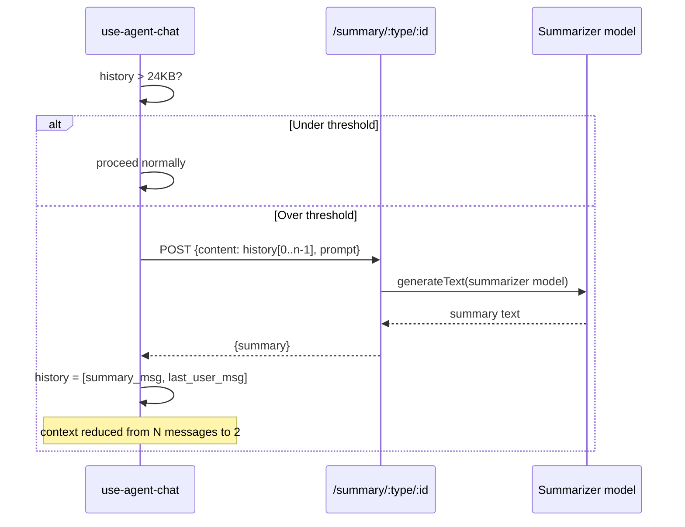

# Conversation history compaction

When serialized history exceeds **24KB** (~8k tokens, 10-15 turns), it is automatically summarized before the next LLM call.

**The last user message is always preserved verbatim** — only prior history is summarized. This keeps the user's latest intent intact while dramatically reducing context size.

The threshold is overridable via `sessionStorage.setItem('agent-chat-compaction-threshold', ...)` for testing.

