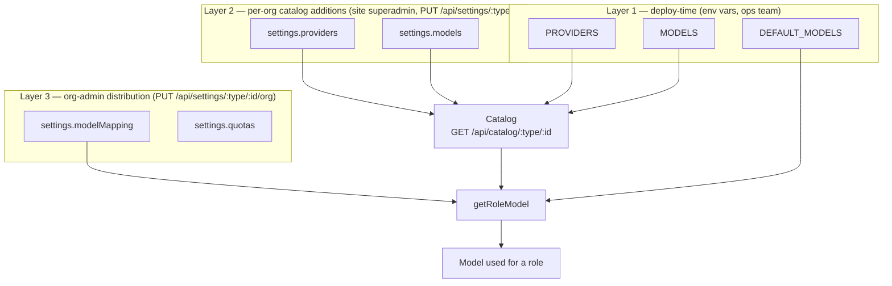

# Configuration: providers, models and credits

AI configuration is split across **three layers**, each owned by a different actor and stored in a different place. A request resolves a role (`assistant`, `tools`, `summarizer`, `evaluator`, `moderator`) to a concrete model by walking the layers from the most specific (org mapping) down to the least specific (global default), then a per-role fallback chain.



## Layer 1 — global config (environment variables)

Set once per deployment, validated fail-fast at boot by `assertGlobalAiConfig` (`api/src/models/operations.ts`, called from `api/src/config.ts`). A bad value crashes the process immediately instead of failing on the first request. The `node-config` mapping lives in `api/config/custom-environment-variables.js`, defaults in `api/config/default.js`, and the full JSON Schema (used to `assertValid` the merged config at boot) in `api/config/type/schema.json`.

### `PROVIDERS`

JSON array of provider definitions. `type` is one of the 9 supported provider types: `openai`, `anthropic`, `google`, `mistral`, `openrouter`, `ollama`, `scaleway`, `openai-compatible`, `mock`. `id` must be unique. `ollama` and `openai-compatible` additionally require `baseURL` (enforced by `assertGlobalAiConfig`). API keys here are **plain text** (unlike per-org provider keys, which are encrypted at rest — see below) since they only ever live in the deployment's env/secret store.

```json
[
  {
    "type": "openai",
    "id": "global-openai",
    "name": "OpenAI (platform)",
    "enabled": true,
    "apiKey": "sk-..."
  },
  {
    "type": "scaleway",
    "id": "global-scaleway",
    "name": "Scaleway",
    "apiKey": "SCW...",
    "projectId": "11111111-1111-1111-1111-111111111111"
  }
]
```

### `MODELS`

JSON array of global model definitions, each referencing a `provider` id from `PROVIDERS`. `usage` flags which roles the model is *allowed* to serve (`assistant`, `tools`, `summarizer`, `evaluator`, `moderator` — at least one, no duplicates). `multiplier` (default `1`) scales the credits formula below (see [Credits](#credits)). `assertGlobalAiConfig` rejects a model referencing an unknown provider id, and rejects duplicate `provider/id` pairs.

```json
[
  {
    "id": "gpt-5.4",
    "name": "GPT-5.4",
    "provider": "global-openai",
    "usage": ["assistant", "tools"],
    "multiplier": 1
  },
  {
    "id": "gpt-5.4-mini",
    "name": "GPT-5.4 Mini",
    "provider": "global-openai",
    "usage": ["summarizer", "moderator"],
    "multiplier": 0.2
  }
]
```

### `DEFAULT_MODELS`

JSON object mapping each role to a `{ provider, id }` ref that must resolve to a model in `MODELS` **and** be flagged for that role's usage — both checked by `assertGlobalAiConfig`. This is the fallback used when an org has no `modelMapping` entry (or no org-owned config at all).

```json
{
  "assistant": { "provider": "global-openai", "id": "gpt-5.4" },
  "tools": { "provider": "global-openai", "id": "gpt-5.4" },
  "summarizer": { "provider": "global-openai", "id": "gpt-5.4-mini" },
  "moderator": { "provider": "global-openai", "id": "gpt-5.4-mini" }
}
```

Note `evaluator` is intentionally omitted above — with no global default and no org mapping, resolution falls through the [fallback chain](#role-resolution-the-catalog) to `assistant`.

### `OUTPUT_TOKEN_WEIGHT`

Plain number (not JSON), default `4`. Weight applied to output tokens in the credits formula — output tokens are typically several times more expensive than input tokens across providers, so this approximates that without needing per-model input/output prices.

```
OUTPUT_TOKEN_WEIGHT=4
```

### `DEFAULT_CREDITS`

Plain number, default `-1` (unlimited). Fallback `ai_credits.limit` used by `getLimits()` (`api/src/limits/service.ts`) for any account that has no `limits` document yet, or whose document has no `ai_credits.limit` set. `-1` means unlimited everywhere this contract is used.

```
DEFAULT_CREDITS=1000
```

### `SECRET_LIMITS`

Plain string, unset by default. Shared secret the external `customers` billing service presents as `?key=` on the `/api/v1/limits` endpoints (see [Limits contract](#limits-contract)). When unset, the `?key=` bypass is disabled entirely — `limitsKeyMatches()` (`api/src/limits/operations.ts`) fails **closed** (an unset secret can never match, including against an unset query param), so no secret means the endpoints fall back to normal session auth rather than opening up.

```
SECRET_LIMITS=a-long-random-shared-secret
```

## Layer 2 — per-org catalog additions (superadmin)

`PUT /api/settings/:type/:id` (`api/src/settings/router.ts`), gated by `reqAdminMode` — a **site superadmin** acting in admin mode, not a regular org admin. This is where an org gets its own providers/models on top of the global catalog, e.g. a customer's own OpenAI key or an internal-only model.

- `settings.providers`: same shape as the global `PROVIDERS` array. `apiKey` is encrypted at rest (AES-256-CBC via `api/src/cipher/`) and obfuscated (`"********"`) in API responses; re-submitting the obfuscated placeholder preserves the stored encrypted value (`encryptProviderApiKeys` in `api/src/settings/operations.ts`).
- `settings.models`: array of `{ model: { id, name, provider: { type, name, id } }, usage: Role[], multiplier? }` — the org-scoped equivalent of global `MODELS`, referencing `settings.providers` by embedded provider info rather than a bare id.

This route only ever touches `providers`/`models` (`+ updatedAt`) — it is a partial update, not a whole-document replace, so it never clobbers the org-admin-owned fields from Layer 3, including a Layer-3 write racing concurrently between its read and write.

## Layer 3 — org-admin distribution

`PUT /api/settings/:type/:id/org` (`api/src/settings/router.ts`), gated by `assertAccountRole(..., 'admin')` — any admin of that specific account, org or superadmin alike. The body is the **full** org-owned representation (whole-document semantics for this subset of fields): `modelMapping`, `quotas`, `moderation`, `storeTraces`.

- `modelMapping`: `Partial<Record<Role, { provider, id, name? }>>`. Each ref is validated against `GET /api/catalog/:type/:id` at write time — the route 400s if the ref isn't in the catalog, or is in the catalog but not flagged for that role's usage.
- `quotas`, `moderation`, `storeTraces`: unchanged shape from before this refactor (see [Quotas & usage](./quotas-usage.md) and [Moderation](./moderation.md)), except `quotas.global` no longer exists — the account-wide cap moved to the credits/limits system below.

## Catalog

`GET /api/catalog/:type/:id?usage=<role>` (`api/src/catalog/router.ts`, admin-only) returns the merged view a given account can pick models from: `getModelCatalog()` (`api/src/models/operations.ts`) concatenates global `MODELS` (skipping models whose global provider is disabled) with the org's `settings.models`, each tagged `source: 'global' | 'org'`. The `usage` query param filters to models flagged for that role. This is what powers the `modelMapping` autocomplete in the org-admin form and the model-picker in the superadmin form (`api/types/settings/schema.js`).

### Role resolution (the catalog)

`getRoleModel()` (`api/src/models/operations.ts`) resolves a role for a request by walking a **fallback chain**, and at each step in the chain trying the org's `modelMapping` before the global `DEFAULT_MODELS`:

```
assistant:  assistant
tools:      tools      -> assistant
summarizer: summarizer -> assistant
evaluator:  evaluator  -> assistant
moderator:  moderator  -> summarizer -> assistant
```

So for role `tools`: try `modelMapping.tools`, then `defaultModels.tools`; if neither resolves to a catalog entry, try `modelMapping.assistant`, then `defaultModels.assistant`. An unresolvable ref (e.g. a deleted provider) logs a warning and falls through rather than failing the request outright; only running out of the whole chain throws `No model configured for <role>`.

## Credits

Every LLM call — assistant/tools/summarizer/evaluator turns, moderator classification calls, and summary-endpoint calls — is priced in **credits**, not currency:

```
credits = (inputTokens + outputTokens × OUTPUT_TOKEN_WEIGHT) / 1_000_000 × multiplier
```

(`computeCredits()`, `api/src/usage/operations.ts`). `multiplier` comes from the resolved catalog entry (global `MODELS[].multiplier` or org `settings.models[].multiplier`, default `1`); `OUTPUT_TOKEN_WEIGHT` is the global env var above. There is no currency, no EUR, no per-model input/output price — a deployment tunes relative cost purely through each model's `multiplier`.

The `usage` MongoDB collection deliberately keeps its pre-existing field name `cost` (see `api/src/usage/service.ts`); the values it stores are credits, not money. This was a conscious choice to avoid a data migration of the `usage` collection itself — only the `settings` collection needed migrating (see [release note](#release-note-caps-shift-units-on-upgrade) below).

## Limits contract

The `limits` MongoDB collection and its `/api/v1/limits` endpoints (`api/src/limits/`) are the integration point with the external **customers** billing service, which owns the authoritative per-account credit allowance for accounts on a paid plan.

- `POST /api/v1/limits/:type/:id?key=SECRET_LIMITS` — customers pushes/updates an account's limits doc. Session admin-mode auth also works (no key needed) for manual/ops use. A push that omits `ai_credits` (or omits `ai_credits.consumption`) preserves whatever this service has already tracked locally — the route merges rather than overwrites that sub-object, so a customers-side push never zeroes out consumption this service already recorded.
- `GET /api/v1/limits/:type/:id?key=SECRET_LIMITS` — same shared-key auth, or session auth for any member of the account (`admin`/`contrib`/`user` role, any account the session belongs to). Lazily creates a `{ defaults: true }` doc on first read if none exists yet, seeded from `DEFAULT_CREDITS`.
- `GET /api/v1/limits?type=&id=` — bulk listing, key or admin-mode only.

Doc shape (`api/types/limits/schema.js`):

```json
{
  "type": "organization",
  "id": "acme",
  "name": "Acme Corp",
  "lastUpdate": "2026-08-14T12:00:00.000Z",
  "defaults": false,
  "consumptionMonth": "2026-08",
  "ai_credits": { "limit": 5000, "consumption": 123.45 }
}
```

`ai_credits.limit === -1` means unlimited. `defaults: true` marks a doc this service created and is fully responsible for (customers has never pushed to it); `defaults` is absent/false once customers has pushed a real limit.

**Enforcement.** `enforceQuotas()` (`api/src/usage/enforce.ts`) checks, in order:

1. **Account credit cap** — `getCreditInfo(owner)` against `ai_credits.limit`/`ai_credits.consumption`. `limit >= 0 && consumption >= limit` short-circuits with a 429, even if the caller's own per-profile quota is unlimited.
2. **Untrusted pool** — combined `anonymous` + `external` usage against `quotas.untrusted`, only for untrusted callers.
3. **Per-profile / per-user quota** — `quotas[role]` (`admin`/`contrib`/`user`/`external`/`anonymous`), only when usage is tracked per-user.

See [Quotas & usage](./quotas-usage.md) for the full flow and the daily/weekly = monthly/2/4 derivation, unchanged by this refactor.

**Renewal semantics.** `incrementConsumption()` stamps `consumptionMonth` on every recorded credit spend. `resetDefaultsConsumption()` (`api/src/limits/service.ts`), run daily from the usage cleanup loop, zeroes `ai_credits.consumption` for any doc where `defaults: true` and `consumptionMonth` is behind the current calendar month — i.e. **only self-managed (`defaults: true`) docs reset automatically, on the calendar month.** A doc customers has pushed to (`defaults` absent/false) is never touched by this reset: customers is expected to reset `ai_credits.consumption` itself on the subscription's actual renewal day (which may not align with the calendar month), typically via the same `POST` endpoint.

### Customers-side integration checklist (separate work, not part of this refactor)

Wiring the `customers` service to actually push/read these limits is a separate session against the `customers` codebase, expected to need roughly:

- An `apis[]` entry pointing at `<agents-base-url>/api/v1/limits`, `types: ['ai_credits']`.
- `ai_credits` added to `renewableLimits`, `limitLabels`, and wherever `getLimitsType()` enumerates supported limit types.
- Plan features carrying `{ limit: { type: 'ai_credits', value: <number> } }` so a subscribed plan's credit allowance actually reaches the pushed limits doc.

This list is a best-effort contract summary written from the `agents`-side implementation, not verified against the `customers` codebase — treat it as a starting point for that session, not a spec.

## Release note: caps shift units on upgrade

The `upgrade/0.10.0/better-config.js` migration (only runs once the deployed service version is bumped to **0.10.0 or higher** — see `api/src/server.ts`'s upgrade-script runner) carries every org's old `quotas.global.monthlyLimit` number across **1:1** into the new `ai_credits.limit` on that org's `limits` doc (`unlimited`/falsy `monthlyLimit` → `-1`).

**That number changes what it measures.** Before this refactor, `quotas.global.monthlyLimit` was a currency budget compared against a cost computed from each model's `inputPricePerMillion`/`outputPricePerMillion` (both now deleted from the schema). After the migration, the *same number* is compared against token-derived credits (`(inputTokens + outputTokens × OUTPUT_TOKEN_WEIGHT) / 1e6 × multiplier`), and `multiplier` defaults to `1` for every migrated model regardless of what it used to cost.

Concretely: an org whose old assistant model priced at $10/1M output tokens is capped, post-migration, as if every model it uses costs `1 credit / 1M weighted tokens` — the same numeric cap now buys a completely different amount of usage, and the size of that shift depends entirely on that org's old per-model prices (which are gone and not recoverable from the migration alone).

**Operators must review every migrated org's `ai_credits.limit` after upgrading**, and its models' `multiplier` values, rather than assuming the carried-over number still means what it used to.
