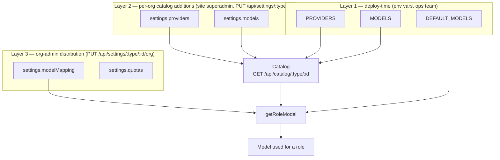

# Configuration: providers, models and credits

AI configuration is split across **three layers**, each owned by a different actor and stored in a different place. A request resolves a role (`assistant`, `tools`, `summarizer`, `evaluator`, `moderator`) to a concrete model by walking the layers from the most specific (org mapping) down to the least specific (global default), then a per-role fallback chain.



## Layer 1 — global config (environment variables)

Set once per deployment, validated fail-fast at boot by `assertGlobalAiConfig` (`api/src/models/operations.ts`, called from `api/src/config.ts`). A bad value crashes the process immediately instead of failing on the first request. The `node-config` mapping lives in `api/config/custom-environment-variables.js`, defaults in `api/config/default.js`, and the full JSON Schema (used to `assertValid` the merged config at boot) in `api/config/type/schema.json`.

### `PROVIDERS`

JSON array of provider definitions. `type` is one of the 9 supported provider types: `openai`, `anthropic`, `google`, `mistral`, `openrouter`, `ollama`, `scaleway`, `openai-compatible`, `mock`. `id` must be unique. `ollama` and `openai-compatible` additionally require `baseURL` (enforced by `assertGlobalAiConfig`). API keys here are **plain text** (unlike per-org provider keys, which are encrypted at rest — see below) since they only ever live in the deployment's env/secret store.

```json
[
  {
    "type": "openai",
    "id": "global-openai",
    "name": "OpenAI (platform)",
    "enabled": true,
    "apiKey": "sk-..."
  },
  {
    "type": "scaleway",
    "id": "global-scaleway",
    "name": "Scaleway",
    "apiKey": "SCW...",
    "projectId": "11111111-1111-1111-1111-111111111111"
  }
]
```

### `MODELS`

JSON array of global model definitions, each referencing a `provider` id from `PROVIDERS`. `usage` flags which roles the model is *allowed* to serve (`assistant`, `tools`, `summarizer`, `evaluator`, `moderator` — at least one, no duplicates).

`inputPricePerMillion` and `outputPricePerMillion` are **mandatory**, in euros per million tokens, copied from the provider's own pricing page. `cachedInputPricePerMillion` is optional and means *unknown* when absent, not free — it falls back to the input price (see [Credits](#credits)). `assertGlobalAiConfig` rejects a model referencing an unknown provider id, rejects duplicate `provider/id` pairs, and **exits the process at boot** on a model missing either mandatory price, naming the offending `provider/id`. A price of `0` is legitimate; an absent one is not, because every account on this deployment can resolve a global model (see the [release note](#release-note-every-account-can-now-resolve-a-model-so-credits-are-the-gate) below) and a model free by omission would be an uncapped consumer of the deployment's own keys.

```json
[
  {
    "id": "gpt-5.4",
    "name": "GPT-5.4",
    "provider": "global-openai",
    "usage": ["assistant", "tools"],
    "inputPricePerMillion": 1.25,
    "cachedInputPricePerMillion": 0.125,
    "outputPricePerMillion": 10
  },
  {
    "id": "gpt-5.4-mini",
    "name": "GPT-5.4 Mini",
    "provider": "global-openai",
    "usage": ["summarizer", "moderator"],
    "inputPricePerMillion": 0.25,
    "outputPricePerMillion": 2
  }
]
```

### `DEFAULT_MODELS`

JSON object mapping each role to a `{ provider, id }` ref that must resolve to a model in `MODELS` **and** be flagged for that role's usage — both checked by `assertGlobalAiConfig`. This is the fallback used when an org has no `modelMapping` entry (or no org-owned config at all).

```json
{
  "assistant": { "provider": "global-openai", "id": "gpt-5.4" },
  "tools": { "provider": "global-openai", "id": "gpt-5.4" },
  "summarizer": { "provider": "global-openai", "id": "gpt-5.4-mini" },
  "moderator": { "provider": "global-openai", "id": "gpt-5.4-mini" }
}
```

Note `evaluator` is intentionally omitted above — with no global default and no org mapping, resolution falls through the [fallback chain](#role-resolution-the-catalog) to `assistant`.

### `EUROS_PER_CREDIT`

Plain number (not JSON), default `0.4`. Euros of inference cost per credit — the single peg that turns the per-model euro prices above into the billed unit.

`0.40` is the input price of the reference model `deepseek-v4-flash-0731` on Scaleway, so one credit is roughly one million tokens consumed by that model.

```
EUROS_PER_CREDIT=0.4
```

**This value must match the reference price in `customers/docs/ai-credits-pricing.md`.** That document derives every plan allowance and every margin from it. If Scaleway moves the reference price, the credit's cost moves and every margin moves with it, with nothing in either codebase saying so — the two have to be changed together.

### `DEFAULT_CREDITS`

Plain number, default `0`. Fallback `ai_credits.limit` used by `getLimits()` (`api/src/limits/service.ts`) for any account that has no `limits` document yet, or whose document has no `ai_credits.limit` set.

`0` means **capped at zero**: the account is refused until something pushes it a real allowance — the `customers` service, or an ops admin via `POST /api/v1/limits/:type/:id`. That is the default because the alternative hands the deployment's own provider API keys to every account that has never been configured (see the release note below). Any negative value means unlimited; `-1` is the conventional spelling.

```
# a self-hosted instance that wants every account to just work:
DEFAULT_CREDITS=-1
# or a free-tier allowance for accounts customers has not priced yet:
DEFAULT_CREDITS=1000
```

A deployment left at `0` with no `SECRET_LIMITS` configured cannot receive allowances at all, so every account stays refused; the server logs a `[credits]` notice at boot for that combination.

### `SECRET_LIMITS`

Plain string, unset by default. Shared secret the external `customers` billing service presents as `?key=` on the `/api/v1/limits` endpoints (see [Limits contract](#limits-contract)). When unset, the `?key=` bypass is disabled entirely — `limitsKeyMatches()` (`api/src/limits/operations.ts`) fails **closed** (an unset secret can never match, including against an unset query param), so no secret means the endpoints fall back to normal session auth rather than opening up.

```
SECRET_LIMITS=a-long-random-shared-secret
```

## Layer 2 — per-org catalog additions (superadmin)

`PUT /api/settings/:type/:id` (`api/src/settings/router.ts`), gated by `reqAdminMode` — a **site superadmin** acting in admin mode, not a regular org admin. This is where an org gets its own providers/models on top of the global catalog, e.g. a customer's own OpenAI key or an internal-only model.

- `settings.providers`: same shape as the global `PROVIDERS` array. `apiKey` is encrypted at rest (AES-256-CBC via `api/src/cipher/`) and obfuscated (`"********"`) in API responses; re-submitting the obfuscated placeholder preserves the stored encrypted value (`encryptProviderApiKeys` in `api/src/settings/operations.ts`).
- `settings.models`: array of `{ model: { id, name, provider: { type, name, id } }, usage: Role[], inputPricePerMillion, outputPricePerMillion, cachedInputPricePerMillion?, contextWindow? }` — the org-scoped equivalent of global `MODELS`, referencing `settings.providers` by embedded provider info rather than a bare id. Both mandatory prices are enforced by the PUT schema, so the route 400s on an entry without them — the write-time half of the boot check on global `MODELS`.

This route only ever touches `providers`/`models` (`+ updatedAt`) — it is a partial update, not a whole-document replace, so it never clobbers the org-admin-owned fields from Layer 3, including a Layer-3 write racing concurrently between its read and write.

## Layer 3 — org-admin distribution

`PUT /api/settings/:type/:id/org` (`api/src/settings/router.ts`), gated by `assertAccountRole(..., 'admin')` — any admin of that specific account, org or superadmin alike. The body is the **full** org-owned representation (whole-document semantics for this subset of fields): `modelMapping`, `quotas`, `moderation`, `storeTraces`.

- `modelMapping`: `Partial<Record<Role, { provider, id, name? }>>`. Each ref is validated against `GET /api/catalog/:type/:id` at write time — the route 400s if the ref isn't in the catalog, or is in the catalog but not flagged for that role's usage.
- `quotas`, `moderation`, `storeTraces`: unchanged shape from before this refactor (see [Quotas & usage](./quotas-usage.md) and [Moderation](./moderation.md)), except `quotas.global` no longer exists — the account-wide cap moved to the credits/limits system below.

## Catalog

`GET /api/catalog/:type/:id?usage=<role>` (`api/src/catalog/router.ts`, admin-only) returns the merged view a given account can pick models from: `getModelCatalog()` (`api/src/models/operations.ts`) concatenates global `MODELS` with the org's `settings.models`, each tagged `source: 'global' | 'org'`. On both sides, a model whose provider is missing or `enabled: false` is skipped — so an org model orphaned by a provider deletion drops out of the catalog and any `modelMapping` still pointing at it is treated as an unresolvable ref (logged, fallen through) rather than being selected and then failing the request. The `usage` query param filters to models flagged for that role. This is what powers the `modelMapping` autocomplete in the org-admin form and the model-picker in the superadmin form (`api/types/settings/schema.js`).

### Role resolution (the catalog)

`getRoleModel()` (`api/src/models/operations.ts`) resolves a role for a request by walking a **fallback chain**, and at each step in the chain trying the org's `modelMapping` before the global `DEFAULT_MODELS`:

```
assistant:  assistant
tools:      tools      -> assistant
summarizer: summarizer -> assistant
evaluator:  evaluator  -> assistant
moderator:  moderator  -> summarizer -> assistant
```

So for role `tools`: try `modelMapping.tools`, then `defaultModels.tools`; if neither resolves to a catalog entry, try `modelMapping.assistant`, then `defaultModels.assistant`. An unresolvable ref (e.g. a deleted provider) logs a warning and falls through rather than failing the request outright; only running out of the whole chain throws `No model configured for <role>`.

## Credits

Every LLM call — assistant/tools/summarizer/evaluator turns, moderator classification calls, and summary-endpoint calls — is priced in **credits**, not currency:

```
euros   = (noCacheTokens + cacheWriteTokens) × inputPricePerMillion       / 1_000_000
        +  cacheReadTokens                   × cachedInputPricePerMillion / 1_000_000
        +  outputTokens                      × outputPricePerMillion      / 1_000_000
credits = euros / EUROS_PER_CREDIT
```

(`priceTokens()` and `toCredits()`, joined by `computeCredits()`, in `api/src/usage/operations.ts`.) The three prices come from the resolved catalog entry — global `MODELS[]` or org `settings.models[]` — and the peg is the global env var above.

**Cache reads are the reason this is priced per class.** Providers charge them at a fraction of fresh input (Scaleway: 0.08 €/M against 0.40, a factor of 5) and claim a 50–90% hit ratio on agentic workloads, so billing them at the fresh rate over-states input cost by 1.67x to 3.57x.

Three rules worth knowing:

- **An unset `cachedInputPricePerMillion` means unknown, not free.** It resolves to the entry's own value, then the snapshot the provider listing gave when the model was picked, then the input price — never to 0. OpenAI, Scaleway, LiteLLM and vLLM publish no cache tariff yet still cache implicitly, and 0 would bill those reads for free and silently loosen every credit cap.
- **Cache writes bill at the plain input price.** There is no write tariff to configure: this codebase never sets `cache_control`, so no provider reports write tokens today. They are billed rather than dropped so they cannot become free if one ever does.
- **`noCacheTokens` is taken verbatim** when the provider reports it (ai@6 normalizes this); the subtraction `inputTokens - cacheRead - cacheWrite` is only a fallback, clamped at 0.

Credits, not euros, are what the account cap and every quota are denominated in, and what `limits.ai_credits` holds — the peg exists so a credit has a defined cost, not so the two become interchangeable in the API.

The `usage` MongoDB collection deliberately keeps its pre-existing field name `cost` (see `api/src/usage/service.ts`); the values it stores are credits, not money. This was a conscious choice to avoid a data migration of the `usage` collection itself — only the `settings` collection needed migrating (see [release note](#release-note-caps-shift-units-on-upgrade) below).

## Limits contract

The `limits` MongoDB collection and its `/api/v1/limits` endpoints (`api/src/limits/`) are the integration point with the external **customers** billing service, which owns the authoritative per-account credit allowance for accounts on a paid plan.

- `POST /api/v1/limits/:type/:id?key=SECRET_LIMITS` — customers pushes/updates an account's limits doc. Session admin-mode auth also works (no key needed) for manual/ops use. A push that omits `ai_credits` (or omits `ai_credits.consumption`) preserves whatever this service has already tracked locally — the route merges rather than overwrites that sub-object, so a customers-side push never zeroes out consumption this service already recorded.
- `GET /api/v1/limits/:type/:id?key=SECRET_LIMITS` — same shared-key auth, or session auth for any member of the account (`admin`/`contrib`/`user` role, any account the session belongs to). Lazily creates a `{ defaults: true }` doc on first read if none exists yet, seeded from `DEFAULT_CREDITS`.
- `GET /api/v1/limits?type=&id=` — bulk listing, key or admin-mode only.

Doc shape (`api/types/limits/schema.js`):

```json
{
  "type": "organization",
  "id": "acme",
  "name": "Acme Corp",
  "lastUpdate": "2026-08-14T12:00:00.000Z",
  "defaults": false,
  "consumptionMonth": "2026-08",
  "ai_credits": { "limit": 5000, "consumption": 123.45 }
}
```

`ai_credits.limit === -1` means unlimited. `defaults: true` marks a doc this service created and is fully responsible for (customers has never pushed to it); `defaults` is absent/false once customers has pushed a real limit.

**Enforcement.** `enforceQuotas()` (`api/src/usage/enforce.ts`) checks, in order:

1. **Account credit cap** — `getCreditInfo(owner)` against `ai_credits.limit`/`ai_credits.consumption`. `limit >= 0 && consumption >= limit` short-circuits with a 429, even if the caller's own per-profile quota is unlimited.
2. **Untrusted pool** — combined `anonymous` + `external` usage against `quotas.untrusted`, only for untrusted callers.
3. **Per-profile / per-user quota** — `quotas[role]` (`admin`/`contrib`/`user`/`external`/`anonymous`), only when usage is tracked per-user.

See [Quotas & usage](./quotas-usage.md) for the full flow and the daily/weekly = monthly/2/4 derivation, unchanged by this refactor.

**Renewal semantics.** `incrementConsumption()` stamps `consumptionMonth` on every recorded credit spend. `resetDefaultsConsumption()` (`api/src/limits/service.ts`), run daily from the usage cleanup loop, zeroes `ai_credits.consumption` for any doc where `defaults: true` and `consumptionMonth` is behind the current calendar month — i.e. **only self-managed (`defaults: true`) docs reset automatically, on the calendar month.** A doc customers has pushed to (`defaults` absent/false) is never touched by this reset: customers is expected to reset `ai_credits.consumption` itself on the subscription's actual renewal day (which may not align with the calendar month), typically via the same `POST` endpoint.

### Customers-side integration checklist (separate work, not part of this refactor)

Wiring the `customers` service to actually push/read these limits is a separate session against the `customers` codebase, expected to need roughly:

- An `apis[]` entry pointing at `<agents-base-url>/api/v1/limits`, `types: ['ai_credits']`.
- `ai_credits` added to `renewableLimits`, `limitLabels`, and wherever `getLimitsType()` enumerates supported limit types.
- Plan features carrying `{ limit: { type: 'ai_credits', value: <number> } }` so a subscribed plan's credit allowance actually reaches the pushed limits doc.
- **A periodic consumption reset, mandatory.** The first `customers` push drops the `defaults: true` flag, and `resetDefaultsConsumption()` only ever renews docs that still carry it (see [Renewal semantics](#limits-contract) above). From that push onwards this service never zeroes `ai_credits.consumption` again, so the integration MUST post a reset on each subscription renewal — otherwise the account keeps accumulating consumption until it hits its limit and stays capped forever, with no server-side recovery path.

This list is a best-effort contract summary written from the `agents`-side implementation, not verified against the `customers` codebase — treat it as a starting point for that session, not a spec.

## Release note: caps shift units on upgrade

The `upgrade/0.10.0/better-config.js` migration (only runs once the deployed service version is bumped to **0.10.0 or higher** — see `api/src/server.ts`'s upgrade-script runner) carries every org's old `quotas.global.monthlyLimit` number across **1:1** into the new `ai_credits.limit` on that org's `limits` doc (`unlimited`/falsy `monthlyLimit` → `-1`).

**That carry is unit-preserving.** The old number was a currency budget, and a credit is pegged to a currency amount (`EUROS_PER_CREDIT`, default `0.40`), so a deployment that leaves the peg alone can read the migrated cap the way it always did — divided by the peg. The migration also carries each old role entry's `inputPricePerMillion` / `outputPricePerMillion` / `cachedInputPricePerMillion` onto its new catalog entry, so what a model costs does not change either.

**What does need review: migrated models that had no prices.** An old role entry without them migrates to `0`, which is what it cost before (the old resolver read every price `?? 0`), and that model bills **nothing** until an admin prices it. Boot validation cannot catch this — it guards new config, not stored documents.

**Operators must therefore review every migrated org's `settings.models[]` prices after upgrading**, alongside its `ai_credits.limit`.

## Release note: every account can now resolve a model, so credits are the gate

Before this refactor, an account with no `settings` document simply did not work: there was no global catalog, so nothing resolved a model for it. Configuration itself was the access gate. After it, two of the three relevant defaults point the other way:

- `getSettings()` returns `emptySettings` (rather than `null`) for an account with no document, and its `defaultQuotas.admin` is `unlimited`;
- the global `PROVIDERS`/`MODELS`/`DEFAULT_MODELS` resolve a model for any account, with no per-account configuration.

So on a deployment with global providers configured, **every account — including every user's personal account, and every account no superadmin has ever touched — can resolve a model and would consume the deployment's own provider API keys.** The credit cap is now the only thing standing in front of that, which is why `DEFAULT_CREDITS` defaults to `0`: an account with no `limits` document is refused until the `customers` service (or an ops admin, via `POST /api/v1/limits/:type/:id` in admin mode) pushes it a real allowance.

Two consequences to plan for **before** upgrading:

- **A deployment that relies on the `customers` integration needs `SECRET_LIMITS` set**, or nothing can push allowances and every account is refused. The server logs a `[credits]` notice at boot for exactly that combination.
- **A self-hosted instance that wants accounts to just work must set `DEFAULT_CREDITS=-1`** (or a finite free-tier number). That restores the "works out of the box" posture, at the cost of every account being an uncapped consumer of the deployment's keys — the server logs a `[credits]` notice for that too.

Existing orgs are unaffected by this default: the migration seeds each one an `ai_credits.limit` from its old `quotas.global` (see the previous section), so only accounts that never had a global quota fall through to `DEFAULT_CREDITS`.
