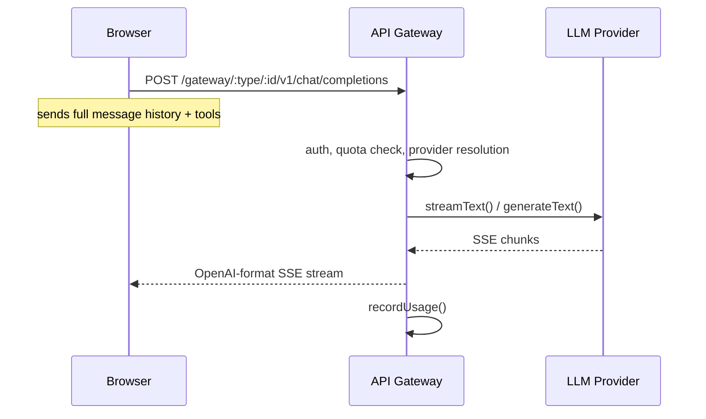

# Stateless OpenAI-compatible gateway

The API server is a pure **LLM proxy** with no server-side conversation state. Conversations live entirely in the browser.

**Why stateless?** Horizontal scaling with no shared state. Any API instance can handle any request since the full context comes from the client. The trade-off is that conversation management complexity moves to the browser (handled by `use-agent-chat.ts`).

**Error handling:** The gateway is fail-fast — there is no automatic retry or provider fallback. On streaming errors, the server writes an SSE error event and closes the stream. The client surfaces the error to the user, who can re-submit the message.

**Key files:**
- `api/src/gateway/router.ts` — SSE streaming, tool forwarding, usage recording
- `api/src/gateway/operations.ts` — OpenAI ↔ AI SDK message/tool format conversion
- `ui/src/composables/use-agent-chat.ts` — client-side history management

**Model IDs are roles, not model names.** The client requests `assistant`, `tools`, `summarizer`, `evaluator`, or `moderator` — the server resolves which provider/model to use from settings.
