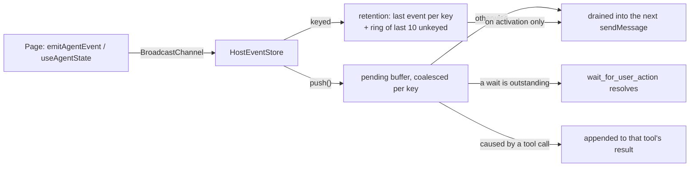

# Host events

The chat only learns what it asks for, and only when a message arrives — unless the host
tells it. This document covers how a host page reports what happened and what is true
now, how the chat delivers that to the model without ever starting a turn, and the one
tool that lets the agent hand the next step to the user and get it back.

## The model

The host reports **events**, one primitive. An event is *keyed* when it describes
something with a current value (the location, a wizard's state): the chat retains only
the last event per key and coalesces pending ones per key. An unkeyed event is a
transition (creation done, dialog dismissed). Navigation is emitted once, keyed
`location`: retention holds where the user is, the delivery is the transition.

Rule of thumb for a page author: **emit an event when the assistant should be told even
if it was not looking, or even if the state afterwards looks the same; give it a key when
a later occurrence supersedes it.** Typing a title is state (keyed `wizard`); pressing
Create is a transition (`item-created`); leaving the page is both (`navigated`, keyed
`location`).

Retention is consulted only when a conversation *activates* — first turn, after reset,
after compaction — the moments the model has no history to integrate from. After that
the model receives events only, each exactly once, persisted, in chronological order.
Nothing is re-sent, nothing is ephemeral, and the host never starts a turn.

## Publishing (`@data-fair/lib-vue-agents`)

- `emitAgentEvent(name, detail?, { key? })` posts `{ type: 'agent-event', event }` on the
  tab BroadcastChannel (`getTabChannelId()`). `detail` is serialised (JSON for objects)
  and capped at 1000 chars (`EVENT_DETAIL_MAX_CHARS`), suffixed `… [truncated]` when it
  overflows.
- `useAgentState(key, source)` watches a ref/getter (`immediate: true, deep: true`) and
  emits a keyed event when the serialised value changes; on scope dispose it posts
  `agent-state-withdrawn`, which only removes the key from retention (the model is not
  told — if leaving mattered, emit `navigated`). It answers the chat's
  `agent-state-request` by re-emitting the last value, so a chat that loads after the page
  rebuilds retention.
- The three message shapes (`agent-event`, `agent-state-withdrawn`,
  `agent-state-request`) share one `channel` field but otherwise diverge, so the publisher
  side types the post function as `HostEventPost = (msg: DistributiveOmit<HostEventMessage,
  'channel'>) => void` — a hand-rolled distributive omit (`T extends any ? Omit<T, K> :
  never`), because a plain `Omit` over a union collapses it to the common `type` field
  first and loses `event`/`key` in the process. `createStateEmitter` takes this `post` as
  a parameter so the emit-on-change logic is unit-testable without a real
  `BroadcastChannel`.

## Consuming (`ui/src/composables/host-events.ts`, `use-host-events.ts`)

`HostEventStore` holds retention (a `Map` of last event per key, iteration order doubling
as first-seen key order for `snapshot()`; plus a ring of the last 10 unkeyed events), the
pending buffer (undelivered, coalesced per key) and at most one pending wait
(`waitForEvent`/`isWaiting`). `push()` feeds a waiter if one is outstanding instead of
buffering — an event never both resolves a wait and sits in the pending buffer.
`clearPending()` drops the buffer *and* settles an outstanding wait as `'aborted'`
(retention is untouched: the pages are still there); `reset()` in `use-agent-chat.ts`
calls it after `abort()`, which has usually already resolved the wait through the same
abort signal, so this is the backstop for whichever one gets there first.
`useHostEvents` feeds the store from the channel and, on creation, posts one
`agent-state-request` so pages that mounted earlier re-emit their keyed state.
`use-agent-chat.ts` delivers:

1. **Pending wait** — the event is the result of `wait_for_user_action`.
2. **Caused by a host tool call** — after the settle barrier (see
   [MCP tool integration](./mcp-tools.md)) and one macrotask, pending events are appended to the
   tool's result as a `<host-events>` block: the event lands in history exactly where it
   happened (the Playwright "action returns the resulting page" shape). Sub-agent tools
   get the same wrapper.
3. **Otherwise** — at the next `sendMessage`, pending events are drained into the
   `<hidden-context>` wrapper of that user turn (before any action-button context).
4. **Activation** — when `history` is empty (first turn, after reset) or
   [compaction](./compaction.md) ran, a `<host-state>` block (retained keys, then recent
   unkeyed events) is placed in that wrapper ahead of the events.

Both blocks say they are reported by the application, not written by the user; the
[moderation](./moderation.md) gate and trace reconstruction see them as ordinary hidden
context — the same `<hidden-context>` sentinel an action button's context rides in, so
nothing new has to be taught to either.

## `wait_for_user_action`

A chat-built-in tool (`WAIT_TOOL_NAME`) merged into the main tool set only — never into
sub-agents — present whenever a host store exists. `{ expecting, timeoutSeconds? }`
(default 120s, max 600s). It resolves on the **next event, whatever it is**: if one is
already sitting in the pending buffer when the tool is called, that one settles the wait
immediately; otherwise it waits for the next `push()`. Either way the chat knows nothing
about expectations — the model judges whether "user navigated to /elsewhere" is what it
waited for. Timeout and abort return plain text (`No user action within N seconds…`,
`Wait cancelled.`); a second call while pending returns `Already waiting for the user.`
(the store itself would reject a concurrent `waitForEvent`, but the tool checks
`isWaiting()` first so the model gets a sentence instead of a thrown error). The
repeated-call [loop guard](./loop-guards.md) bounds wait→wait loops the same way it bounds
any other repeated call. Key withdrawal never resolves a wait (a `v-if` toggling a panel
must not cancel one). While pending the chat shows a "Waiting for: …" line and chip and
the embedded host receives `agent-status: waiting-user`.

It is chat-built-in rather than a page tool because a page-side pending call dies with
the page on the navigation that follows Create — the exact moment that matters.

## Cost

Context costs tokens, not turns. Every delivery here is a persisted message that becomes
cached prefix on later requests; nothing is re-sent. The only turn the host ever resumes
is a wait the agent itself declared, at most one continuation per wait. This replaces
the `get_current_location`-every-turn pattern, which spent a whole model request per
look.

## Dev page and tests

`ui/src/pages/_dev/chat-workflow.vue` is the data-fair creation wizard in miniature: it
publishes keyed `location` itself and embeds `WorkflowWizard.vue` (keyed `wizard`, the
`select_type`/`set_title`/`advance` page tools) and, once created, `WorkflowDetail.vue`
(keyed `detail`); the wizard emits unkeyed `item-created` and a "Leave page" button is the
departure a pending wait must survive. Mock seams (`api/src/models/mock-model.ts`):
`where am i`, `what happened`, `select note`, `wait for me`, `wait briefly`. Tests:
`tests/features/host-events/` (unit specs for the store and the state emitter, plus an
eight-case e2e spec covering activation, coalesced delivery, tool-call delivery, a
resumed wait, a wait resolved by leaving the page, a timeout, Stop cancelling a wait, and
reset re-activating). Simulation case: `workflow-hand-back`.

## Rejected alternatives

- A separate "situation" re-sent every turn (duplicated navigation as state and event,
  needed an ephemeral prepareStep injection, cost more over a long conversation).
- Inserting events into `history` mid-turn (lands before the turn's own messages).
- Auto-cancelling a wait on key withdrawal.
- Page-triggered turns (`agent-start-session` stays a user gesture on an action button).
