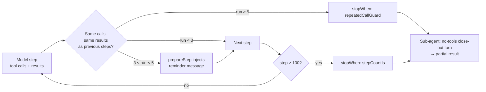

# Loop guards

Both agent loops — the main chat turn (`streamText` in `use-agent-chat.ts`) and each delegated sub-agent (`ToolLoopAgent`, see [sub-agents](./sub-agents.md)) — run autonomously: the model calls tools, gets results, and decides whether to call more. Two failure shapes have to be bounded without crippling the loop:

- **Runaway** — the model re-issues the same call over and over (the single most common agent failure mode: "step repetition" is 15.7% of failures in the MAST taxonomy, and AgentBench attributes most step-limit exits to repeated content).
- **Unbounded but productive work** — a page whose tools are deliberately fine-grained needs many steps. A json-layout form is filled one `setFieldValue` per field, plus `getFieldSuggestions` round-trips and `editArray` + N fields per array item, so even a modest form takes several dozen steps.

A single step count cannot serve both. Any value low enough to cut a runaway short (the historical `stepCountIs(10)`) also truncates real work mid-form, and the close-out then reports a half-filled form as the result. So the two concerns are guarded separately, in `ui/src/composables/agent-loop-guards.ts`.

## 1. Flat step backstop — `STEP_LIMIT = 100`

One generous constant for both loops. It is **not** a spend control: the gateway enforces [quotas](./quotas-usage.md) on every request, and the user always has the Stop button (`abort()`), which is what actually bounds cost and gives the user control. The step limit only has to stop a runaway the repeat guard cannot recognise — typically a tool whose output changes on every call.

100 matches the runaway backstops of harnesses built for long runs (OpenHands and browser-use default to 100, mini-swe-agent to 250, Google ADK to 500 LLM calls) and sits well above observed successful trajectories: browser tasks run 10–50 steps, coding agents 50–180, form filling a few dozen. Frameworks with much lower defaults (OpenAI Agents SDK 10, AI SDK `ToolLoopAgent` 20, LangGraph.js 25) assume one short loop per call; LangGraph Python raised its default from 25 to 1000 for exactly the reason above.

Pages do **not** declare their own budget. An earlier iteration let a sub-agent config carry `maxSteps`, clamped by the host; no surveyed harness does that, and a flat generous limit removes the negotiation entirely.

## 2. Repeated-call guard — nudge at 3, stop at 5

`trailingRepeatCount(steps)` measures the trailing run of identical steps. A step's signature is the sorted set of its tool calls (`toolName` + serialized `input`) **and** its results (`toolName` + serialized `output`), so:

- the same call returning **different** output (polling a status, re-reading a field after a change) is progress, not a repeat;
- a step with no tool call breaks the run (the model spoke, it is not stuck on a call);
- parallel calls compare as a set, regardless of order;
- an early repeat that the model recovered from is forgiven — only the trailing run counts.

Two thresholds, following the OpenHands SDK ladder:

| Trailing run | Mechanism | Effect |
|---|---|---|
| `REPEATED_CALL_NUDGE_AT` = 3 | `loopGuardPrepareStep` (a `prepareStep` hook) | Appends a user message to the **next model request only**: "You have called `X` with the same arguments 3 times in a row and got the same result each time…". It never enters the stored transcript, and is re-derived on every step while the run persists. |
| `REPEATED_CALL_LIMIT` = 5 | `repeatedCallGuard()` (a `stopWhen` condition) | Ends the loop on a tool-call step. |

The nudge is the mildest intervention that works: telling the model plainly what it just did. Comparable production thresholds are 3 consecutive identical calls (Roo Code, Reflexion, AWS Strands) to 5 (Gemini CLI, which also detects cycles of length up to 5). Comparing results as well as calls is the refinement most of them converged on after false positives (Gemini CLI had to add an opt-out).

On the main loop the hook is composed with the [tool-exploration](./tool-exploration.md) `activeTools` gating: `prepareStep: (opts) => ({ ...loopGuardPrepareStep(opts), ...explorationPrepareStep() })`.

## 3. Never stop silently

Either guard ends the loop with `finishReason: 'tool-calls'`. For a sub-agent, the orchestrator then runs **one close-out turn with no tools** (`SUBAGENT_CLOSEOUT_PROMPT`) so the model must synthesize a best-effort answer from what it gathered, and surfaces it to the lead as a *partial* result rather than a failure — see [sub-agents §3](./sub-agents.md#loop-guard-close-out). This mirrors smolagents (`provide_final_answer`), CrewAI (`force_final_answer`), browser-use (done-only last step) and Claude Code sub-agents (output "marked partial"); hard-stop-and-throw is the pattern users complain about.

On the main loop the turn simply ends; the "turn ends on a tool-call step" fallback in `use-agent-chat.ts` makes sure the user sees something rather than a blank turn.

## 4. Test seams

The mock model (`api/src/models/mock-model.ts`) answers a task of exactly `loop forever` with the same `get_schema` call on every step and **ignores the injected nudge**, so the e2e test `Sub-agent that loops to its step cap recovers a close-out answer` exercises the whole ladder: 5 identical calls, the guard stops the loop, the close-out recovers an answer. The guard logic itself is covered by the `loop-guards` unit spec.

## References

- OpenHands SDK stuck detector (nudge at 3 identical action+error, stop at 4 identical action+observation): https://docs.openhands.dev/sdk/guides/agent-stuck-detector
- Gemini CLI `loopDetectionService` (hash of name+args, cycles of length 1–5 repeated 5×): https://github.com/google-gemini/gemini-cli/issues/11002
- Roo Code `ToolRepetitionDetector` (3 consecutive identical calls, then ask the user): https://github.com/RooCodeInc/Roo-Code/pull/5752
- browser-use budget warning at 75% and done-only last step: https://docs.browser-use.com/customize/agent/all-parameters
- Vercel AI SDK loop control (`stopWhen`, `prepareStep`) and the proposed `hasRepeatedToolCalls`: https://ai-sdk.dev/docs/agents/loop-control, https://github.com/vercel/ai/issues/17606
- Claude Agent SDK budgets (`maxTurns` unlimited by default, `maxBudgetUsd`, sub-agent output marked partial): https://code.claude.com/docs/en/agent-sdk/agent-loop
- LangGraph recursion limit raised from 25 to 1000: https://github.com/langchain-ai/langgraph/pull/6676
- "Why Do Multi-Agent LLM Systems Fail?" (MAST, step repetition as the top failure mode): https://arxiv.org/abs/2503.13657
- Reflexion (same action + same observation for more than 3 cycles): https://arxiv.org/abs/2303.11366
- Anthropic on many-small-call workloads (programmatic tool calling, code execution with MCP): https://www.anthropic.com/engineering/advanced-tool-use
