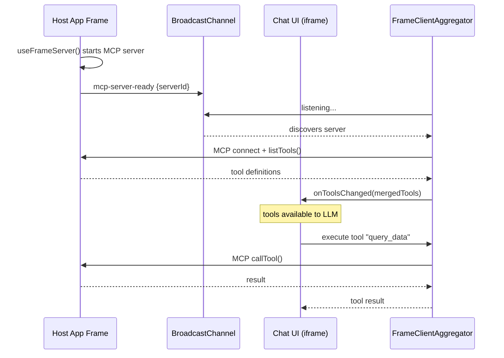
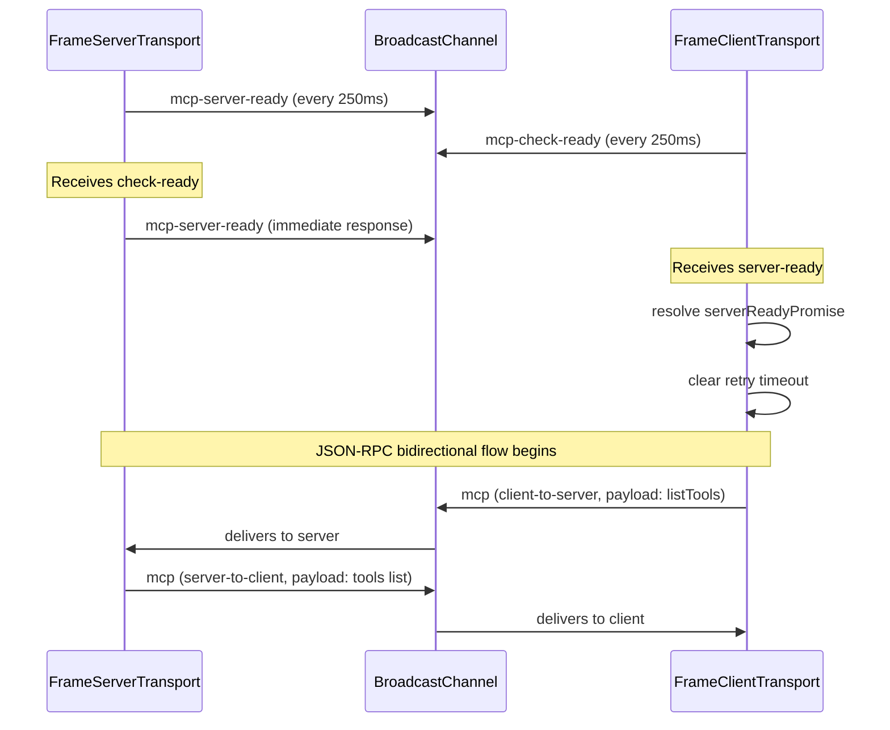
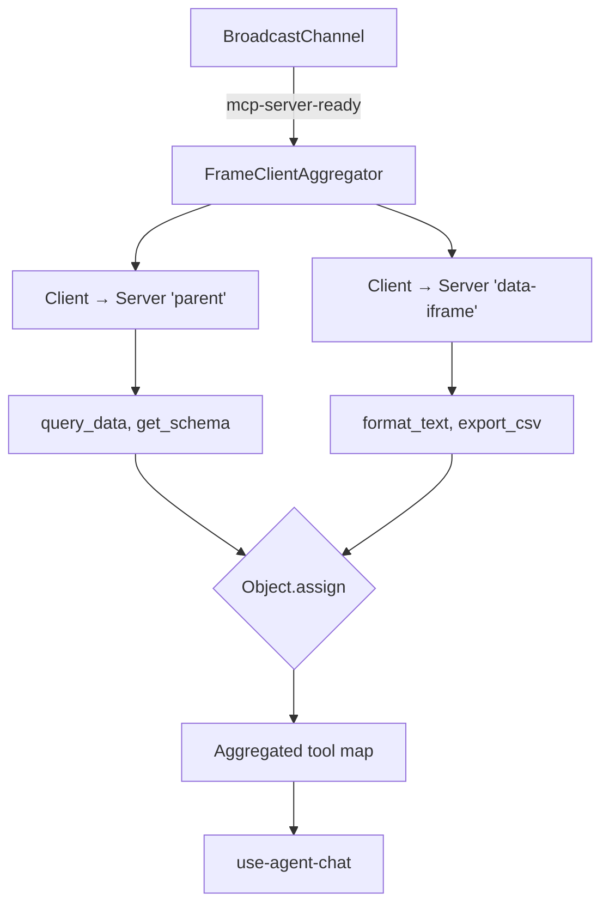
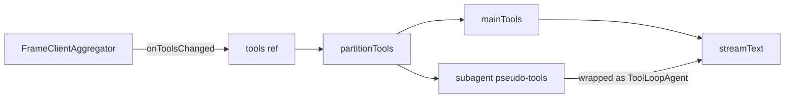

# MCP tool integration

Tools are **decoupled from the chat UI**. MCP servers run in sibling frames and are discovered dynamically through BroadcastChannel. This document covers the full lifecycle from tool registration to LLM invocation.

## Overview

MCP servers run in sibling frames and are discovered dynamically through BroadcastChannel.



**Why BroadcastChannel over postMessage?** No parent/child relationship needed — any frame on the same origin can expose tools. Multiple MCP servers are aggregated into a single tool map. Servers can appear and disappear dynamically.

The rest of this document drills into each stage: registration & the WebMCP polyfill, the server-side transport, the BroadcastChannel discovery protocol, `FrameClientAggregator` aggregation/merge, the flow to the LLM, gateway tool conversion, and error handling.

---

## 1. Tool Registration

Host application components register tools using `useAgentTool()`:

```typescript
import { useAgentTool } from '@data-fair/lib-vue-agents'

useAgentTool({
  name: 'query_data',
  description: 'Execute a SQL query on the dataset',
  inputSchema: {
    type: 'object',
    properties: {
      sql: { type: 'string', description: 'The SQL query' }
    },
    required: ['sql']
  },
  execute: async ({ sql }) => {
    const rows = await runQuery(sql)
    return JSON.stringify(rows)
  }
})
```

Under the hood:
1. `initializeWebMCPPolyfill()` ensures `navigator.modelContext` exists (WebMCP standard API)
2. The tool is registered via `navigator.modelContext.registerTool(agentTool)`
3. `onScopeDispose()` automatically unregisters the tool when the Vue component unmounts

**Key file:** `lib-vue/use-agent-tools.ts`

---

## 2. Server-Side Transport

For tools to be visible across frames, the host frame must expose them via `useFrameServer()`:

```typescript
import { useFrameServer } from '@data-fair/lib-vue-agents'

useFrameServer('parent')  // unique server ID
```

This composable:
1. Creates a `FrameServerTransport` connected to a BroadcastChannel
2. Creates a `BrowserMcpServer` wrapping the existing `navigator.modelContext` (preserving already-registered tools)
3. **Replaces** `navigator.modelContext` with the server — all subsequent `registerTool()` calls go through the MCP server and are automatically exposed via BroadcastChannel
4. On dispose: closes transport, restores original `navigator.modelContext`

**Key files:** `lib-vue/use-frame-server.ts`, `lib-vue/frame-server-transport.ts`

---

## 3. BroadcastChannel Protocol

All MCP communication uses a shared `BroadcastChannel` with a tab-specific channel ID (stored in `sessionStorage`, generated by `getTabChannelId()`). This provides tab isolation — multiple browser tabs maintain independent tool namespaces.

### Message Types

```typescript
interface FrameMessage {
  channel: string       // tab-specific channel ID
  type: 'mcp' | 'mcp-server-ready' | 'mcp-server-stopped' | 'mcp-check-ready'
  serverId: string      // unique server identifier
  direction?: 'server-to-client' | 'client-to-server'
  payload?: JSONRPCMessage
}
```

### Discovery Handshake



Both sides retry independently at 250ms intervals until they find each other. Once connected, the client clears its retry timer. The server keeps broadcasting periodically for late-joining clients.

### Server Shutdown

When a server closes (frame unmounts), it broadcasts `mcp-server-stopped`. The client transport auto-closes upon receiving this message.

### Message Validation

Both transports validate incoming JSON-RPC messages with `JSONRPCMessageSchema.safeParse()`. Invalid messages trigger the `onerror` callback without crashing the transport.

---

## 4. Aggregation

The chat UI runs a `FrameClientAggregator` that discovers and connects to all available MCP servers:



For each discovered server:
1. Creates a `FrameClientTransport` targeting that `serverId`
2. Creates an MCP `Client` with a `ToolListChangedNotification` handler
3. Connects and waits for `serverReadyPromise`
4. Calls `client.listTools()` to fetch available tools
5. Wraps each MCP tool as an AI SDK `tool()` with an `execute` function that calls `client.callTool()`
6. Merges all tools from all servers into a single map
7. Calls `onToolsChanged(aggregatedTools)` to notify the chat composable

### Tool Wrapping

Each MCP tool is wrapped as an AI SDK tool:

```typescript
const aiTool = tool({
  description: t.description || '',
  inputSchema: jsonSchema(t.inputSchema || { type: 'object', properties: {} }),
  execute: async (args) => {
    const callResult = await server.client.callTool({ name: t.name, arguments: args })
    const textParts = callResult.content
      ?.filter(c => c.type === 'text')
      .map(c => c.text)
    return textParts?.join('\n') ?? JSON.stringify(callResult)
  }
})
```

Tool annotations (like `title`) are preserved on the wrapper for UI display.

### Dynamic Lifecycle

| Event | Aggregator response |
|-------|-------------------|
| `mcp-server-ready` (new) | Connect, list tools, merge |
| `mcp-server-ready` (known) | Ignored (already connected) |
| `mcp-server-stopped` | Disconnect client, remove tools, re-merge |
| `tools/list_changed` notification | Re-fetch tools from that server, re-merge |

Tool name collisions across servers are resolved by last-write-wins (`Object.assign`).

**Key file:** `ui/src/transports/frame-client-aggregator.ts`

---

## 5. Flow to the LLM

The chat composable (`use-agent-chat.ts`) receives aggregated tools via the `onToolsChanged` callback and passes them to the AI SDK's `streamText()`:



1. `tools.value` is updated reactively when `onToolsChanged` fires
2. Before each `sendMessage()`, tools are partitioned (see [Sub-Agent Orchestration](./sub-agents.md))
3. `streamText()` receives the tool map — the AI SDK handles tool-call/tool-result cycling up to 10 steps

When the LLM requests a tool call:
1. AI SDK invokes the tool's `execute()` function
2. The aggregator's wrapped execute calls `client.callTool()` over BroadcastChannel
3. The MCP server dispatches to the registered tool's execute function
4. The result flows back through the same chain

**Key file:** `ui/src/composables/use-agent-chat.ts:114-582`

> By default the full aggregated tool map is sent to the LLM on every request. An opt-in **exploration mode** instead discloses tools on demand — see [Tool exploration](./tool-exploration.md).

---

## 6. Gateway Tool Conversion

When tools are sent to the API gateway, they are converted between OpenAI format and AI SDK format:

```
Browser (AI SDK tools) → OpenAI wire format → Gateway → AI SDK tools (schema-only) → LLM
```

The gateway's `convertOpenAITools()` creates tools **without execute functions** — they are schema-only definitions used for the LLM's tool-calling guidance. Tool execution happens client-side; the gateway only sees tool calls in the message history.

`convertToolChoice()` maps between formats:
- `'none'` / `'auto'` / `'required'` → AI SDK equivalents
- `{ type: 'function', function: { name } }` → `{ type: 'tool', toolName }`

**Key file:** `api/src/gateway/operations.ts`

---

## 7. Error Handling

Errors are handled at four layers:

| Layer | Mechanism |
|-------|-----------|
| **Transport** | `JSONRPCMessageSchema.safeParse()` validates messages; invalid ones trigger `onerror` callback. Sending on a stopped transport throws. |
| **Aggregator** | Connection failures are logged and the server is removed. Tool listing failures are logged but the server is retained (retried on next `tools/list_changed`). |
| **Chat composable** | Stream errors captured via `onError` callback. `AbortError` (user cancel) silently handled. Multi-format error extraction: `e.data.error.message`, `e.responseBody`, `e.message`. |
| **Gateway** | Model not configured → 404. Stream errors → SSE error frame + `[DONE]`. Usage tracking failures don't block the response. |

---

## 8. Progressive Tool Disclosure (Exploration Mode)

By default every aggregated tool is sent on every request. An opt-in **exploration mode** instead discloses tools on demand: the assistant sees only a single constant `explore_tools` tool plus a catalog of tool *names*, and promotes the real tools it needs as it goes. See [Tool exploration](./tool-exploration.md) for the full mechanism.

---

## End-to-End Data Flow

```
Registration:
  useAgentTool() → navigator.modelContext.registerTool()
    → BrowserMcpServer → FrameServerTransport
      → BroadcastChannel (mcp-server-ready)

Discovery:
  FrameClientAggregator → FrameClientTransport
    → BroadcastChannel (mcp-check-ready / mcp-server-ready)
      → MCP Client.connect() → Client.listTools()
        → AI SDK tool() wrappers → onToolsChanged()

Execution:
  LLM tool-call → AI SDK tool.execute()
    → MCP Client.callTool() → BroadcastChannel (JSON-RPC)
      → FrameServerTransport → BrowserMcpServer
        → registered tool.execute() → CallToolResult
          → text extraction → tool-result → LLM
```

---

## Key Files

| File | Role |
|------|------|
| `lib-vue/use-agent-tools.ts` | `useAgentTool()` — registers tools via WebMCP polyfill |
| `lib-vue/use-frame-server.ts` | `useFrameServer()` — exposes tools across frames |
| `lib-vue/frame-server-transport.ts` | `FrameServerTransport` — BroadcastChannel server-side |
| `ui/src/transports/frame-client-transport.ts` | `FrameClientTransport` — BroadcastChannel client-side |
| `ui/src/transports/frame-client-aggregator.ts` | `FrameClientAggregator` — discovers servers, merges tools |
| `ui/src/composables/use-agent-chat.ts` | Passes tools to LLM, handles tool results |
| `api/src/gateway/operations.ts` | `convertOpenAITools()` — OpenAI ↔ AI SDK conversion |
