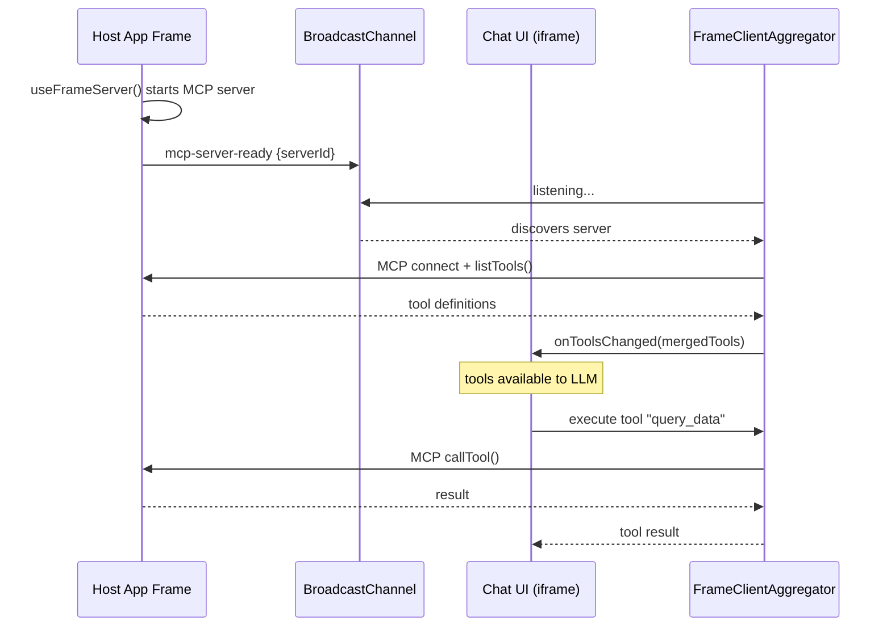
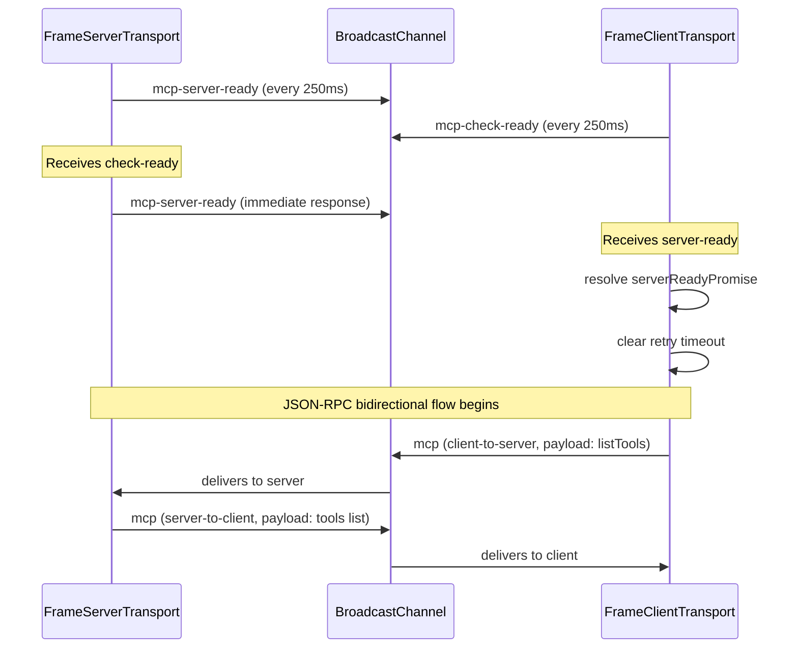
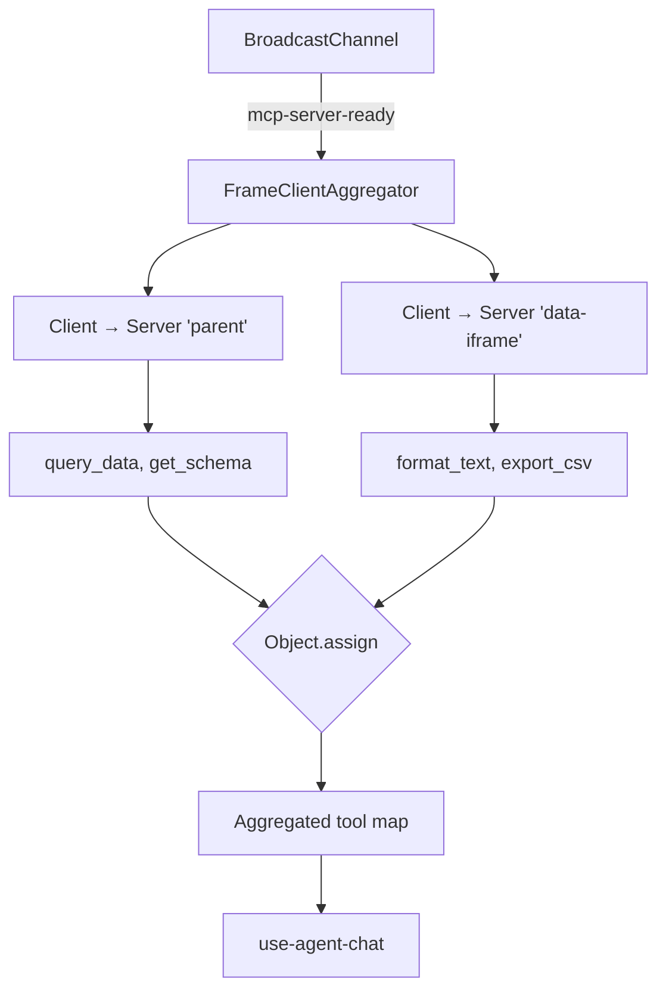
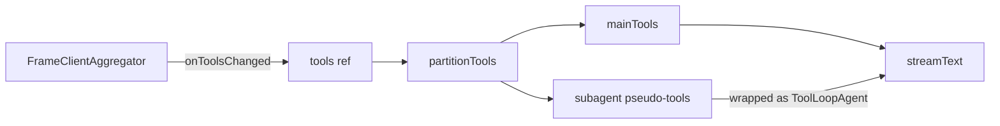
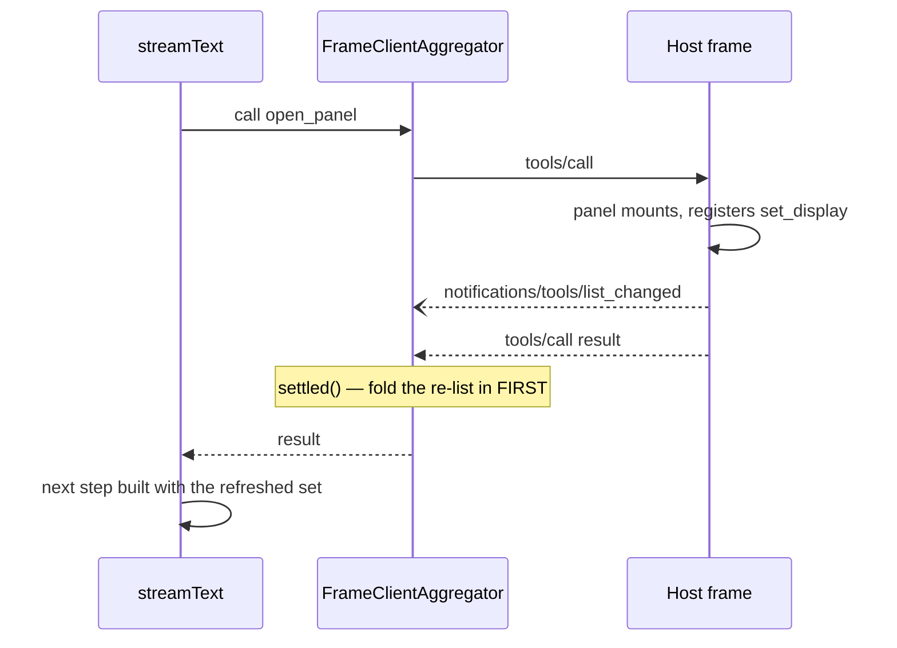

# MCP tool integration

Tools are **decoupled from the chat UI**. Each frame declares its tools through the **WebMCP** standard (`navigator.modelContext`, via the `@mcp-b/webmcp-*` packages); the project adds a **BroadcastChannel transport** on top so those WebMCP servers can be discovered and shared across sibling frames of the same origin — which WebMCP, scoped to a single page, does not cover on its own. This document covers the full lifecycle from tool registration to LLM invocation.

## Overview

Each frame runs a WebMCP server (`navigator.modelContext`); these servers are discovered dynamically through the BroadcastChannel transport.


```mermaid
sequenceDiagram
  participant Host as Host App Frame
  participant BC as BroadcastChannel
  participant Chat as Chat UI (iframe)
  participant Agg as FrameClientAggregator

  Host->>Host: useFrameServer() starts MCP server
  Host->>BC: mcp-server-ready {serverId}
  Agg->>BC: listening...
  BC-->>Agg: discovers server
  Agg->>Host: MCP connect + listTools()
  Host-->>Agg: tool definitions
  Agg->>Chat: onToolsChanged(mergedTools)

  Note over Chat: tools available to LLM

  Chat->>Agg: execute tool "query_data"
  Agg->>Host: MCP callTool()
  Host-->>Agg: result
  Agg-->>Chat: tool result
```

**Why BroadcastChannel over postMessage?** No parent/child relationship needed — any frame on the same origin can expose tools. Multiple MCP servers are aggregated into a single tool map. Servers can appear and disappear dynamically.

The rest of this document drills into each stage: registration & the WebMCP polyfill, the server-side transport, the BroadcastChannel discovery protocol, `FrameClientAggregator` aggregation/merge, the flow to the LLM, gateway tool conversion, and error handling.

---

## 1. Tool Registration

Host application components register tools using `useAgentTool()`:

```typescript
import { useAgentTool } from '@data-fair/lib-vue-agents'

useAgentTool({
  name: 'query_data',
  description: 'Execute a SQL query on the dataset',
  inputSchema: {
    type: 'object',
    properties: {
      sql: { type: 'string', description: 'The SQL query' }
    },
    required: ['sql']
  },
  execute: async ({ sql }) => {
    const rows = await runQuery(sql)
    return JSON.stringify(rows)
  }
})
```

Under the hood:
1. `initializeWebMCPPolyfill()` ensures `navigator.modelContext` exists (WebMCP standard API)
2. The tool is registered via `navigator.modelContext.registerTool(agentTool)`
3. `onScopeDispose()` automatically unregisters the tool when the Vue component unmounts

---

## 2. Server-Side Transport

For tools to be visible across frames, the host frame must expose them via `useFrameServer()`:

```typescript
import { useFrameServer } from '@data-fair/lib-vue-agents'

useFrameServer('parent')  // unique server ID
```

This composable:
1. Creates a `FrameServerTransport` connected to a BroadcastChannel
2. Creates a `BrowserMcpServer` wrapping the existing `navigator.modelContext` (preserving already-registered tools)
3. **Replaces** `navigator.modelContext` with the server — all subsequent `registerTool()` calls go through the MCP server and are automatically exposed via BroadcastChannel
4. On dispose: closes transport, restores original `navigator.modelContext`

---

## 3. BroadcastChannel Protocol

All MCP communication uses a shared `BroadcastChannel` with a tab-specific channel ID (stored in `sessionStorage`, generated by `getTabChannelId()`). This provides tab isolation — multiple browser tabs maintain independent tool namespaces.

### Message Types

```typescript
interface FrameMessage {
  channel: string       // tab-specific channel ID
  type: 'mcp' | 'mcp-server-ready' | 'mcp-server-stopped' | 'mcp-check-ready'
  serverId: string      // unique server identifier
  direction?: 'server-to-client' | 'client-to-server'
  payload?: JSONRPCMessage
}
```

### Discovery Handshake


```mermaid
sequenceDiagram
  participant S as FrameServerTransport
  participant BC as BroadcastChannel
  participant C as FrameClientTransport

  S->>BC: mcp-server-ready (every 250ms)
  C->>BC: mcp-check-ready (every 250ms)
  
  Note over S: Receives check-ready
  S->>BC: mcp-server-ready (immediate response)
  
  Note over C: Receives server-ready
  C->>C: resolve serverReadyPromise
  C->>C: clear retry timeout
  
  Note over S,C: JSON-RPC bidirectional flow begins
  C->>BC: mcp (client-to-server, payload: listTools)
  BC->>S: delivers to server
  S->>BC: mcp (server-to-client, payload: tools list)
  BC->>C: delivers to client
```

Both sides retry independently at 250ms intervals until they find each other. Once connected, the client clears its retry timer. The server keeps broadcasting periodically for late-joining clients.

### Server Shutdown

When a server closes (frame unmounts), it broadcasts `mcp-server-stopped`. The client transport auto-closes upon receiving this message.

### Message Validation

Both transports validate incoming JSON-RPC messages with `JSONRPCMessageSchema.safeParse()`. Invalid messages trigger the `onerror` callback without crashing the transport.

---

## 4. Aggregation

The chat UI runs a `FrameClientAggregator` that discovers and connects to all available MCP servers:


```mermaid
flowchart TB
  BC[BroadcastChannel] -->|mcp-server-ready| Agg[FrameClientAggregator]
  
  Agg --> C1[Client → Server 'parent']
  Agg --> C2[Client → Server 'data-iframe']
  
  C1 --> T1[query_data, get_schema]
  C2 --> T2[format_text, export_csv]
  
  T1 --> Merge{Object.assign}
  T2 --> Merge
  Merge --> Tools[Aggregated tool map]
  Tools --> Chat[use-agent-chat]
```

For each discovered server:
1. Creates a `FrameClientTransport` targeting that `serverId`
2. Creates an MCP `Client` with a `ToolListChangedNotification` handler
3. Connects and waits for `serverReadyPromise`
4. Calls `client.listTools()` to fetch available tools
5. Wraps each MCP tool as an AI SDK `tool()` with an `execute` function that calls `client.callTool()`
6. Merges all tools from all servers into a single map
7. Calls `onToolsChanged(aggregatedTools)` to notify the chat composable

### Tool Wrapping

Each MCP tool is wrapped as an AI SDK tool:

```typescript
const aiTool = tool({
  description: t.description || '',
  inputSchema: jsonSchema(t.inputSchema || { type: 'object', properties: {} }),
  execute: async (args) => {
    // request() rather than callTool(): the latter also validates the result's
    // structuredContent against the tool's declared outputSchema, but we discard
    // structuredContent (see below), so that check could only break the call.
    const callResult = await server.client.request(
      { method: 'tools/call', params: { name: t.name, arguments: args } },
      CallToolResultSchema
    )
    return formatMcpToolResult(callResult)
  }
})
```

`formatMcpToolResult` keeps the text and image `content` parts (and prefixes
`isError` results) — `structuredContent` is intentionally dropped because the
OpenAI-compatible wire protocol to the gateway carries tool output as a single
text string with no structured channel. Since `structuredContent` is never
consumed, output-schema validation is bypassed (see above) so it cannot reject a
call over a value that is thrown away.

Text-only results stay a plain string. A result carrying MCP `image` parts
becomes a **media envelope** (`{_agentsMediaResult: true, text?, media: [{data,
mediaType}]}`): the AI SDK serializes that object as JSON into the same wire
string, and the gateway (`convertOpenAIMessages`) rebuilds real image parts from
it. Providers with a native media channel in their tool-result format
(anthropic, openai via the Responses API, google) receive the images in the tool
result itself; for text-only tool-result channels (mistral, and the
chat-completions paths: scaleway, ollama, openrouter, openai-compatible in
"compatible" mode) the gateway statelessly rewrites the result to a text stub
and injects the images as a user message after the tool-message run. The role
model consuming such results must be vision-capable. Compaction prompts and
stored traces redact the base64 payloads to size placeholders.

Tool annotations (like `title`) are preserved on the wrapper for UI display.

### Dynamic Lifecycle

| Event | Aggregator response |
|-------|-------------------|
| `mcp-server-ready` (new) | Connect, list tools, merge |
| `mcp-server-ready` (known) | Ignored (already connected) |
| `mcp-server-stopped` | Disconnect client, remove tools, re-merge |
| `tools/list_changed` notification | Re-fetch tools from that server, re-merge |

Tool name collisions across servers are resolved by last-write-wins (`Object.assign`).

---

## 5. Flow to the LLM

The chat composable (`use-agent-chat.ts`) receives aggregated tools via the `onToolsChanged` callback and passes them to the AI SDK's `streamText()`:


```mermaid
flowchart LR
  Agg[FrameClientAggregator] -->|onToolsChanged| TV[tools ref]
  TV --> Part[partitionTools]
  Part --> Main[mainTools]
  Part --> SA[subagent pseudo-tools]
  Main --> LLM[streamText]
  SA -->|wrapped as ToolLoopAgent| LLM
```

1. `tools.value` is updated reactively when `onToolsChanged` fires
2. Before each `sendMessage()`, tools are partitioned (see [Sub-Agent Orchestration](./sub-agents.md))
3. `streamText()` receives the tool map — the AI SDK handles tool-call/tool-result cycling until a [loop guard](./loop-guards.md) fires

When the LLM requests a tool call:
1. AI SDK invokes the tool's `execute()` function
2. The aggregator's wrapped execute calls `client.callTool()` over BroadcastChannel
3. The MCP server dispatches to the registered tool's execute function
4. The result flows back through the same chain

### Mid-turn tool changes

The aggregate can change *while a turn runs* — the standard case is the agent calling a
tool that brings up new UI (a panel, a navigation), whose components register their own
tools. Those tools used to become callable only on the **next user turn** (measured: the
same turn kept sending `toolCount=17` after a navigation, the next turn sent 21), and the
agent concluded it was stuck.

Two facts make the fix small:

1. **`streamText` does not snapshot `tools`.** It dereferences the object it was given at
   every step boundary — once via `prepareToolsAndToolChoice` to build the list advertised
   to the model, and again as `tools[name]` to dispatch a call. So a tool map that is
   *reconciled in place* is picked up on the next step, with no need to stop and relaunch
   the stream. `composables/live-tools.ts` holds that reconciliation;
   `2.sdk-live-tools.unit.spec.ts` pins the SDK behaviour so an `ai` upgrade that started
   snapshotting fails loudly instead of silently reinstating the bug.

2. **The update has to land before the next step is built.** It does not, on its own: the
   registration, the `tools/list_changed` notification, the aggregator's re-list and the
   client rebuild all complete *after* the tool's own result — measured at ~4ms after, and
   the SDK starts the next step the moment it has that result. A few milliseconds late is
   as bad as a whole turn late.

So the tool result is held until the aggregate has caught up:


```mermaid
sequenceDiagram
  participant SDK as streamText
  participant Agg as FrameClientAggregator
  participant Host as Host frame

  SDK->>Agg: call open_panel
  Agg->>Host: tools/call
  Host->>Host: panel mounts, registers set_display
  Host--)Agg: notifications/tools/list_changed
  Host-->>Agg: tools/call result
  Note over Agg: settled() — fold the re-list in FIRST
  Agg-->>SDK: result
  SDK->>SDK: next step built with the refreshed set
```

- `FrameClientAggregator.settled()` resolves once every in-flight `tools/list_changed`
  refresh has been folded into the aggregate. The tool wrapper awaits it before returning
  the result. This is ordering, not a timing guess: the host registers its tools *during*
  its own execution, so the notification is put on the channel before the result, and
  BroadcastChannel delivery is FIFO per channel.
- On the client side the `toolsVersion` watch runs with `flush: 'sync'`, so the rebuild is
  registered as in-flight inside `onToolsChanged` itself; a second barrier waits for that
  rebuild (it is async — `resolveSubAgents` round-trips to the host) before the tool result
  is handed back. A 500ms deadline keeps a rebuild that never settles from wedging the turn.
- Rebuilds carry a generation counter, so a slow rebuild overtaken by a newer one bails
  instead of reconciling a stale set.
- In exploration mode the rebuild also announces the new names as a `<tools-available>`
  message, inserted before this turn's user message. That reaches the model mid-turn for
  the same reason the tool map does: `history` stays the array `streamText` was given
  (response messages are folded in only when the turn ends) and each step's prompt is
  rebuilt as `[...initialMessages, ...responseMessages]`. Announced names are tracked so a
  moderation block un-announces them along with the history it rolls back.
- Cross-frame changes that no tool call caused (a frame appearing on its own) are still
  picked up, just without the ordering guarantee — they land on whichever step comes next.

**Why there is no stream restart.** The obvious alternative is to stop the stream when the
tool set changes and relaunch it on the accumulated history. It is not needed: the tools
*and* the messages are both live, so the next step already sees the change. It also does
not work on its own — the change lands a few milliseconds after the step boundary, so the
step the restart is supposed to catch has already been built with the stale set, and the
model answers "I cannot do that" and finishes on `stop`, which any sane restart guard
refuses to relaunch. Ordering the update ahead of the tool result is what actually fixes
it; a restart on top would only ever re-run a stream it stopped itself.

> By default the full aggregated tool map is sent to the LLM on every request. An opt-in **exploration mode** instead discloses tools on demand — see [Tool exploration](./tool-exploration.md).

---

## 6. Gateway Tool Conversion

When tools are sent to the API gateway, they are converted between OpenAI format and AI SDK format:

```
Browser (AI SDK tools) → OpenAI wire format → Gateway → AI SDK tools (schema-only) → LLM
```

The gateway's `convertOpenAITools()` creates tools **without execute functions** — they are schema-only definitions used for the LLM's tool-calling guidance. Tool execution happens client-side; the gateway only sees tool calls in the message history.

`convertToolChoice()` maps between formats:
- `'none'` / `'auto'` / `'required'` → AI SDK equivalents
- `{ type: 'function', function: { name } }` → `{ type: 'tool', toolName }`

---

## 7. Error Handling

Errors are handled at four layers:

| Layer | Mechanism |
|-------|-----------|
| **Transport** | `JSONRPCMessageSchema.safeParse()` validates messages; invalid ones trigger `onerror` callback. Sending on a stopped transport throws. |
| **Aggregator** | Connection failures are logged and the server is removed. Tool listing failures are logged but the server is retained (retried on next `tools/list_changed`). |
| **Chat composable** | Stream errors captured via `onError` callback. `AbortError` (user cancel) silently handled. Multi-format error extraction: `e.data.error.message`, `e.responseBody`, `e.message`. |
| **Gateway** | Model not configured → 404. Stream errors → SSE error frame + `[DONE]`. Usage tracking failures don't block the response. |

---

## 8. Progressive Tool Disclosure (Exploration Mode)

By default every aggregated tool is sent on every request. An opt-in **exploration mode** instead discloses tools on demand: the assistant sees only a single constant `explore_tools` tool plus a catalog of tool *names*, and promotes the real tools it needs as it goes. See [Tool exploration](./tool-exploration.md) for the full mechanism.

---

## Execution context & safety

Tool `execute()` runs **client-side only**, inside the user's own browser session and with exactly the user's permissions — the gateway never runs tools (it forwards schema-only definitions and sees only tool-calls/results in the message history). A tool therefore can do nothing the user could not already do: a prompt injection or a compromised tool descriptor cannot escalate privileges or reach resources the session isn't entitled to. The blast radius of any injection is bounded to the same restricted tool surface already available to the user.

That surface is deliberately narrow and **assistive / non-destructive** by design: no generic HTTP client, no arbitrary-code/JS executor — only well-defined actions over page content or read-only API endpoints. Tools never commit writes themselves; at most a tool *prepares* an action (e.g. pre-fills a form), and the actual write is performed by the user, with the UI responsible for surfacing the pending changes before they are committed. This is why a tool call that slips through on a moderation fail-open before a late block lands ([moderation](./moderation.md)) is acceptable — such side effects are reads or staged actions, never validated writes.

---

## End-to-End Data Flow

```
Registration:
  useAgentTool() → navigator.modelContext.registerTool()
    → BrowserMcpServer → FrameServerTransport
      → BroadcastChannel (mcp-server-ready)

Discovery:
  FrameClientAggregator → FrameClientTransport
    → BroadcastChannel (mcp-check-ready / mcp-server-ready)
      → MCP Client.connect() → Client.listTools()
        → AI SDK tool() wrappers → onToolsChanged()

Execution:
  LLM tool-call → AI SDK tool.execute()
    → MCP Client.callTool() → BroadcastChannel (JSON-RPC)
      → FrameServerTransport → BrowserMcpServer
        → registered tool.execute() → CallToolResult
          → text / media-envelope extraction → tool-result → LLM
```

---

