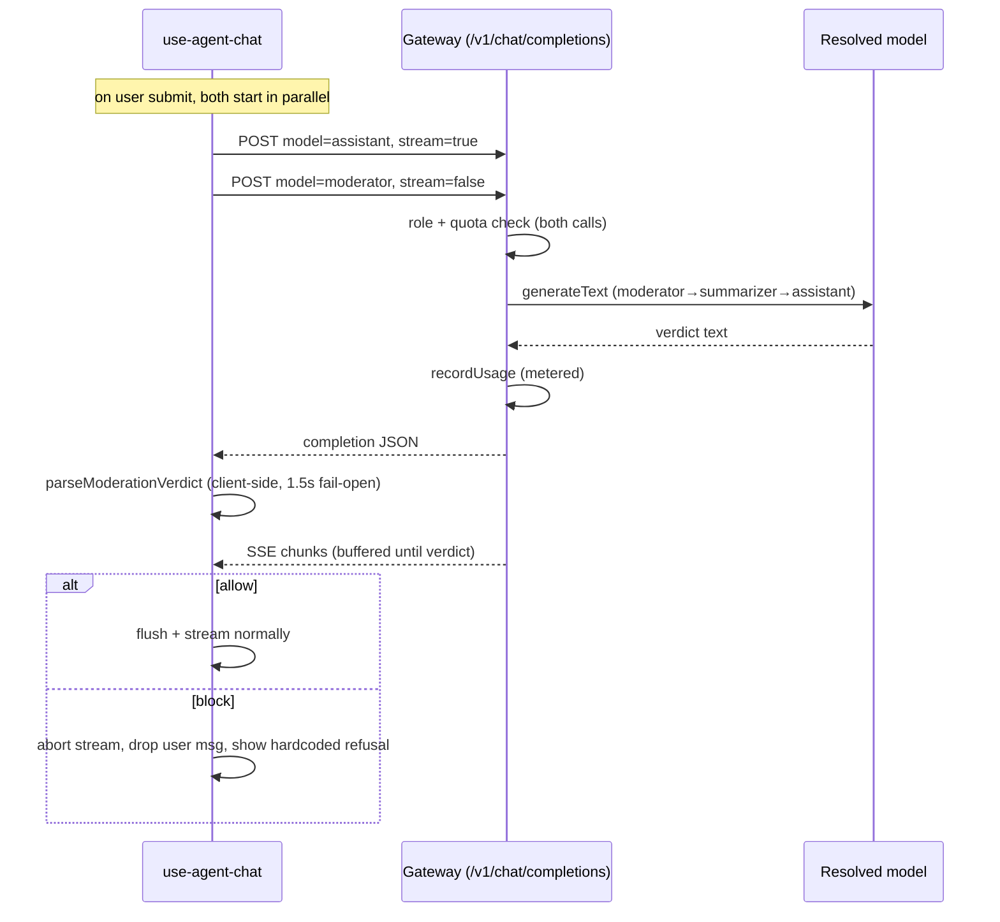

# Input moderation guard

A per-message guard protects the **UI-integrated assistant** from abuse — profanity, prompt-injection attempts, persona/identity override, and out-of-scope requests that deviate from the agent's mission. It is **always on** and runs **concurrently** with the assistant turn, only withholding the first visible output byte; the request itself is never delayed.

**Reuses the gateway.** There is no dedicated moderation endpoint. The client issues a second, non-streaming gateway call with `model: 'moderator'`, which resolves **moderator → summarizer → assistant** server-side (`getModelConfig`). Because it goes through the gateway, moderation inherits the same role checks, quota checks, and usage recording as any other model call — every user message therefore costs two metered calls (moderation + assistant).

**Advisory, not a security boundary.** The gate lives in the client orchestration loop. A direct or anonymous call straight to the gateway's `assistant` model bypasses moderation entirely; that is by design and governed by auth/quotas. The moderation prompt and verdict parser live in the browser (`ui/src/composables/moderation.ts`).

**Fail-open everywhere.** A client-side 1.5s timeout, any transport/HTTP error (including a quota 429 on the moderation call), and any unparseable model output all resolve to `allow`. Moderation never blocks the user on an internal failure.

**Hardcoded refusal.** Blocked messages show a fixed, localized refusal (en/fr) supplied by the chat component; it is not configurable. The model's `category`/`reason` are recorded in the trace but never shown to the user.

**Input only (v1).** The moderator sees the new user message plus the agent mission (system prompt) — not the full history. No output moderation, no tool-result / indirect-injection coverage, no multi-turn jailbreak detection. A block is enforced before any assistant text is shown, but if a turn's first action is a tool call, the tool may already have executed by the time the verdict arrives — moderation does not roll back tool side effects. The impact is bounded, though: tools run client-side with the user's own permissions and are assistive/non-destructive (never validated writes — see [mcp-tools](./mcp-tools.md#execution-context--safety)).

**Observable when trace storage is on.** Moderation runs as a `moderator`-role gateway call tagged with an `x-trace-ctx: moderation:<turnId>` header. When [trace storage](./tracing.md) is enabled (org `storeTraces`) and consented (`x-trace-consent`), that physical request is stored server-side and later surfaces as a moderation entry (`action`, `category`, `reason`) in the **reconstructed** trace on the review page. Fidelity gap: a **skipped** (fail-open) decision makes no model call, so it produces no physical request and does not appear in a stored/reconstructed trace.

**Key files:**
- `api/src/gateway/router.ts` — resolves the `moderator` role and meters the call
- `ui/src/composables/moderation.ts` — moderation prompt + tolerant verdict parser
- `ui/src/composables/use-agent-chat.ts` — parallel gate, withholding the first byte, block → refusal
