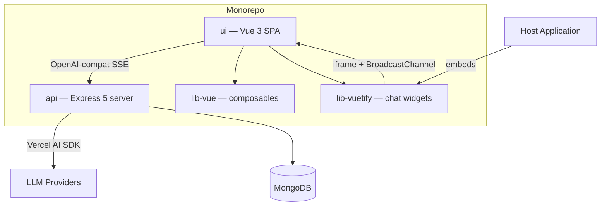

# Architecture overview

**data-fair/agents** is a multi-provider AI chat service with tool-use capabilities, designed to be embedded into data-fair applications. It provides an OpenAI-compatible API gateway, client-side orchestration with sub-agents, and an embeddable chat widget.

| Workspace | Role |
|-----------|------|
| `api/` | Stateless Express server: LLM gateway, settings, usage tracking, summarization |
| `ui/` | Vue 3 + Vuetify 4 SPA: chat interface, tool orchestration, sub-agent rendering |
| `lib-vue/` | Vue composables: WebMCP tool registration, sub-agent declaration, BroadcastChannel transport |
| `lib-vuetify/` | Embeddable Vuetify components: chat drawer, menu, action button, toggle FAB |

The API server is a stateless LLM proxy with no server-side conversation state; all conversation history lives in the browser and is sent with each request.
