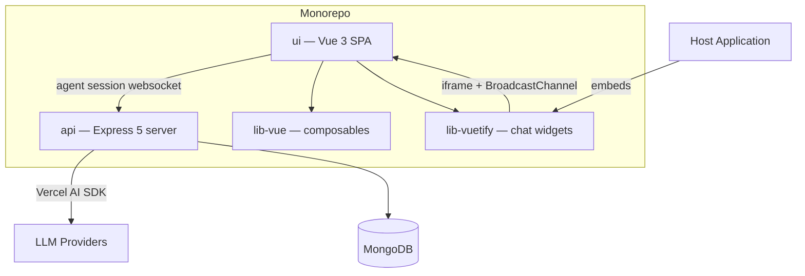

# Architecture overview

**data-fair/agents** is a multi-provider AI chat service with tool-use capabilities, designed to be embedded into data-fair applications. The agent loop runs on the server, which also holds the conversation; the browser renders it and contributes page tools. It provides a websocket agent session, server-side orchestration with sub-agents, and an embeddable chat widget.

```mermaid
graph TB
  subgraph Monorepo
    UI[ui — Vue 3 SPA]
    API[api — Express 5 server]
    LV[lib-vue — composables]
    LVT[lib-vuetify — chat widgets]
  end

  UI -->|agent session websocket| API
  UI --> LV
  UI --> LVT
  LVT -->|iframe + BroadcastChannel| UI

  API -->|Vercel AI SDK| Providers[LLM Providers]
  API --> MongoDB[(MongoDB)]

  HostApp[Host Application] -->|embeds| LVT
```

| Workspace | Role |
|-----------|------|
| `api/` | Express server: the agent loop and conversation store, settings, usage tracking, summarization |
| `ui/` | Vue 3 + Vuetify 4 SPA: chat interface, tool orchestration, sub-agent rendering |
| `lib-vue/` | Vue composables: WebMCP tool registration, sub-agent declaration, BroadcastChannel transport |
| `lib-vuetify/` | Embeddable Vuetify components: chat drawer, menu, action button, toggle FAB |

Every conversation runs on ONE loop, on the server (`api/src/conversations/executor.ts`): the in-page
chat's personal assistant and configured [autonomous agents](./autonomous-agents.md) alike. The chat
talks to it over the agent session websocket (`shared/agent-session-protocol.ts`): it sends prompts and
its page's contextual tools, and receives the stored turn as it is written, plus calls to those tools.

A signed-in person's conversations are stored and theirs to come back to. An **anonymous visitor's**
thread is stored only for the loop's sake: the socket that created it is the only one that can use it,
and it is purged when that socket closes (`createAnonymousConversation`, `purgeAbandonedAnonymous`).
Their turns are charged per IP, in the untrusted pool — see [Quotas & usage](./quotas-usage.md).

AI provider/model configuration and credit-based quotas are layered across deploy-time env vars, per-org superadmin definitions, and org-admin distribution — see [Configuration](./configuration.md).
