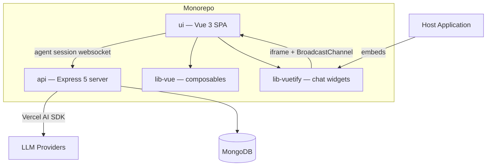

# Architecture overview

**data-fair/agents** is a multi-provider AI chat service with tool-use capabilities, designed to be embedded into data-fair applications. The agent loop runs on the server, which also holds the conversation; the browser renders it and contributes page tools. It provides a websocket agent session, server-side orchestration with sub-agents, and an embeddable chat widget.

```mermaid
graph TB
  subgraph Monorepo
    UI[ui — Vue 3 SPA]
    API[api — Express 5 server]
    LV[lib-vue — composables]
    LVT[lib-vuetify — chat widgets]
  end

  UI -->|agent session websocket| API
  UI --> LV
  UI --> LVT
  LVT -->|iframe + BroadcastChannel| UI

  API -->|Vercel AI SDK| Providers[LLM Providers]
  API --> MongoDB[(MongoDB)]

  HostApp[Host Application] -->|embeds| LVT
```

| Workspace | Role |
|-----------|------|
| `api/` | Express server: the agent loop and conversation store, the agent session socket, settings, quotas and usage, moderation, review, summarization |
| `ui/` | Vue 3 + Vuetify 4 SPA: the chat (rendering the turn the server streams, gathering the page's tools for it), settings and review pages |
| `shared/` | What both the server and the browser read: the agent session protocol and its frame schemas, host events, message parts, the audited-agent rule — and nothing else (a unit test enforces that every module has a UI consumer) |
| `lib-vue/` | Vue composables: WebMCP tool registration, sub-agent declaration, BroadcastChannel transport |
| `lib-vuetify/` | Embeddable Vuetify components: chat drawer, menu, action button, toggle FAB |
| `lib-sim/` | The scenario-simulation harness (`npm run simulate`) and the dev bridge to Claude Code models |

Every conversation runs on ONE loop, on the server (`api/src/conversations/executor.ts`): the in-page
chat's personal assistant and configured [autonomous agents](./autonomous-agents.md) alike. The chat
talks to it over the agent session websocket (`api/src/agent-session/service.ts`, protocol in
`shared/agent-session-protocol.ts`), the only live channel and the only way to start a turn or decide
on an approval: there is no HTTP route for either, and no polling. The chat sends prompts, its page's
contextual tools, its host state and events, aborts and approval decisions; it receives the stored turn
as it is written (`delta`, `message`, `activity`, `subagent`, `cost`, `turn-end`), plus calls to those
tools. HTTP serves the rest: the agents a person may talk to, the history list, a conversation's
runs as a plain read, and deleting a thread. A transcript is read only over the socket (the history
sent on attach) and through review.

The frames are JSON schemas like every other boundary, compiled by `npm run build-types`:
`shared/agent-session-client-frame/schema.js` is what a browser may send, strictly validated (an
invalid frame is answered with the field that was wrong, never dropped silently);
`shared/agent-session-server-frame/schema.js` is what the server sends, typed only, and the browser
reads it leniently, ignoring a type it does not know. A refusal is an `error` frame carrying the status
the same refusal would have had over HTTP (400, 401, 403, 404, 409), or 500 for anything else.

A conversation starts one way, for everyone: a `hello` without `conversationId` names the account and
the agent, and is checked at once, so a refused agent is reported when the chat opens; the first
`prompt` then creates the thread (`createConversation`), carrying its title, and an `attached` frame
names it. Opening a chat creates nothing. A `hello` with a `conversationId` binds to an existing thread
after the ownership check, and replays its stored transcript. A new prompt stops the previous turn of
the thread, whether it is live or still queued for its lock: the person spoke, and the agent answers
what they say now.

A signed-in person's conversations are stored and theirs to come back to. An **anonymous visitor's**
thread is stored only for the loop's sake: the socket that created it is the only one that can use it,
and it is purged when that socket closes (`purgeAbandonedAnonymous` sweeps one whose close never ran).
Their turns are charged per IP, in the untrusted pool — see [Quotas & usage](./quotas-usage.md).

The person's consent to [review](./conversation-review.md) travels in the protocol as well: the browser
keeps its answer in its own cookie and says it in the `hello`, and in a `trace-consent` frame when it
changes. The server never reads that cookie.

AI provider/model configuration and credit-based quotas are layered across deploy-time env vars, per-org superadmin definitions, and org-admin distribution — see [Configuration](./configuration.md). Every model call, whoever makes it, is charged through one function, `chargeModelCall` (`api/src/usage/charge.ts`) — see [Quotas & usage](./quotas-usage.md).

**Development seams.** What the test suites need from the server — a reset of every `test*` document
and in-process cache, state manufactured on purpose (orphaned runs, held locks), clocks passed in as
data, a thread's stored messages read over HTTP — lives in one router, `api/src/test-env/router.ts`,
mounted under `/api/test-env` only when `NODE_ENV` is `development`. Product code does not know it
exists: where a test must observe something (the task notifications pushed to the events service),
the router wraps the product's own outlet.

## The other documents

| Concern | Read |
|---|---|
| A turn's tools: page tools over the socket, the MCP catalog, `wait_for_user_action` | [MCP tool integration](./mcp-tools.md), [Host events](./host-events.md) |
| What the model is sent, and how a long conversation is kept within its window | [Context management](./context-management.md) |
| What stops a turn: step and repetition guards, budgets, the clock | [Loop guards](./loop-guards.md) |
| Delegating to workers | [Sub-agent orchestration](./sub-agents.md) |
| Configured agents with their own identity | [Autonomous agents](./autonomous-agents.md) |
| What an agent remembers across conversations | [Agent memory](./agent-memory.md) |
| Prompts an agent runs on a schedule, unattended | [Planned tasks](./planned-tasks.md) |
| Reading web pages, feeds and sitemaps under an allowlist | [Web access](./web-access.md) |
| Providers, models, roles | [Multi-provider AI abstraction](./providers.md), [Configuration](./configuration.md) |
| Who may spend what, and what it cost | [Quotas & usage](./quotas-usage.md) |
| Refusing abusive input | [Input moderation guard](./moderation.md) |
| What an admin may read back | [Conversation review](./conversation-review.md) |
| Putting the chat in a host application | [Embedding](./embedding.md), [Integration context](./integration-context.md) |
| Shelved | [Progressive tool disclosure](./tool-exploration.md) |
