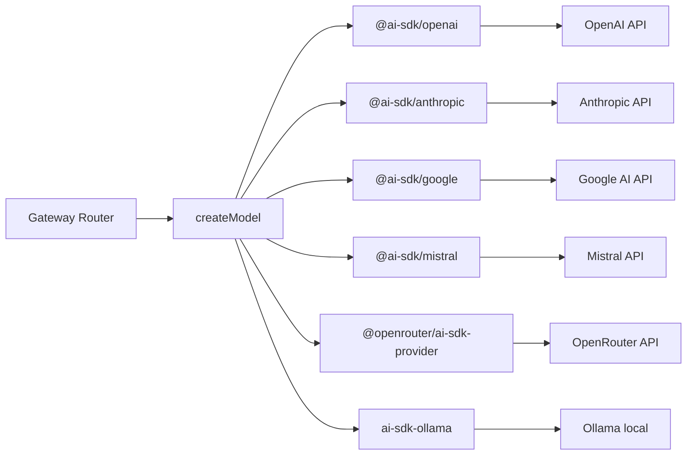

# Multi-provider AI abstraction

The system supports **6 LLM providers** through a unified factory built on Vercel AI SDK.

**Settings map 5 roles to concrete models:**

| Role | Purpose | Typical cost ratio |
|------|---------|-------------------|
| `assistant` | Primary conversational model | 1.0 |
| `tools` | Structured data / tool-calling specialist | 0.5 |
| `summarizer` | Context compaction | 0.5 |
| `evaluator` | Quality control / reasoning | 1.0 |
| `moderator` | Input moderation guard (internal, gateway-side) | 0.5 |

Each owner (user or organization) configures their own providers and model assignments. API keys are **encrypted at rest** (AES-256-CBC) and obfuscated in API responses. Model lists are fetched from provider APIs with **5-minute memoized caching**.

**Key files:**
- `api/src/models/operations.ts` — `createModel()` factory
- `api/src/models/router.ts` — Dynamic model discovery with caching
- `api/src/settings/operations.ts` — API key encryption/obfuscation
