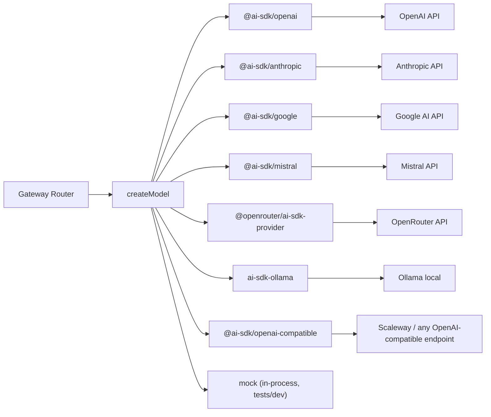

# Multi-provider AI abstraction

The system supports **9 provider types** through a unified factory (`createModel()`, `api/src/models/operations.ts`) built on Vercel AI SDK.

```mermaid
graph LR
  GW[Gateway Router] --> CM[createModel]

  CM --> OAI["@ai-sdk/openai"]
  CM --> ANT["@ai-sdk/anthropic"]
  CM --> GOO["@ai-sdk/google"]
  CM --> MIS["@ai-sdk/mistral"]
  CM --> OR["@openrouter/ai-sdk-provider"]
  CM --> OLL["ai-sdk-ollama"]
  CM --> OC["@ai-sdk/openai-compatible"]
  CM --> MOCK["mock (in-process, tests/dev)"]

  OAI --> LLM1[OpenAI API]
  ANT --> LLM2[Anthropic API]
  GOO --> LLM3[Google AI API]
  MIS --> LLM4[Mistral API]
  OR --> LLM5[OpenRouter API]
  OLL --> LLM6[Ollama local]
  OC --> LLM7["Scaleway / any OpenAI-compatible endpoint"]
```

`scaleway` is its own provider `type` but is routed through `@ai-sdk/openai-compatible` (see `scalewayBaseURL()` and the comment on `createModel()`), same as `openai-compatible` in `compatibility: 'compatible'` mode — both need `reasoning_content` captured, which `@ai-sdk/openai`'s `/v1/responses` client drops.

**Settings map 5 roles to concrete models:**

| Role | Purpose |
|------|---------|
| `assistant` | Primary conversational model |
| `tools` | Structured data / tool-calling specialist |
| `summarizer` | Context compaction |
| `evaluator` | Quality control / reasoning |
| `moderator` | Input moderation guard (internal, gateway-side) |

There is no per-role fixed cost ratio. Each model in the catalog (global `MODELS` or an org's `settings.models`) carries its own prices per token class — fresh input, cached input, output — in euros per million tokens, and credits come from actual token counts against those prices divided by the credit peg; see [Configuration → Credits](./configuration.md#credits) for the formula. A cheaper role like `summarizer` is typically *mapped* to a cheaper model, but nothing in the schema ties a role to a fixed ratio.

Each owner (user or organization) may add its own providers and models on top of the deployment-wide catalog — see [Configuration](./configuration.md) for the full env-var / superadmin / org-admin layering. API keys are **encrypted at rest** (AES-256-CBC) and obfuscated in API responses for org-owned providers (the deployment-wide `PROVIDERS` env var is plain text, since it never leaves the deployment's own secret store).

`GET /api/models/:type/:id` (`api/src/models/router.ts`) lists the *raw* models each of the org's own `settings.providers` actually offers upstream (used by the superadmin form's model-picker when adding an entry to `settings.models`) — it only queries an org's own providers, not the global `PROVIDERS`. Results are memoized for **5 minutes**, keyed by `owner:updatedAt` so a settings change busts the cache.

Each catalog entry may carry a **context window** (tokens). It sizes history
compaction, which only ever applies to the assistant seat, but it describes the
model rather than the role, so any entry may set it. Left empty it falls back to
whatever the model listing reported when the model was picked — only OpenRouter
and the mock provider report a context length today; everything else, Ollama
included, falls back to a 128000-token default sized for frontier assistant
models. See [Conversation history compaction](./compaction.md) for how it feeds
the budget.

Cache reads are charged at their own rate, not at the fresh-input rate — the
reason prices are per token class at all. Left empty, a model's cache price falls
back to its input price (*unknown*, never *free*), which is what most entries do:
the reference model is the only one in the Scaleway catalog publishing a cache
tariff. Cache **writes** bill at the plain input price; there is no write tariff
to configure, because this codebase never sets `cache_control`.

