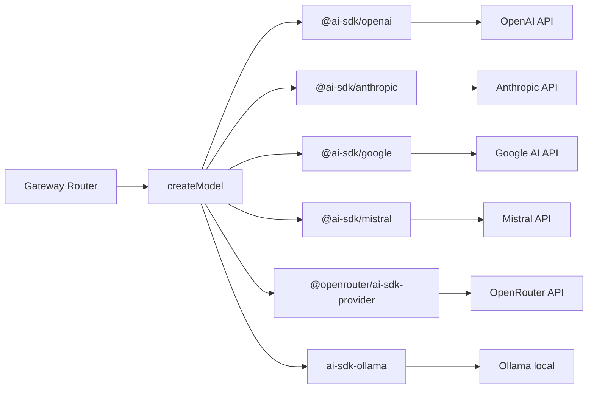

# Multi-provider AI abstraction

The system supports **6 LLM providers** through a unified factory built on Vercel AI SDK.

```mermaid
graph LR
  GW[Gateway Router] --> CM[createModel]

  CM --> OAI["@ai-sdk/openai"]
  CM --> ANT["@ai-sdk/anthropic"]
  CM --> GOO["@ai-sdk/google"]
  CM --> MIS["@ai-sdk/mistral"]
  CM --> OR["@openrouter/ai-sdk-provider"]
  CM --> OLL["ai-sdk-ollama"]

  OAI --> LLM1[OpenAI API]
  ANT --> LLM2[Anthropic API]
  GOO --> LLM3[Google AI API]
  MIS --> LLM4[Mistral API]
  OR --> LLM5[OpenRouter API]
  OLL --> LLM6[Ollama local]
```

**Settings map 5 roles to concrete models:**

| Role | Purpose | Typical cost ratio |
|------|---------|-------------------|
| `assistant` | Primary conversational model | 1.0 |
| `tools` | Structured data / tool-calling specialist | 0.5 |
| `summarizer` | Context compaction | 0.5 |
| `evaluator` | Quality control / reasoning | 1.0 |
| `moderator` | Input moderation guard (internal, gateway-side) | 0.5 |

Each role carries an optional **cached input** price per million tokens; left
empty it falls back to the listing snapshot, then to the role's plain input price
(an unset cache price means *unknown*, never *free*). There is no cache-**write**
tariff: this codebase never sets `cache_control`, so no provider reports write
tokens today. Should any appear they are billed at the plain input price rather
than dropped — Anthropic's real rate is 1.25x input, so that under-bills slightly
instead of not at all, and a tariff can be added when breakpoints land.

The **assistant role alone** carries a **context window** (tokens), because the
assistant is the only role whose history is compacted. Left empty it falls back to
whatever the model listing reported when the model was picked — only OpenRouter
and the mock provider report a context length today; everything else, Ollama
included, falls back to a conservative 32000-token default. See
[Conversation history compaction](./compaction.md) for how it feeds the budget.

Each owner (user or organization) configures their own providers and model assignments. API keys are **encrypted at rest** (AES-256-CBC) and obfuscated in API responses. Model lists are fetched from provider APIs with **5-minute memoized caching**.

