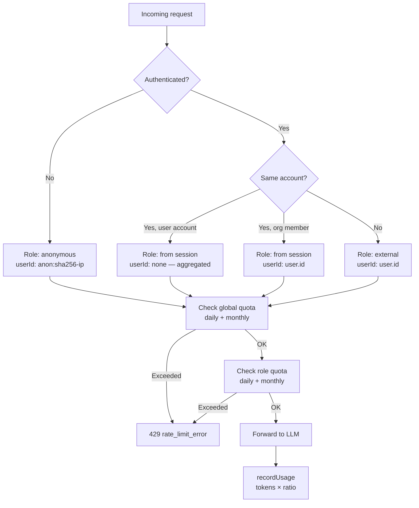

# Quotas & usage

Quota enforcement happens at **two levels**: global (account-wide) and per-role (per-user within an account).

**Cost ratios** let cheaper models (summarizer, tools) consume less quota. A request using the summarizer at ratio 0.5 records half the actual token count.

**Storage:** Two MongoDB documents per user×period — one `daily:YYYY-MM-DD`, one `monthly:YYYY-MM`. Atomic `$inc` upserts for concurrent-safe recording.

**Key files:**
- `api/src/usage/service.ts` — `checkQuota()`, `recordUsage()`, `getOwnerUsage()`
- `api/src/auth.ts` — `getEffectiveRole()`, `assertCanUseModel()`
- `api/src/gateway/router.ts` — Quota enforcement in the request path

## Account & role routing

`getEffectiveRole()` derives the effective role for quota lookup by comparing the request session's account to the settings owner: a different account is always treated as `external`, while a matching account uses `session.accountRole` (defaulting to `user`). Combined with the flowchart above, each request resolves to a role and `userId` as follows:

- **Anonymous (unauthenticated)** → role `anonymous`, userId `anon:sha256-ip`.
- **Same account, user-type owner** → role from session, userId omitted (usage aggregated for the account).
- **Same account, organization member** → role from session, userId `user.id`.
- **Different account** → role `external`, userId `user.id`.
