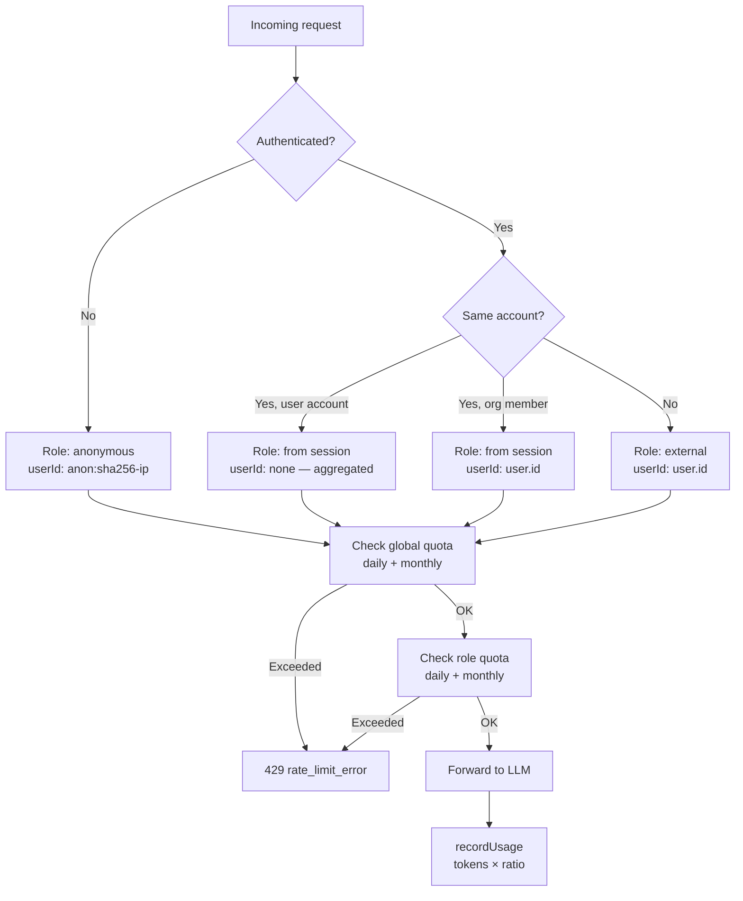

# Quotas & usage

Quota enforcement happens at **three levels**: global (account-wide), an untrusted pool (anonymous + external combined), and per-role (per-user within an account). The flowchart below shows the global and per-role checks; the untrusted pool sits between them and is covered in [its own section](#untrusted-pool-quota).

**Cost ratios** let cheaper models (summarizer, tools) consume less quota. A request using the summarizer at ratio 0.5 records half the actual token count.

**Storage:** Two MongoDB documents per user×period — one `daily:YYYY-MM-DD`, one `monthly:YYYY-MM`. Atomic `$inc` upserts for concurrent-safe recording.

**Key files:**
- `api/src/usage/enforce.ts:41` — `resolveUsageIdentity()` resolves the caller's identity (per-user/per-IP, untrusted flag, `poolId`)
- `api/src/usage/enforce.ts:71` — `enforceQuotas()` orchestrates the global → untrusted-pool → per-user checks
- `api/src/usage/operations.ts:32` — `checkQuota()`, plus `firstQuotaViolation()` and `isUntrustedRole()` (`api/src/usage/operations.ts:104`)
- `api/src/usage/service.ts:61` — `getUsage()`, `recordUsage()` (`:81`), `getOwnerUsage()` (`:141`)
- `api/src/settings/service.ts:13` — `defaultQuotas` (includes the `untrusted` pool entry, `:20`)
- `api/src/auth.ts` — `getEffectiveRole()`, `assertCanUseModel()`, `assertRoleQuota()`
- `api/src/gateway/router.ts:123` — request path: `resolveUsageIdentity()` then `enforceQuotas()`, 429 on violation

## Untrusted pool quota

Per-user role quotas cap each *individual* anonymous IP and external user, and the global quota caps *everyone combined* — but neither caps the *aggregate* of untrusted traffic on its own. With a per-IP cap of e.g. $10 and a thousand IPs, anonymous traffic could grow until it hits the shared global cap and starve the account's real members. The **untrusted pool** closes that gap: a single shared quota covering all `anonymous` and `external` usage combined, sitting between the global and per-user checks.

A caller is "untrusted" when `isUntrustedRole(role)` is true, i.e. `role === 'anonymous' || role === 'external'` (`api/src/usage/operations.ts:104`). `resolveUsageIdentity()` sets `isUntrusted` and tags the request with `poolId = 'pool:untrusted'` (the `UNTRUSTED_POOL_ID` sentinel, `api/src/usage/enforce.ts:25`) for untrusted callers; trusted callers get no `poolId`.

**Enforcement order.** The single entry point is `enforceQuotas()` (`api/src/usage/enforce.ts:71`), called from the gateway at `api/src/gateway/router.ts:126`. It builds the checks in this order and returns the first violation via `firstQuotaViolation()`:

1. **Global** (account-wide aggregate, `getOwnerUsage()`), scope `organization`/`user`.
2. **Untrusted pool** — only when `identity.isUntrusted`; reads the pool aggregate with `getUsage(owner, 'pool:untrusted')`, scope `untrusted`.
3. **Per-user / per-IP** role cap — only when `trackPerUser`; reads `getUsage(owner, usageUserId)`, scope `user`.

> Note: the design spec proposed the order per-user → pool → global, but the implemented order is global → pool → per-user (verified in `api/src/usage/enforce.ts`). Each check is skipped when its `RoleQuota` is `unlimited` or has `monthlyLimit === 0`, so a pool limit of `0` means "no pool cap" — backwards-compatible for accounts that never configure one.

**Recording.** `recordUsage()` takes an optional `poolId` (`api/src/usage/service.ts:81`); when set it upserts the `pool:untrusted` daily/weekly/monthly aggregates the same way it already upserts the account aggregate, in addition to the per-user record. The gateway passes `identity.poolId` so untrusted requests increment all three (per-user + account + pool).

**Configuration.** The limit is a standard `RoleQuota` (`unlimited` + `monthlyLimit`) stored under `quotas.untrusted` in account settings (`api/types/settings/schema.js`, UI title "Anonymous + external pool"), defaulting to `{ unlimited: false, monthlyLimit: 0 }` in `defaultQuotas` (`api/src/settings/service.ts:20`).

**Pool records are not real users.** `getUsersDailyHistory()` skips any `userId` starting with `pool:` so the shared aggregate never appears as a user in usage history (`api/src/usage/service.ts`).

## Account & role routing

`getEffectiveRole()` derives the effective role for quota lookup by comparing the request session's account to the settings owner: a different account is always treated as `external`, while a matching account uses `session.accountRole` (defaulting to `user`). Combined with the flowchart above, each request resolves to a role and `userId` as follows:

- **Anonymous (unauthenticated)** → role `anonymous`, userId `anon:sha256-ip`.
- **Same account, user-type owner** → role from session, userId omitted (usage aggregated for the account).
- **Same account, organization member** → role from session, userId `user.id`.
- **Different account** → role `external`, userId `user.id`.
