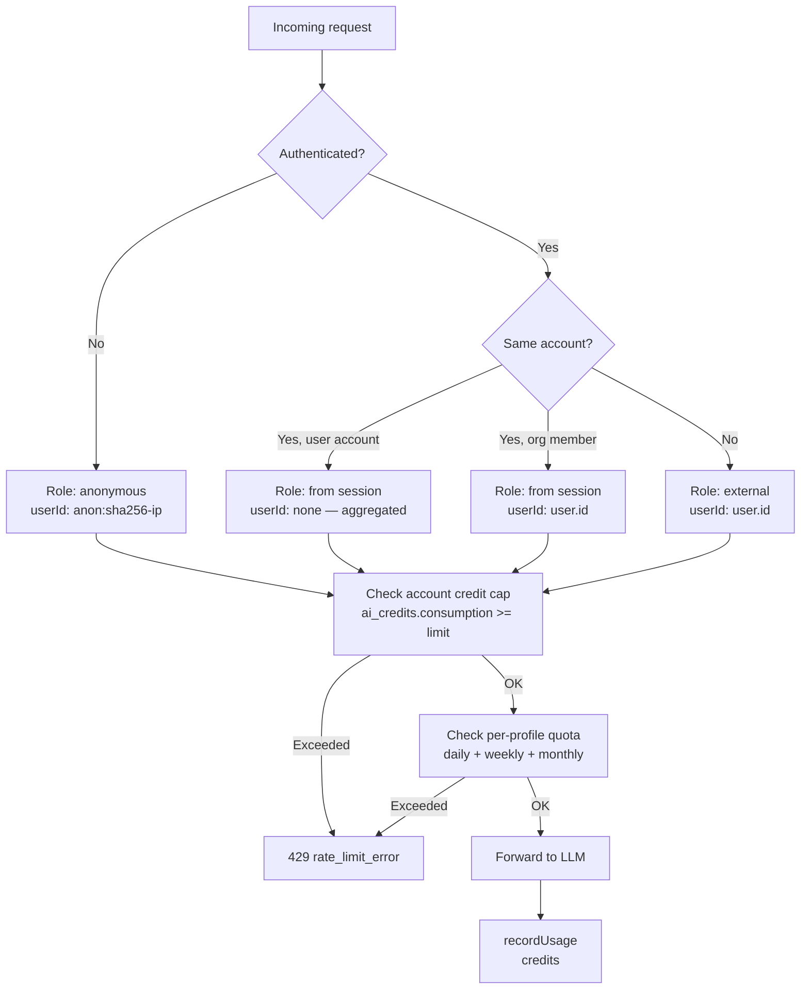

# Quotas & usage

Enforcement happens at **three levels**, checked in order: an org-wide **credit cap** (backed by the `limits` collection — see [Configuration](./configuration.md#limits-contract)), an **untrusted pool** (anonymous + external combined), and a **per-profile** quota (per-user within an account, or per-IP for anonymous). The flowchart below shows the credit-cap and per-profile checks; the untrusted pool sits between them and is covered in [its own section](#untrusted-pool-quota).

```mermaid
flowchart TD
  Req[Incoming request] --> Auth{Authenticated?}

  Auth -->|No| Anon[Role: anonymous<br/>userId: anon:sha256-ip]
  Auth -->|Yes| Same{Same account?}

  Same -->|Yes, user account| UserOwner[Role: from session<br/>userId: none — aggregated]
  Same -->|Yes, org member| OrgMember[Role: from session<br/>userId: user.id]
  Same -->|No| External[Role: external<br/>userId: user.id]

  Anon --> CC[Check account credit cap<br/>ai_credits.consumption >= limit]
  UserOwner --> CC
  OrgMember --> CC
  External --> CC

  CC -->|OK| RQ[Check per-profile quota<br/>daily + weekly + monthly]
  CC -->|Exceeded| R429[429 rate_limit_error]

  RQ -->|OK| LLM[Forward to LLM]
  RQ -->|Exceeded| R429

  LLM --> Record[recordUsage<br/>credits]
```

Every call is priced in **credits**, not currency — see [Configuration → Credits](./configuration.md#credits) for the exact formula (`(inputTokens + outputTokens × outputTokenWeight) / 1e6 × multiplier`). There is no per-role "cost ratio": each model's own resolved `multiplier` is what makes a cheaper model (e.g. the summarizer's model) consume fewer credits per token than a pricier one.

**Storage:** Three MongoDB documents per user×period in the `usage` collection — `daily:YYYY-MM-DD`, `weekly:YYYY-Www`, `monthly:YYYY-MM` — each with a `cost` field (named for historical reasons; the value stored is credits). Atomic `$inc` upserts for concurrent-safe recording. `recordUsage()` also increments the account's `limits.ai_credits.consumption` counter in the same call, so the credit cap check above always reads consumption recorded by this same path.

## Untrusted pool quota

Per-profile quotas cap each *individual* anonymous IP and external user, and the account credit cap caps *everyone combined* — but neither caps the *aggregate* of untrusted traffic on its own. With a per-IP cap of e.g. 100 credits and a thousand IPs, anonymous traffic could grow until it hits the account's shared credit cap and starve the account's real members. The **untrusted pool** closes that gap: a single shared quota covering all `anonymous` and `external` usage combined, sitting between the credit cap and per-profile checks.

A caller is "untrusted" when `isUntrustedRole(role)` is true, i.e. `role === 'anonymous' || role === 'external'`. `resolveUsageIdentity()` sets `isUntrusted` and tags the request with `poolId = 'pool:untrusted'` (the `UNTRUSTED_POOL_ID` sentinel) for untrusted callers; trusted callers get no `poolId`.

The same `isUntrusted` flag also gates the [moderation guard](./moderation.md): before any quota check, the gateway refuses untrusted callers under a moderation strike cooldown outright (zero LLM calls, no quota consumed).

**Enforcement order.** The single entry point is `enforceQuotas()` in `api/src/usage/enforce.ts`, called from the gateway router. It builds the checks in this order and returns the first violation:

1. **Account credit cap** — `getCreditInfo(owner)` (`api/src/limits/service.ts`) reads `ai_credits.limit`/`ai_credits.consumption` from the `limits` collection (see [Configuration → Limits contract](./configuration.md#limits-contract)). `limit >= 0 && consumption >= limit` short-circuits with scope `account`, period `monthly`, before any other check — even when the caller's own per-profile quota is unlimited. This is no longer a `RoleQuota`/`quotas` entry; `quotas.global` has been removed from the schema entirely and replaced by this credits-based cap.
2. **Untrusted pool** — only when `identity.isUntrusted`; reads the pool aggregate with `getUsage(owner, 'pool:untrusted')`, scope `untrusted`, via `quotas.untrusted`.
3. **Per-profile / per-IP** role cap — only when `trackPerUser`; reads `getUsage(owner, usageUserId)`, scope `user`, via `quotas[role]`.

Steps 2 and 3 go through `firstQuotaViolation()` (`api/src/usage/operations.ts`), unchanged from before this refactor. Each is skipped when its `RoleQuota` is `unlimited` or has `monthlyLimit === 0`, so a pool limit of `0` means "no pool cap" — backwards-compatible for accounts that never configure one.

**Recording.** `recordUsage()` takes an optional `poolId`; when set it upserts the `pool:untrusted` daily/weekly/monthly aggregates the same way it already upserts the account aggregate, in addition to the per-user record. The gateway passes `identity.poolId` so untrusted requests increment all three (per-user + account + pool) — plus the account's `ai_credits.consumption` counter via `incrementConsumption()`, which step 1 above reads back on the next request.

**`getOwnerUsage()` is display-only now.** `api/src/usage/router.ts`'s account-usage endpoint (admin dashboard) still calls it to show historical account-wide consumption, but `enforceQuotas()` no longer uses it for enforcement — that moved to `getCreditInfo()`/the `limits` collection.

**Configuration.** The limit is a standard `RoleQuota` (`unlimited` + `monthlyLimit`) stored under `quotas.untrusted` in account settings (UI title "Anonymous + external pool"), defaulting to `{ unlimited: false, monthlyLimit: 0 }` in `defaultQuotas`.

**Pool records are not real users.** `getUsersDailyHistory()` skips any `userId` starting with `pool:` so the shared aggregate never appears as a user in usage history.

## Account & role routing

`getEffectiveRole()` derives the effective role for quota lookup by comparing the request session's account to the settings owner: a different account is always treated as `external`, while a matching account uses `session.accountRole` (defaulting to `user`). Combined with the flowchart above, each request resolves to a role and `userId` as follows:

- **Anonymous (unauthenticated)** → role `anonymous`, userId `anon:sha256-ip`.
- **Same account, user-type owner** → role from session, userId omitted (usage aggregated for the account).
- **Same account, organization member** → role from session, userId `user.id`.
- **Different account** → role `external`, userId `user.id`.
