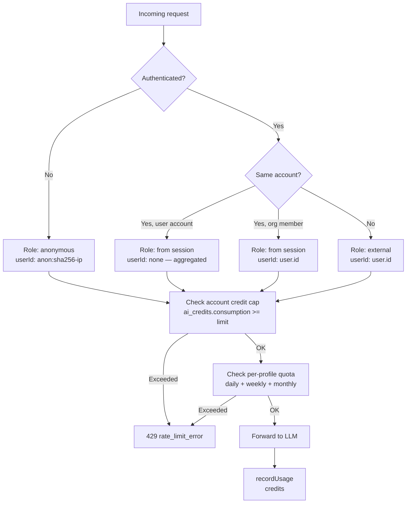

# Quotas & usage

Enforcement happens at **three levels**, checked in order: an org-wide **credit cap** (backed by the `limits` collection — see [Configuration](./configuration.md#limits-contract)), an **untrusted pool** (anonymous + external combined), and a **per-profile** quota (per-user within an account, or per-IP for anonymous). The flowchart below shows the credit-cap and per-profile checks; the untrusted pool sits between them and is covered in [its own section](#untrusted-pool-quota).

```mermaid
flowchart TD
  Req[Incoming request] --> Auth{Authenticated?}

  Auth -->|No| Anon[Role: anonymous<br/>userId: anon:sha256-ip]
  Auth -->|Yes| Same{Same account?}

  Same -->|Yes, user account| UserOwner[Role: from session<br/>userId: none — aggregated]
  Same -->|Yes, org member| OrgMember[Role: from session<br/>userId: user.id]
  Same -->|No| External[Role: external<br/>userId: user.id]

  Anon --> CC[Check account credit cap<br/>ai_credits.consumption >= limit]
  UserOwner --> CC
  OrgMember --> CC
  External --> CC

  CC -->|OK| RQ[Check per-profile quota<br/>daily + weekly + monthly]
  CC -->|Exceeded| R429[429 rate_limit_error]

  RQ -->|OK| LLM[Forward to LLM]
  RQ -->|Exceeded| R429

  LLM --> Record[recordUsage<br/>credits]
```

Every call is priced in **credits**, not currency — see [Configuration → Credits](./configuration.md#credits) for the exact formula (token counts against the model's per-class euro prices, divided by `EUROS_PER_CREDIT`). There is no per-role "cost ratio": each model's own prices are what make a cheaper model (e.g. the summarizer's model) consume fewer credits per token than a pricier one, and cache reads cost a fraction of fresh input on the same model.

**Storage:** Three MongoDB documents per user×period in the `usage` collection — `daily:YYYY-MM-DD`, `weekly:YYYY-Www`, `monthly:YYYY-MM` — each with a `cost` field (named for historical reasons; the value stored is credits). Atomic `$inc` upserts for concurrent-safe recording. `recordUsage()` also increments the account's `limits.ai_credits.consumption` counter in the same call, so the credit cap check above always reads consumption recorded by this same path.

**Breakdown flags.** The same `$inc` also feeds a `breakdown` sub-document on each record, one map per dimension: `modelRole` (assistant/tools/summarizer/evaluator/moderator), `model` (resolved catalog model id), `profile` (the effective role: admin/contrib/user/external/anonymous) and `tokenType` (input/cachedInput/output, from `computeCreditBreakdown()` — the token classes always sum to the total cost). Each request attributes its whole cost to its single model role/model/profile value and splits it by token class, so the monitoring histograms can stack the exact same period shape by any of these dimensions and the layers sum to the unbroken-down total. Model ids routinely contain dots, which MongoDB field paths reject, so map keys go through `encodeBreakdownKey()`/`decodeBreakdownKey()` (percent-escaped, injective). Historical records without a `breakdown` read as zeros; `cost` remains the source of truth.

**Monitoring endpoints.** `GET /api/usage/:type/:id/history` accepts `dimension=<modelRole|model|profile|tokenType>` for the `account-daily`, `account-monthly` and `users` scopes, and returns a decoded `breakdown` per bucket. `GET /api/usage/history` is superadmin-only: it sums the account-level records of **every** owner per period, with `dimension=owner` (the default) stacking accounts on top and any account dimension available for drill-down, plus an optional `ownerType`/`ownerId` filter. It is what the platform monitor on the `/admin` home renders; the account and per-user histograms get the same breakdown selector.

## Untrusted pool quota

Per-profile quotas cap each *individual* anonymous IP and external user, and the account credit cap caps *everyone combined* — but neither caps the *aggregate* of untrusted traffic on its own. With a per-IP cap of e.g. 100 credits and a thousand IPs, anonymous traffic could grow until it hits the account's shared credit cap and starve the account's real members. The **untrusted pool** closes that gap: a single shared quota covering all `anonymous` and `external` usage combined, sitting between the credit cap and per-profile checks.

A caller is "untrusted" when `isUntrustedRole(role)` is true, i.e. `role === 'anonymous' || role === 'external'`. `resolveUsageIdentity()` sets `isUntrusted` and tags the request with `poolId = 'pool:untrusted'` (the `UNTRUSTED_POOL_ID` sentinel) for untrusted callers; trusted callers get no `poolId`.

The same `isUntrusted` flag also gates the [moderation guard](./moderation.md): before any quota check, the gateway refuses untrusted callers under a moderation strike cooldown outright (zero LLM calls, no quota consumed).

**Enforcement order.** The single entry point is `enforceQuotas()` in `api/src/usage/enforce.ts`, called from the gateway router. It builds the checks in this order and returns the first violation:

1. **Account credit cap** — `getCreditInfo(owner)` (`api/src/limits/service.ts`) reads `ai_credits.limit`/`ai_credits.consumption` from the `limits` collection (see [Configuration → Limits contract](./configuration.md#limits-contract)). `limit >= 0 && consumption >= limit` short-circuits with scope `account`, period `monthly`, before any other check — even when the caller's own per-profile quota is unlimited. This is no longer a `RoleQuota`/`quotas` entry; `quotas.global` has been removed from the schema entirely and replaced by this credits-based cap.
2. **Untrusted pool** — only when `identity.isUntrusted`; reads the pool aggregate with `getUsage(owner, 'pool:untrusted')`, scope `untrusted`, via `quotas.untrusted`.
3. **Per-profile / per-IP** role cap — only when `trackPerUser`; reads `getUsage(owner, usageUserId)`, scope `user`, via `quotas[role]`.

Steps 2 and 3 go through `firstQuotaViolation()` (`api/src/usage/operations.ts`), unchanged from before this refactor. Each is skipped when its `RoleQuota` is `unlimited` or has `monthlyLimit === 0`, so a pool limit of `0` means "no pool cap" — backwards-compatible for accounts that never configure one.

**Recording.** `recordUsage()` takes an optional `poolId`; when set it upserts the `pool:untrusted` daily/weekly/monthly aggregates the same way it already upserts the account aggregate, in addition to the per-user record. The gateway passes `identity.poolId` so untrusted requests increment all three (per-user + account + pool) — plus the account's `ai_credits.consumption` counter via `incrementConsumption()`, which step 1 above reads back on the next request.

**`getOwnerUsage()` is display-only now.** `api/src/usage/router.ts`'s account-usage endpoint (admin dashboard) still calls it to show historical account-wide consumption, but `enforceQuotas()` no longer uses it for enforcement — that moved to `getCreditInfo()`/the `limits` collection.

**Configuration.** The limit is a standard `RoleQuota` (`unlimited` + `monthlyLimit`) stored under `quotas.untrusted` in account settings (UI title "Anonymous + external pool"), defaulting to `{ unlimited: false, monthlyLimit: 0 }` in `defaultQuotas`.

**Pool records are not real users.** `getUsersDailyHistory()` skips any `userId` starting with `pool:` so the shared aggregate never appears as a user in usage history.

## Account & role routing

`getEffectiveRole()` derives the effective role for quota lookup by comparing the request session's account to the settings owner: a different account is always treated as `external`, while a matching account uses `session.accountRole` (defaulting to `user`). Combined with the flowchart above, each request resolves to a role and `userId` as follows:

- **Anonymous (unauthenticated)** → role `anonymous`, userId `anon:sha256-ip`.
- **Same account, user-type owner** → role from session, userId omitted (usage aggregated for the account).
- **Same account, organization member** → role from session, userId `user.id`.
- **Different account** → role `external`, userId `user.id`.

## Self-service view

Any caller can read their own consumption: `GET /api/gateway/:type/:id/usage`
resolves the caller through the same `resolveUsageIdentity()` as a completion
(same 401/403, anonymous action token included) and returns `getSelfUsage()`
(`api/src/usage/enforce.ts`; the `SelfUsage` type is defined in the pure
`api/src/usage/operations.ts` and re-exported from enforce.ts):

- `quota` — the caller's own daily/weekly/monthly windows from `quotaWindows()`
  (`api/src/usage/operations.ts`), the same function `checkQuota()` enforces with.
  A caller not tracked per user (owner of a user account) reads the account
  aggregate, reported as unlimited since no per-profile quota applies to them.
- `account` — `accountViolation()` (credit cap, then the untrusted pool for
  anonymous/external callers) as a status `ok|exhausted` + `resetsAt`. Only an
  admin of the owner also gets the credit cap numbers.

The same rule applies to 429 bodies (`quotaErrorBody()`): `usage`/`limit` of the
`account` and `untrusted` scopes are omitted for non-admins; `period` and
`resets_at` are always present, and the chat renders them as a localized
"which limit, resets when" message. This redaction protects the shared budgets
from external and anonymous callers: org members (contrib/user) can already
read the org credit cap and consumption through `GET /api/limits/:type/:id`,
which mirrors the ecosystem's member-level access. A quota 429 is marked
non-retryable client-side (`gatewayFetch` throws a non-retryable `APICallError`
for a `rate_limit_error` body), so the AI SDK does not spend ~7s retrying it
before the message shows; other 429s, such as an upstream provider's rate
limit, keep the SDK's default retries. The client's `extractQuotaError`
(`ui/src/utils/error.ts`) finds the 429 through the AI SDK's `RetryError.lastError`
and prefers the raw `responseBody`, because the SDK's parsed `data` drops `scope`,
`period` and `resets_at`.

**Per-call cost.** Every gateway `usage` object carries `cost` — the credits
billed for that call, following OpenRouter's `usage.cost` convention — including
the moderation classifier call when its verdict settled before the gate opened.
`gatewayFetch` (in `ui/src/composables/use-agent-chat.ts`) sums it, through
`watchResponseCost` from `ui/src/utils/gateway-cost.ts`, into the conversation
total shown in the chat settings' Consumption tab. A verdict that lands after
the gate failed open is recorded server-side but not reported in any response,
and a blocked (`content_filter`) response has no usage chunk, so its moderation
cost is not reported to the client either; both are recorded server-side. The
conversation total may therefore slightly undercount; the quota windows
(server-side) stay exact.
