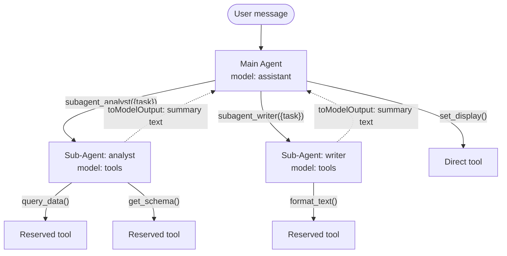
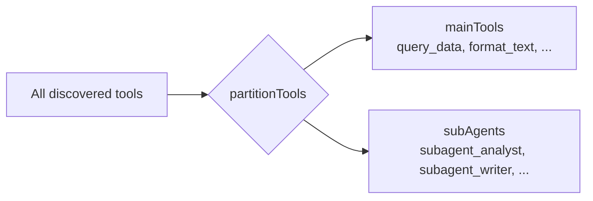
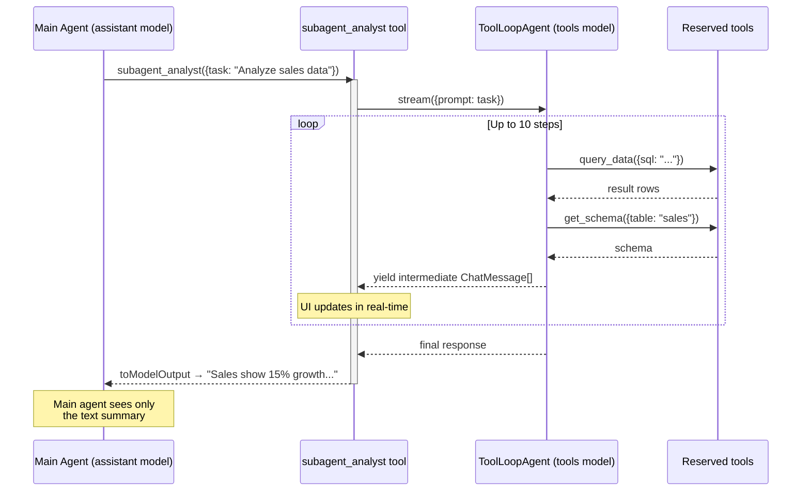
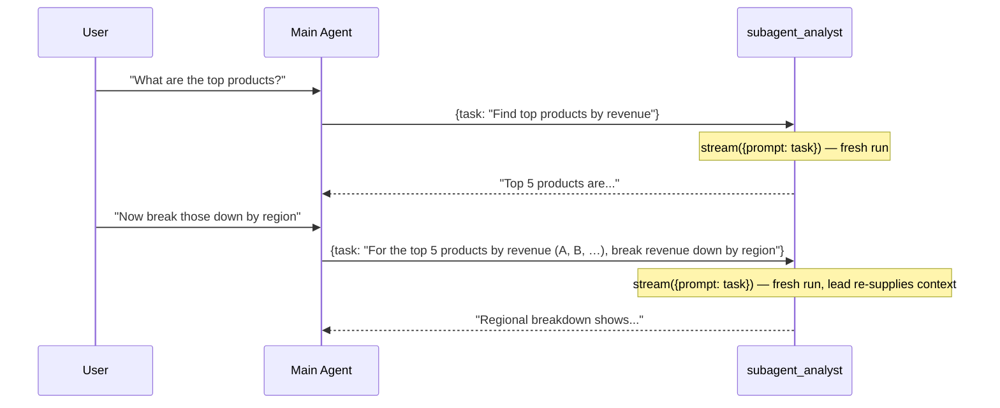

# Sub-agent orchestration

The orchestrator-worker pattern runs **entirely in the browser**. The main agent delegates tasks to specialized sub-agents via pseudo-tools (`subagent_*`), each backed by a `ToolLoopAgent` from Vercel AI SDK v6.



At a glance:

1. **Registration** — Child components call `useAgentSubAgent()` which registers a `subagent_*` MCP tool with a JSON config (prompt, tool list, model).
2. **Partitioning** — `use-agent-chat.ts` splits tools: sub-agent reserved tools are removed from the main set.
3. **Execution** — Each sub-agent gets a `ToolLoopAgent` instance with its own tool set and system prompt. It runs up to 10 steps autonomously. Sub-agents run **concurrently** when the main agent requests several in one step — the AI SDK dispatches each tool call without awaiting the previous (`executeToolCall` is fired and tracked, not awaited). Each call streams into its own panel, keyed by the delegating `toolCallId`. There is no special-casing for repeated or same-name calls: every delegation is independent, so concurrent calls to the same sub-agent run in parallel just like calls to different ones.
4. **Stateless workers** — Each delegation is a fresh, single-shot run: the worker keeps no conversation history across calls. The lead holds the state and re-states all needed context in the `task` field.
5. **Context reduction** — The main agent sees only a compact text summary via `toModelOutput()`. The UI renders the full sub-agent trace in collapsible panels.

The rest of this document expands each of these mechanics in turn.

---

## 1. Registration

Host application components declare sub-agents using `useAgentSubAgent()`:

```typescript
useAgentSubAgent({
  name: 'analyst',
  title: 'Data Analyst',
  description: 'Analyzes datasets and produces insights',
  prompt: 'You are a data analyst. Use the provided tools to query and analyze data.',
  tools: ['query_data', 'get_schema'],
  model: 'tools'  // optional, defaults to 'tools'
})
```

This registers a pseudo-tool named `subagent_analyst` via `useAgentTool()`. The tool's `execute()` function returns a static JSON config:

```json
{ "prompt": "You are a data analyst...", "tools": ["query_data", "get_schema"], "model": "tools" }
```

The config is not used directly by the LLM — it is consumed by the orchestration layer to bootstrap the sub-agent at runtime.

---

## 2. Tool Partitioning

Before each LLM call, `partitionTools()` splits the aggregated tool map into two sets:



Rules:
- Tools whose name starts with `subagent_` go to the sub-agent set
- All other tools go to `mainTools` initially

Then `resolveSubAgents()` refines the partition:
1. Calls each sub-agent's `execute({task: ''})` to retrieve its config
2. Parses the JSON to extract `{ prompt, tools, model }`
3. **Removes reserved tools** from `mainTools` — tools listed in a sub-agent's `tools` array become exclusive to that sub-agent

```
Before resolveSubAgents:
  mainTools: [query_data, get_schema, format_text, set_display]
  subAgents: [subagent_analyst (config: null)]

After resolveSubAgents:
  mainTools: [format_text, set_display]           ← query_data, get_schema removed
  subAgents: [subagent_analyst (config: {tools: [query_data, get_schema], ...})]
```

This ensures the main agent cannot call tools that belong to a sub-agent, enforcing delegation.

---

## 3. ToolLoopAgent Wrapping

For each sub-agent, the orchestrator creates a `ToolLoopAgent` instance and wraps it as an async generator tool visible to the main LLM:



Each `ToolLoopAgent` is configured with:
- **model** — resolved from `provider.chat(config.model ?? 'tools')`
- **instructions** — the sub-agent's system prompt
- **tools** — the reserved tool set (only tools listed in `config.tools`)
- **stopWhen** — `stepCountIs(10)` (max 10 autonomous steps)

Sub-agents run **concurrently** when the main agent requests several in one step — the AI SDK dispatches each tool call without awaiting the previous (`executeToolCall` is fired and tracked, not awaited). Each call streams into its own panel, keyed by the delegating `toolCallId`. Because workers are stateless (§5), there is nothing to serialize: even two concurrent calls to the same sub-agent run in parallel.

---

## 4. Async Generator Streaming

The sub-agent tool uses `async function*` to yield intermediate results while the sub-agent is still working:

```typescript
execute: async function* (args, { abortSignal }) {
  const subResult = await subAgent.stream({ prompt: args.task, abortSignal })

  for await (const part of subResult.fullStream) {
    applyStreamPart(part, subScope)               // build this panel's transcript
    parent.subAgentPanels = {                      // reassign → Vue re-renders the panel
      ...(parent.subAgentPanels ?? {}),
      [parentToolCallId]: { messages: [...subScope.messages] }
    }
    yield [...subScope.messages]                   // AI SDK marks these "preliminary"
  }
}
```

Each `yield` emits a **preliminary** tool result. The AI SDK streams these to the main agent's `fullStream` with `preliminary: true`, which the UI uses to show real-time sub-agent progress without marking the tool invocation as done.

`applyStreamPart()` (the same builder the main loop uses) folds each delta part into the panel's `ChatMessage[]`, handling text deltas, tool-call / tool-result parts, and step boundaries. The transcript is published per delegating `toolCallId` into `parent.subAgentPanels`, so concurrent delegations each render in their own panel.

The live phase (pending step count, tool name) is tracked per `toolCallId` via the composable's `subAgentActivities` map, so concurrent panels each show their own phase independently.

---

## 5. Stateless Workers

Sub-agents are **stateless and single-shot**: every delegation is a fresh run that keeps no
conversation history across calls. This is the standard orchestrator-worker design — the
*orchestrator* (main agent) holds the conversation state, and workers are pure functions of
their `task` input. The input schema already instructs the lead to *"include all relevant
context… that the sub-agent needs"*, so the worker never needs its own memory.



Every call is `subAgent.stream({ prompt: args.task })` — there is no per-sub-agent history
`Map`, no call-index tracking, and no serialization of same-name calls. Benefits:

- **Bounded worker window by construction** — a worker's context can never grow beyond a
  single task, so it needs no compaction and is exempt from no compaction-clearing edge cases.
- **Full parallelism** — concurrent calls to the same sub-agent run in parallel (there is no
  shared state to order).
- **Internal consistency** — the worker behaves exactly as the `task` contract promises:
  self-contained in, deliverable out.

Multi-step work *within* a single delegation still happens — that is the `ToolLoopAgent`'s
internal step loop (`stepCountIs(10)`), which is orthogonal to cross-call statelessness.

---

## 6. Context Reduction

The main agent never sees the full sub-agent trace. `toModelOutput()` extracts only the last assistant message's text:

```typescript
toModelOutput: ({ output }) => {
  const lastMsg = Array.isArray(output) ? output[output.length - 1] : null
  return {
    type: 'text',
    value: (lastMsg as ChatMessage | null)?.content || 'Task completed.'
  }
}
```

This keeps the main agent's context window lean — a sub-agent that made 8 tool calls across 5 steps produces a single paragraph of text in the main conversation. The full trace is visible in the UI via `ChatMessage.subAgentPanels`, rendered per delegating tool-call as a bordered, state-colored panel that is **collapsed by default** and expanded on demand (its live activity shows in the header even while collapsed). A per-user **"Simplify sub-agent display"** flag (`simpleSubAgents`, on by default) instead renders each delegation as a plain status chip, like any other tool call; the full-panel view is the opt-in. Panels never auto-open.

This also reduces pressure on the 24,000-character compaction threshold (see [Conversation history compaction](./compaction.md)).

---

## 7. Telemetry

There is no live in-browser recorder. Instead, each sub-agent's physical LLM requests are tagged with a trace context id via an `x-trace-ctx: sub:<name>:<index>:<parentToolCallId>` header. When [trace storage](./tracing.md) is enabled (org `storeTraces`) and consented (`x-trace-consent`), the gateway stores those requests; at view time `reconstructTrace()` groups them by `contextId` into a sub-agent block, shown alongside the main agent's flow on the review page.

---

## 8. Flatten mode (experimental)

An admin-only opt-in (`localStorage` key `agent-chat-flatten`, toggled from the chat debug
dialog's Settings tab) replaces delegation with flat tool exposure. The choice is made **per
sub-agent** each turn via `shouldFlattenSubAgent(config, flatten)` (`ui/src/composables/sub-agent-flatten.ts`).
For a sub-agent that flattens, `sendMessage`:

- keeps its reserved tools in the main tool set (`resolveSubAgents` skips removal for that
  sub-agent), so the main agent calls them directly;
- registers its `subagent_*` as a no-arg **guidance tool** under its de-prefixed name
  (`data_analyst`), whose `execute()` returns the sub-agent's own prompt. No `ToolLoopAgent`,
  separate model, `toModelOutput` summary, or sub-agent UI panel.

**Per-sub-agent opt-out.** Flattening is lossy for sub-agents a host prompt uses as
black-box *producers* (it inverts the "delegate then receive a deliverable" contract and
discards any pinned model). So a sub-agent **stays delegated** even when the toggle is on
when it pins a non-default model (the default heuristic — lib-vue materializes the default
to `tools`, so non-`tools` is an explicit pin) or when its config sets `delegateOnly: true`
(explicit override, added to lib-vue's `useAgentSubAgent`). `delegateOnly: false` forces
flattening even for a model-pinned sub-agent. Reserved-tool removal is therefore per
sub-agent, and a single turn can run some sub-agents flat and others delegated (**mixed
mode**).

It exists to A/B whether a flat tool surface yields better tool use than delegation. It is
independent of [tool-exploration](./tool-exploration.md) and the two can be enabled together:
the now-flat reserved tools are still gated behind `explore_tools` like any plain tool.
Known limitation of the combined mode: the de-prefixed guidance tools are not promotable by
`explore_tools` (they live in `mainLLMTools` but not `mainTools`, and the always-active list
still references the `subagent_`-prefixed names), so they are effectively hidden when
exploration is also on. This degrades gracefully (no crash) and matters only when both
experimental toggles are active at once.

---

## Data Structures

```typescript
// Sub-agent config (returned by pseudo-tool execute)
interface SubAgentConfig {
  prompt: string       // system prompt for the sub-agent
  tools: string[]      // tool names reserved for this sub-agent
  model?: string       // model role ('tools', 'assistant', etc.)
}

// Chat message with sub-agent support
interface ChatMessage {
  role: 'user' | 'assistant'
  content: string
  toolInvocations?: Array<{
    toolCallId: string
    toolName: string
    state: 'pending' | 'done'
  }>
  // Per delegating tool-call id: the sub-agent's full trace.
  // Keyed by toolCallId so concurrent delegations render in separate panels.
  subAgentPanels?: Record<string, { messages: ChatMessage[] }>
}

// Debug partition info (exposed via resolvedPartition ref)
interface DebugToolsPartition {
  mainTools: ToolInfo[]
  subAgents: SubAgentInfo[]
}
```

---

