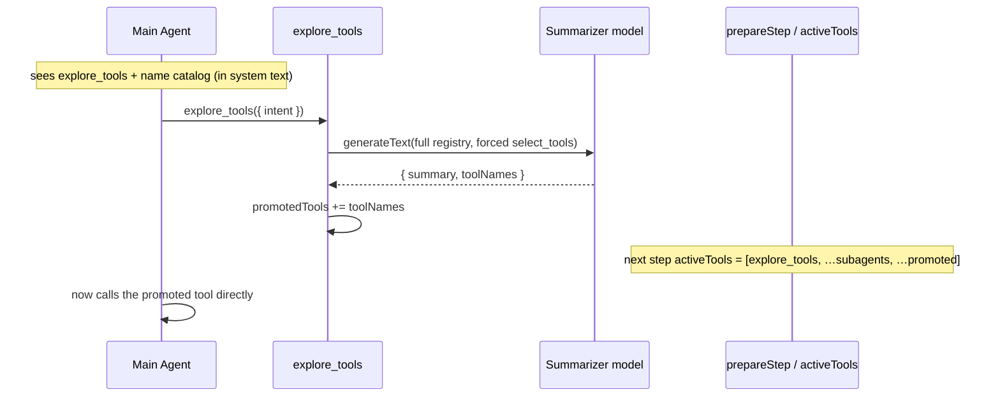

# Progressive tool disclosure (tool exploration)

When many tools are registered (or they churn as the user navigates), sending every tool's full schema on every request bloats context and destabilises any prompt cache. An **opt-in** exploration mode replaces "send all tools" with "discover on demand": the assistant sees only a single always-on `explore_tools` tool plus a catalog of tool *names*, and must call `explore_tools` to make the tools it needs callable.

**How it works:**

1. The full tool registry is still passed to `streamText`, but `activeTools` (returned from `prepareStep` each step) gates which tools are exposed to the model. It starts as `[explore_tools, …subAgentNames]`.
2. `explore_tools.execute` runs the **summarizer** model over the full registry, forcing a `select_tools` tool call to get structured `{ summary, toolNames }`. Selected names are validated against the live registry and added to a `promotedTools` set.
3. `prepareStep` reads `promotedTools` live, so a tool promoted at step *N* is callable at step *N+1* — within the same turn, no re-issue.
4. Promotions **clear on history compaction** (and on reset); the name catalog is always present, so re-exploration is cheap.

**Catalog placement.** The tool-name catalog is folded into the **system text** at stream time (not a separate "tail" message) because the gateway hoists all `system`-role messages into the top-level system block and no provider prompt cache is active today. Revisit tail placement if caching is introduced.

**Opt-in & testing.** Gated by `debug` + `sessionStorage.setItem('agent-chat-explore', '1')`, mirroring the tracing toggle — when off, the chat behaves exactly as before (no `explore_tools`, no `prepareStep`). Sub-agent pseudo-tools are always active and unaffected. Gating limits which tools are *advertised*, not a hard execution barrier.

See [MCP tool integration §8](./mcp-tools.md#8-progressive-tool-disclosure-exploration-mode) for the detailed mechanism.
