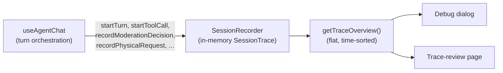

# Tracing

The agent runs almost entirely in the browser: the UI composable orchestrates turns,
sub-agents, tool calls and moderation, and only the raw LLM completions cross the
network (through the [gateway](./gateway.md)). To make that complex client-side flow
inspectable, the UI carries an **always-on, ephemeral tracer** that records everything
a turn does and exposes it in a debug dialog and a dedicated trace-review page.

## The client-side recorder

A single `SessionRecorder` instance is created per chat component and lives for the
lifetime of that conversation. It is wired into the `useAgentChat` composable, which
calls into it at every significant point of a turn. The recorder is purely in-memory:
it accumulates a `SessionTrace` object and never persists it on its own.

What it records:

- **System prompt and tool snapshots** — the active system prompt, plus a snapshot of
  the tool set each time it changes (`snapshotTools` / `toolChanges`), so the trace
  reflects [tool exploration](./tool-exploration.md) enabling/disabling tools mid-conversation.
- **Turns** — each user message (and any hidden context attached to it) starts a turn.
- **Assistant steps** — the messages and `finishReason` of every assistant step.
- **Tool calls** — start/finish of each tool call with its input, output and duration.
- **Sub-agent runs** — when a tool call spawns a [sub-agent](./sub-agents.md), the
  recorder nests the sub-agent's name, system prompt, task, tool snapshot and per-step
  trace under the parent tool call.
- **Moderation decisions** — every [moderation](./moderation.md) verdict
  (`allow` / `block` / `skipped`, with category and reason) via
  `recordModerationDecision`.
- **Compaction** — when history is compacted, the original messages, the summary and
  the before/after character counts.
- **Physical LLM requests** — the actual requests sent to the gateway
  (`recordPhysicalRequest`), keyed by an `x-trace-ctx` header so the main turn,
  sub-agents and the compaction call can be told apart. Each entry carries model role,
  request body, result, token counts (including cache read/write), message/tool counts,
  body size and timings.

From these the recorder derives a flat, time-sorted **trace overview** (and lazily
materialised entry details) used by the viewers. The flow looks like this:

## Debug dialog and reset

The debug dialog (`AgentChatDebugDialog.vue`) reads the live overview from the recorder
and lets an operator:

- **Download** the trace as a JSON file (`downloadTrace`).
- **Open the trace-review page** in a new tab. This stores the trace under a
  `localStorage` handoff key (`writeHandoff`); the review page reads and removes it on
  load. If the trace is too large for the storage quota, it falls back to downloading
  the JSON for manual upload.

The trace is **reset on conversation reset**: `handleReset` calls `recorder.reset()`
(and re-sets the system prompt), so starting a new conversation — or toggling tool
exploration, which forces a reset — clears the accumulated trace. There is no
persistence beyond the current conversation.

## Trace-review page

The review page lives at `/{type}/{id}/trace-review` and is **admin-gated**: on mount
it checks for site admin or an `admin` role on the account and otherwise redirects back
to the chat. It loads a trace either from the `localStorage` handoff (when opened from
the debug dialog) or from a manually uploaded JSON file, rebuilds a `SessionRecorder`
via `SessionRecorder.fromTrace`, and shows the time-sorted trace alongside an
evaluator chat for analysing it.

## Server-side storage

There is currently **no server-side trace storage** in this codebase. Tracing is
entirely client-side and ephemeral: traces live in memory for the duration of a
conversation, can be handed off via `localStorage` to the review tab, or exported as a
JSON file by an operator. The API exposes no trace ingestion route, and the Mongo layer
(`api/src/mongo.ts`) defines no trace collection or TTL index — the only 30-day
retention in the backend applies to account-level [usage](./quotas-usage.md) records,
not to traces. Any consent-gated, opt-in server storage with a retention TTL would be a
future addition and is not implemented here.

## Key files

- `ui/src/traces/session-recorder.ts:116` — `SessionRecorder` class (in-memory trace,
  `recordModerationDecision`, `recordPhysicalRequest`, sub-agent steps, overview).
- `ui/src/composables/use-agent-chat.ts:150` — recorder wiring into turn orchestration
  (the chat component instantiates and feeds the recorder).
- `ui/src/components/AgentChat.vue:150` — recorder instantiation and `recorder.reset()`
  on conversation reset (`handleReset`, line 277).
- `ui/src/components/agent-chat/AgentChatDebugDialog.vue:269` — debug dialog download /
  open-in-trace-review handlers.
- `ui/src/traces/trace-handoff.ts:7` — `writeHandoff` / `readHandoff` / `downloadTrace`
  (localStorage handoff and JSON export).
- `ui/src/pages/[type]/[id]/trace-review.vue:138` — admin-gated trace-review page.
- `api/src/mongo.ts:28` — Mongo collection setup; note the absence of any trace
  collection or TTL index.
