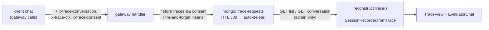

# Tracing

The agent loop runs almost entirely in the browser: the UI composable orchestrates
turns, sub-agents, tool calls and compaction, and only the raw LLM
completions cross the network (through the [gateway](./gateway.md)). Tracing makes that
flow inspectable in two complementary ways:

- a **client-side trace viewer** that reconstructs a session from stored data, and
- **server-side storage** of the physical LLM requests, written by the gateway, opt-in
  per org and consent-gated per user.

There is no longer an always-on in-browser recorder that captures the live conversation:
the gateway is now the single writer, and the stored requests are the single source of
truth for review. The browser only *reconstructs* a `SessionTrace` for display.

## Server-side storage (source of truth)

Storage is **off by default** and only happens when two conditions both hold:

1. **The org enables it.** A `storeTraces` boolean (default `false`) on the account
   settings. Its description states the contract:
   *"conversations of consenting users are stored on the server for 30 days for admin
   review. Each user must explicitly accept."* The gateway reads it from the already
   fetched settings, so no extra request is needed.
2. **The user consents.** The browser stores a 1-year `agent-chat-trace-consent` cookie
   (`yes` / `no`), managed by `ui/src/traces/trace-consent.ts`. The cookie is **not**
   read server-side; instead the client forwards its value as an **`x-trace-consent`
   header** on every gateway call (`traceHeaders` in `use-agent-chat.ts`). The gateway
   stores a request only when `settings.storeTraces === true` **and**
   `x-trace-consent === 'yes'`.

When `storeTraces` is on, the gateway advertises this to the client with a response
header **`x-trace-storage: available`**; the client flips the reactive `traceStorageAvailable`
flag which drives the consent toggle in the chat. Storage only begins on turns sent *after*
the user accepts — the pre-consent turn is never stored.

### What the gateway writes

Inside the completions handler, at the point usage is recorded, the gateway records
**one MongoDB document per physical LLM request**, **fire-and-forget**: the insert runs
in a `try/catch` that swallows all errors so trace recording can never block or fail the
user's response (`recordTraceRequest` in `api/src/traces/service.ts`). Each document is
assembled by the pure `buildTraceRequestDoc` in `api/src/traces/operations.ts` and
captures (see `api/src/traces/types.ts` for the full shape):

- `owner` (the GDPR data controller, mirroring settings/usage), optional `userId` /
  `userName` (omitted for anonymous sessions — data minimisation);
- `conversation.id` (from the `x-trace-conversation` header, a stable id generated once
  per `useAgentChat` session);
- `contextId` / `contextKind` / optional `agent` — parsed from the `x-trace-ctx` header
  (`turn:<uid>` / `sub:<name>:<idx>:<uid>` / `compaction:<uid>`) by `parseContextId`,
  preserving sub-agent identity and ordering that the request body alone does not carry;
- `modelRole` (`assistant` / `tools` / `summarizer` / `evaluator`),
  resolved `provider` (name + type) and resolved `request.model`;
- optional `moderation` — the gateway-side [moderation](./moderation.md) verdict
  (`action`, `category`, `reason`, `latencyMs`, `failOpen`), embedded when the check had
  settled by the time the request was recorded (untrusted callers only);
- `request.body` — the raw OpenAI request body (system + messages + tools) — plus derived
  `messageCount` / `toolCount` / `bodyChars`;
- `response` (assistant content, tool calls, finish reason), `usage` (input/output and
  optional cache read/write tokens), and `timing` (duration, optional time-to-first-chunk);
- `createdAt` — a BSON `Date` that is **both** the ordering key and the TTL target.

The document model is intentionally aligned in spirit with the OpenTelemetry **GenAI
semantic conventions** (`gen_ai.*`): one stored physical request maps to one GenAI
inference span (`conversation.id`, `operation.name: 'chat'`, `request.model`,
`provider.name`, `response.finishReason`, `usage.*`, sub-agent `agent.name`). The stored
field names stay bespoke (`request` / `response` / `usage` / `provider`) rather than the
literal `gen_ai.*` keys, keeping a future export-to-OTel feature a thin mapper while
adding no cost now.

### Upstream physical-request capture

Each stored document carries an optional **`upstream`** field that records the raw
gateway→provider exchange — the actual HTTP call the gateway made to the model provider:

- `upstream.request.url` — the provider endpoint URL;
- `upstream.request.body` — the serialised request body (the model payload sent to the
  provider, e.g. the OpenAI `/v1/chat/completions` JSON body);
- `upstream.response.status` — the HTTP status code returned by the provider;
- `upstream.response.raw` — the raw response body as a string (the streamed SSE text or
  JSON, exactly as received), **capped at 256 KB** (`UPSTREAM_RAW_CAP`). When the raw
  response exceeds the cap it is truncated and the document sets `upstream.response.truncated = true`;
  `upstream.response.rawChars` records the pre-truncation byte count.

**Request headers are never captured** — this prevents API-key leakage.

Capture is a passthrough `capturingFetch` wrapper injected into `createModel` (`api/src/providers/service.ts`).
It is only active when both `storeTraces` and user consent are on — the same two conditions that
gate the document write.  Only the **main model** (assistant / tools / summarizer / evaluator roles)
is captured; the moderator model is excluded.

The capture is exposed to the evaluator via the **`getUpstreamExchange`** tool
(`api/src/evaluator/operations.ts`): given a physical-request index it returns the stored
`upstream.request` and `upstream.response` (raw bytes included). The trace-viewer surfaces this
in a collapsible **"Upstream (provider)"** panel, visible to account admins only.

### Collection, retention and GDPR controls

Documents live in the **`trace-requests`** MongoDB collection. Retention is a **fixed
30-day TTL**: a TTL index on `createdAt` with `expireAfterSeconds = RETENTION_SECONDS`
(`30 * 24 * 60 * 60`). Mongo auto-deletes expired documents; no application cleanup job
is needed.

Reads and deletes are an **admin-only** CRUD layer, every route guarded by
`assertAccountRole(session, owner, 'admin')`:

- `GET /traces/:type/:id` — paginated, newest-first list of conversations
  (`conversationId`, `preview` of the first user message, `userName`, `userId`,
  `startedAt`, `requestCount`), via a Mongo aggregation grouping by `conversation.id`.
- `GET /traces/:type/:id/:conversationId` — the raw stored requests for one conversation,
  ordered by `createdAt`.
- `GET /traces/conversation/:conversationId` — fetch a conversation by its globally
  unique id, resolving the owning account *from the stored documents* and authorizing
  against it (used by the account-less review route). Registered **before** the
  `/:type/:id` param route so the literal `conversation` segment is not shadowed.
- `DELETE /traces/:type/:id/:conversationId` — erase one conversation.
- `DELETE /traces/:type/:id?userId=…` — erase all of one user's traces (GDPR right to
  erasure).

## The client-side trace viewer

The browser does not record traces during a chat; it **reconstructs** one at view time.
The pure function `reconstructTrace(requests)` in `ui/src/traces/reconstruct-trace.ts`
takes the ordered stored requests for a conversation and rebuilds a full `SessionTrace`:

- maps each stored request 1:1 into `physicalRequests[]` (model role, body, token/timing
  entries);
- takes the `systemPrompt` from the first request's system message;
- derives `toolSnapshots` / `toolChanges` by diffing `request.tools` across requests
  (reflecting [tool exploration](./tool-exploration.md) enabling/disabling tools);
- rebuilds `turns → steps → toolCalls / tool results` by diffing successive
  `request.messages` and reading each `response`;
- groups sub-agent requests by `contextId` into [sub-agent](./sub-agents.md) blocks;
- maps embedded `moderation` verdicts to [moderation](./moderation.md) entries and the
  `compaction` context to a compaction entry.

The output feeds `SessionRecorder.fromTrace()` in `ui/src/traces/session-recorder.ts`.
`SessionRecorder` is now trimmed to `fromTrace` plus the read-only accessors the viewer
needs (`getTraceOverview`, which sorts entries by timestamp into a flat overview); the
old live-capture methods that fed an in-memory trace during chat have been removed. The
single source of truth means there is **no duplicate upload**: the data the viewer shows
is exactly what the gateway already stored.

Known fidelity gap: a moderation verdict that has not settled when the request is
recorded (and a late block, which aborts before any finish event) appears only in the
`moderation-events` collection — events, not traces, are the authoritative moderation
record (see [moderation](./moderation.md)).

## Viewing

Two pages consume the stored traces, both admin-gated:

- **Activity page** — `ui/src/pages/[type]/[id]/index.vue`, route
  `/:type/:id`. Read-only, for any admin of the account (`isAdmin`:
  site-admin or `admin` role on the account, redirects to chat otherwise). It shows a
  read-only configuration/limits summary and a paginated list of recent stored
  conversations (`GET /traces/:type/:id`), with per-row delete and per-user erase
  actions; each row links to the review page.
- **Trace review page** — `ui/src/components/TraceReview.vue`, mounted by the
  account-scoped route page `ui/src/pages/[type]/[id]/traces/[convId].vue` (route
  `/:type/:id/traces/:convId`) and a superadmin variant under `admin/`. It fetches
  `GET /traces/conversation/:convId` (which resolves the owner and asserts the requester is
  an admin of it), runs `reconstructTrace` → `SessionRecorder.fromTrace`, and renders the
  two-pane `TraceView` + `EvaluatorChat` for analysis. The chat debug dialog surfaces a
  link to the current conversation's review only when the viewer is an admin and trace
  storage is available and consented.
  In the superadmin (`admin/`) variant the evaluator (and its summarizer tool) run
  against the account configured by `config.evaluatorAccount` — advertised via the
  admin `/info` route (`evaluatorAccount` / `evaluatorAvailable`) — so reviewing a
  trace never consumes the reviewed account; the chat is disabled with a hint when
  that source account is unset, lacks an assistant **or** evaluator model (the
  gateway refuses any account without an assistant), or admin mode is off. The
  source account is consumed like a normal session — its quotas apply and its usage
  is recorded under the superadmin's id. Operators should not add `admin` to the
  source account's moderation categories, or superadmin review messages would be
  moderated.

### Comparing two traces

The review page accepts an optional `?compare=<conversationId>` query param. A
"Compare with…" picker lists the account's other stored conversations (reusing the
paginated `GET /traces/:type/:id` list) and sets the param. When present, the page
fetches and reconstructs a second `SessionRecorder` and renders it beside the first
(two `TraceView`s + a collapsible `EvaluatorChat`). There is no built-in diff — the
two traces are shown raw, side by side. The single evaluator chat can query either
trace: in compare mode each trace-scoped evaluator tool takes a required `trace: 'A' | 'B'`
parameter and the evaluator system prompt gains a compare preamble. Comparison is
restricted to traces of the same owner (the evaluator is owner-scoped); no new API
endpoints are introduced.

> Historical note: an earlier always-on in-browser recorder, a chat "trace" tab, and an
> upload/`localStorage`-handoff review page (the now-removed
> `ui/src/pages/[type]/[id]/trace-review.vue`) have been replaced by the server-stored,
> reconstruct-at-view model described above.
