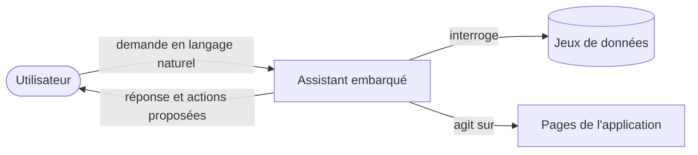

## Introduction

data-fair/agents est un service d'assistant conversationnel embarqué dans les applications de la plateforme data-fair, aussi bien les interfaces d'administration que les portails de données publics. Il donne accès à plusieurs fournisseurs de grands modèles de langage — OpenAI, Anthropic, Google, Mistral, Scaleway, ou tout serveur compatible avec l'API OpenAI — à travers une passerelle unique, sans que l'application hôte ait à gérer elle-même ces intégrations.

Au-delà de la conversation, l'assistant pratique l'appel d'outils : il peut interroger un jeu de données, naviguer dans l'application ou récupérer des métadonnées en réponse à une demande formulée en langage naturel. C'est cette capacité à agir, et pas seulement à répondre, qui le distingue d'un simple agent de discussion.

Ce document s'adresse aux intégrateurs qui embarquent le service et aux équipes sécurité qui l'évaluent. Il présente l'architecture, les protocoles d'échange, les scénarios d'intégration et la posture de sécurité, de façon synthétique et sans renvoyer au détail du code.
