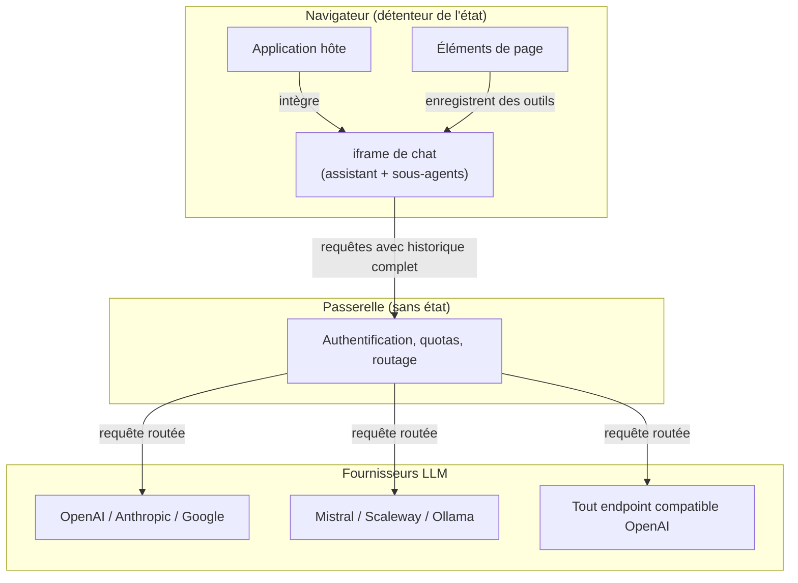

## Architecture

Le service repose sur quatre choix structurants : une **passerelle sans état** qui relaie les requêtes vers les fournisseurs, une **orchestration entièrement côté navigateur**, un **embarquement par iframe** où les outils sont découverts dynamiquement, et une **configuration multi-fournisseurs** propre à chaque compte.

### Passerelle sans état

La **passerelle** est le seul composant serveur. Elle expose une interface compatible OpenAI et se limite à recevoir une requête, vérifier l'identité et les droits de l'appelant, appliquer les quotas, puis router la requête vers le fournisseur configuré pour le compte. Son fonctionnement ne dépend d'aucun état de conversation côté serveur : chaque requête porte l'intégralité du contexte, que le navigateur reconstruit à chaque tour. (Un enregistrement de traces côté serveur existe, mais c'est une fonction distincte, optionnelle et soumise à consentement ; voir la section Sécurité.)

Ce choix rend le service horizontalement extensible, puisque n'importe quelle instance traite n'importe quelle requête, sans session collante ni affinité ; en contrepartie, la complexité est reportée vers le client, qui assume l'orchestration et la construction du contexte.

### Orchestration côté navigateur

L'intelligence d'orchestration vit dans le navigateur. Un **assistant** dialogue avec l'utilisateur, interprète ses demandes et décide ce qu'il traite directement ou délègue. Les tâches outillées (interroger un jeu de données, vérifier une configuration, naviguer) sont confiées à des **sous-agents** : des instances de modèle distinctes, chacune dotée d'un périmètre d'outils restreint.

Un sous-agent peut enchaîner plusieurs appels d'outils, puis ne restitue à l'assistant qu'un résumé compact de son travail. Cette réduction de contexte est délibérée : l'assistant ne voit jamais le détail des échanges internes, ce qui garde la conversation principale lisible et limite les coûts. Ce patron orchestrateur-travailleur compose des comportements riches à partir d'agents simples et ciblés.

### Embarquement et découverte d'outils

L'interface est rendue dans une iframe isolée que l'application hôte intègre dans ses pages. Les outils disponibles ne sont pas figés dans le service : ils sont fournis à l'exécution par les **éléments de page** de l'hôte (un tableau, un formulaire, un graphique) qui déclarent leurs outils selon le standard **WebMCP**, avec nom, description et paramètres. Ces définitions sont partagées entre frames par une couche de transport BroadcastChannel ; l'assistant les agrège et peut invoquer les outils correspondants.

L'assistant n'a donc aucune connaissance codée en dur des applications : il découvre les capacités selon le contexte de la page. Toute nouvelle application peut exposer ses outils sans toucher au service, et l'isolation de l'iframe interdit tout accès direct au DOM de l'hôte : les échanges passent uniquement par un protocole de messages défini.

### Fournisseurs et rôles de modèles

Un même déploiement adresse plusieurs fournisseurs simultanément. Chaque compte configure ses fournisseurs et leurs clés (chiffrées au repos), puis affecte un modèle à chacun des cinq rôles fonctionnels :

| Rôle | Responsabilité |
|---|---|
| Assistant | Fil conversationnel de haut niveau |
| Outils | Exécution des appels d'outils enchaînés par les sous-agents |
| Résumeur | Synthèse compacte du travail des sous-agents |
| Évaluateur | Contrôle qualité et raisonnement approfondi |
| Modérateur | Filtrage des messages du trafic non fiable (utilisé en interne par la passerelle, voir la section Sécurité) |

Cette séparation permet d'affecter un modèle rapide et économique aux rôles sensibles à la latence et au coût, et un modèle plus puissant aux tâches de raisonnement. Comme la passerelle normalise les échanges, le code d'orchestration ne dépend d'aucun fournisseur : passer d'un service hébergé à un serveur local ne demande qu'une reconfiguration du compte.

### Maîtrise du contexte, de la latence et des coûts

La taille du contexte transmis au modèle est le principal levier sur la latence et le coût ; plusieurs mécanismes la contiennent. Les **sous-agents ciblés** absorbent les échanges outillés volumineux et ne restituent qu'un résumé compact : les gros volumes de données, comme de longs JSON de résultats, ne remontent jamais dans le contexte de l'assistant principal. Une **compaction automatique** condense l'historique lorsqu'il s'allonge, pour rester sous les limites de fenêtre et éviter une inflation du coût au fil de la conversation. Enfin, les **descriptions d'outils sont volontairement compactes**, et un outil expérimental d'**exploration des outils** permet à l'agent de ne charger le détail d'un outil qu'au moment où il en a besoin, plutôt que de porter en permanence l'ensemble des descripteurs.

Ces choix expliquent pourquoi le service ne s'engage pas sur des temps de réponse chiffrés : la latence dépend du modèle retenu, de la complexité de la question et de la taille des jeux de données interrogés, trop hétérogènes pour une mesure unique et représentative. L'effort porte donc sur la réduction structurelle du contexte et sur le choix d'un modèle adapté à chaque rôle, plutôt que sur une garantie de délai.
