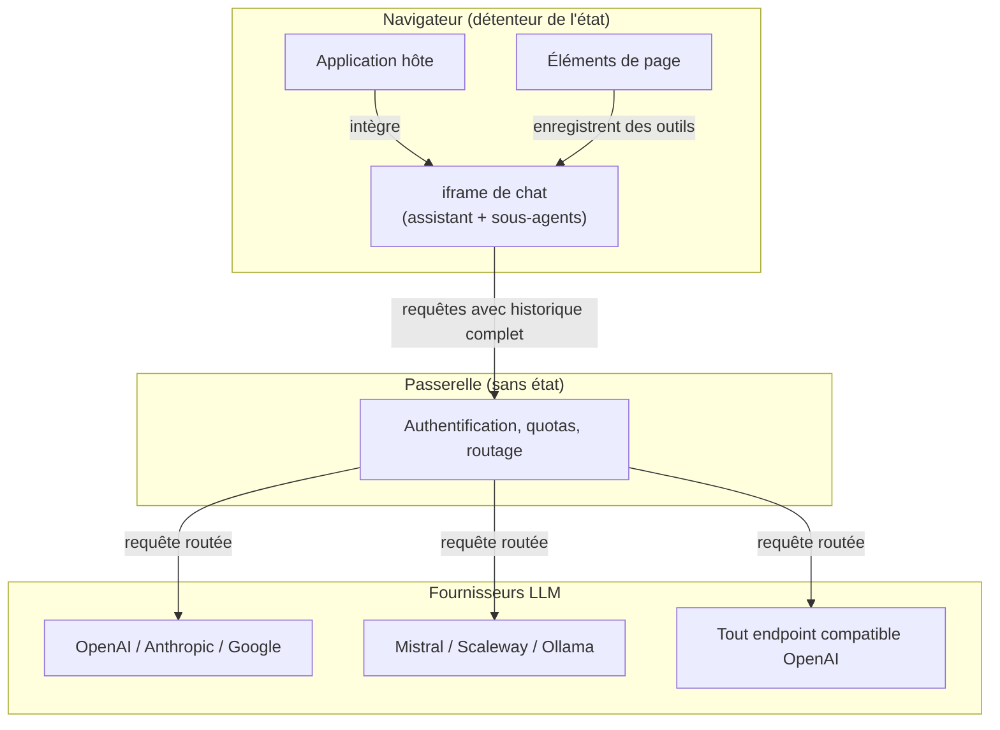
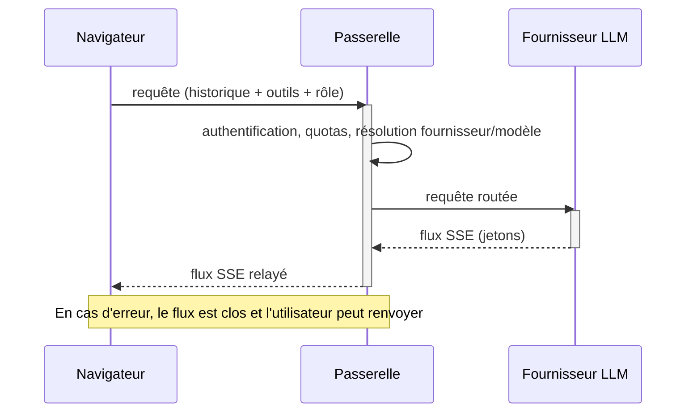
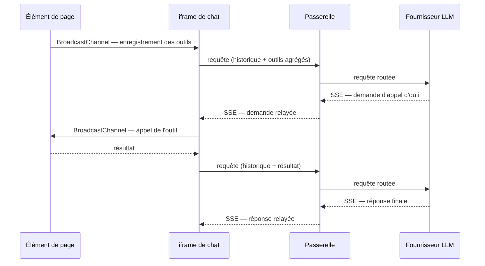

## Architecture

Le service repose sur quatre principes structurants :

- **Passerelle sans état** — un unique composant serveur relaie les requêtes vers les fournisseurs, sans rien mémoriser de la conversation.
- **Orchestration côté navigateur** — un assistant et ses sous-agents décident et délèguent depuis le client, qui détient tout l'état.
- **Découverte dynamique des outils** — rien n'est codé en dur dans le service ; les éléments de la page hôte déclarent leurs outils à l'exécution.
- **Configuration multi-fournisseurs** — chaque compte choisit ses fournisseurs et affecte un modèle à chaque rôle.

Deux protocoles portent l'ensemble des échanges, détaillés dans les sections qui suivent :

- une **passerelle SSE compatible OpenAI**, entre le navigateur et les fournisseurs ;
- une **découverte d'outils WebMCP / BroadcastChannel**, entre l'iframe de chat et les éléments de la page hôte.

### Passerelle sans état

La **passerelle** est le seul composant serveur. Elle expose une interface compatible OpenAI : recevoir une requête, vérifier l'identité et les droits de l'appelant, appliquer les quotas, puis router la requête vers le fournisseur configuré pour le compte. Aucun état de conversation n'est conservé côté serveur — chaque requête porte l'intégralité du contexte, que le navigateur reconstruit à chaque tour. Le service est ainsi horizontalement extensible : n'importe quelle instance traite n'importe quelle requête, sans session collante. (Un enregistrement de traces existe, mais c'est une fonction distincte, optionnelle et soumise à consentement ; voir la section Sécurité.)

Concrètement, à chaque tour, l'assistant (ou un sous-agent) envoie une requête de complétion en *streaming* via Server-Sent Events : le navigateur reçoit les jetons au fil de leur production, pour un affichage progressif. La requête porte l'historique complet (appels d'outils et résultats compris), la liste des outils disponibles pour ce tour, et le **rôle** de modèle souhaité — jamais un modèle nommé. La passerelle résout le couple (fournisseur, modèle) selon la configuration du compte, de sorte que clés d'API et identifiants de modèles restent côté serveur. En cas d'erreur, le flux est clos sans reprise ni bascule de secours, et l'utilisateur peut renvoyer son message.

### Orchestration côté navigateur

Ce positionnement découle d'un choix premier : **exécuter les outils côté client**, dans la session de l'utilisateur et avec ses seuls droits (la section Sécurité en détaille les bénéfices). Dès lors que les outils vivent dans le navigateur, y placer aussi l'orchestration devient le choix naturel : la boucle « appel d'outil → résultat → tour suivant » se déroule au plus près des outils, sans avoir à introduire un protocole d'échange supplémentaire entre un orchestrateur serveur et des outils restés côté client. La passerelle peut alors se limiter à exposer, de façon standard, les capacités IA de la stack, sans embarquer de logique d'agent.

L'intelligence d'orchestration vit donc dans le navigateur. Un **assistant** dialogue avec l'utilisateur et décide ce qu'il traite directement ou délègue. Les tâches outillées (interroger un jeu de données, vérifier une configuration, naviguer) sont confiées à des **sous-agents** : des instances de modèle distinctes, chacune dotée d'un périmètre d'outils restreint.

Un sous-agent enchaîne plusieurs appels d'outils, puis ne restitue à l'assistant qu'un résumé compact. Cette réduction de contexte est délibérée : l'assistant ne voit jamais le détail des échanges internes, ce qui garde la conversation principale lisible et limite les coûts.

### Embarquement et découverte des outils

L'interface est rendue dans une iframe isolée que l'application hôte intègre dans ses pages ; l'isolation interdit tout accès direct au DOM de l'hôte. Les outils ne sont pas figés dans le service : ils sont fournis à l'exécution par les **éléments de page** de l'hôte (un tableau, un formulaire, un graphique) qui déclarent leurs outils selon le standard **WebMCP**, déclinaison web du *Model Context Protocol*. L'assistant n'a donc aucune connaissance codée en dur des applications : il découvre les capacités selon le contexte de la page, et toute nouvelle application peut exposer ses outils sans toucher au service.

WebMCP restant limité à une seule page, le service ajoute par-dessus une couche de transport fondée sur le **BroadcastChannel** natif, qui partage ces définitions entre contextes de même origine (frames ou onglets du même domaine). Au démarrage et à chaque changement de page, l'iframe émet un message de découverte ; les éléments actifs répondent avec leurs descripteurs (nom, description, schéma de paramètres), et la liste se met à jour au gré de la navigation. Lorsque le modèle appelle un outil, la passerelle relaie la demande, que l'iframe route vers le bon fournisseur avant de réintégrer le résultat dans l'historique.

### Fournisseurs et rôles de modèles

Un même déploiement adresse plusieurs fournisseurs simultanément. Chaque compte configure ses fournisseurs et leurs clés (chiffrées au repos), puis affecte un modèle à chacun des cinq rôles fonctionnels :

| Rôle | Responsabilité |
|---|---|
| Assistant | Fil conversationnel de haut niveau |
| Outils | Exécution des appels d'outils enchaînés par les sous-agents |
| Résumeur | Synthèse compacte du travail des sous-agents |
| Évaluateur | Contrôle qualité et raisonnement approfondi |
| Modérateur | Filtrage des messages du trafic non fiable (utilisé en interne par la passerelle, voir la section Sécurité) |

Cette séparation permet d'affecter un modèle rapide et économique aux rôles sensibles à la latence et au coût, et un modèle plus puissant aux tâches de raisonnement. Comme la passerelle normalise les échanges, le code d'orchestration ne dépend d'aucun fournisseur : passer d'un service hébergé à un serveur local ne demande qu'une reconfiguration du compte.

### Maîtrise du contexte, de la latence et des coûts

La taille du contexte transmis au modèle est le principal levier sur la latence et le coût ; trois mécanismes la contiennent. Les **sous-agents ciblés** absorbent les échanges outillés volumineux et ne remontent qu'un résumé, si bien que les gros volumes de données (longs JSON de résultats) n'atteignent jamais le contexte de l'assistant. Une **compaction automatique** condense l'historique lorsqu'il s'allonge, pour rester sous les limites de fenêtre. Enfin, les **descriptions d'outils restent compactes**, et un mécanisme expérimental d'**exploration des outils** ne charge le détail d'un outil qu'au moment où l'agent en a besoin.

Le service ne s'engage donc pas sur des temps de réponse chiffrés : la latence dépend du modèle, de la complexité de la question et de la taille des jeux de données interrogés, trop hétérogènes pour une garantie unique. L'effort porte sur la réduction structurelle du contexte et le choix d'un modèle adapté à chaque rôle.
