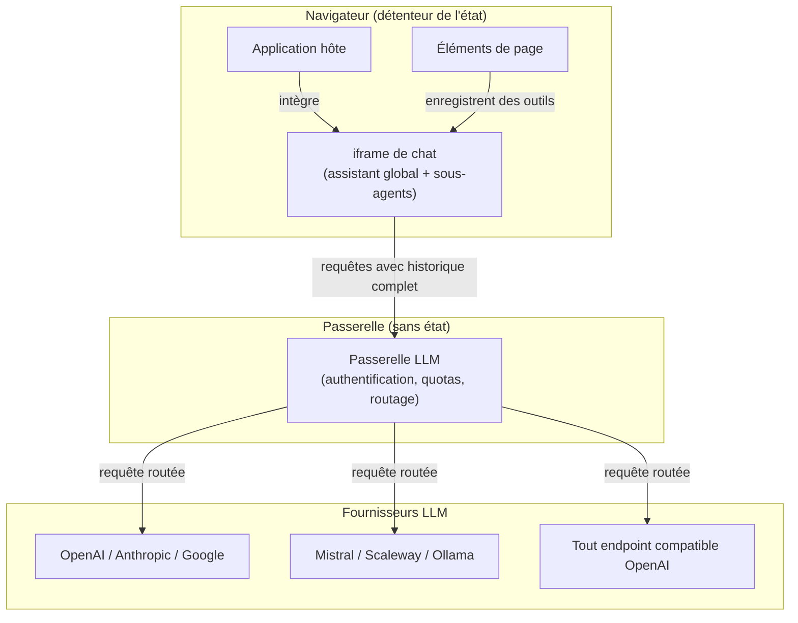

# Architecture d'ensemble

Ce chapitre décrit comment les quatre principes structurants identifiés en introduction s'articulent concrètement au sein du service. Il s'adresse à ceux qui souhaitent comprendre les flux de données, les responsabilités de chaque composant et les choix d'architecture qui en découlent — sans entrer dans le détail d'implémentation.

## Vue d'ensemble

## Passerelle sans état

La passerelle est le seul composant serveur du service. Elle expose une interface compatible avec la spécification OpenAI, ce qui lui permet d'être adressée par n'importe quel client standard. Son rôle est délibérément limité : recevoir une requête, vérifier l'identité et les droits de l'appelant, appliquer les quotas, puis router la requête vers le fournisseur LLM configuré pour le compte concerné.

**Aucun état de conversation n'est conservé côté serveur.** Chaque requête arrivant à la passerelle contient l'intégralité de l'historique de la conversation, que le navigateur reconstruit et transmet à chaque tour. La passerelle traite donc chaque requête de manière autonome, sans dépendance à un état interne persistant.

Ce choix a deux conséquences directes :

- **Montée en charge horizontale** : n'importe quelle instance de la passerelle peut traiter n'importe quelle requête. Il n'y a pas de session à coller, pas d'affinité à gérer. Le déploiement de plusieurs instances derrière un répartiteur de charge est transparent.
- **Déport de la complexité côté client** : l'orchestration, la gestion des tours de conversation, la construction du contexte envoyé au modèle et la coordination des sous-agents sont entièrement pris en charge par le navigateur. Le serveur reste simple et prévisible.

## Orchestration côté navigateur

L'intelligence d'orchestration réside dans le navigateur de l'utilisateur, pas sur le serveur. Deux niveaux de traitement s'y déroulent.

### L'assistant global

L'**assistant global** est l'interlocuteur direct de l'utilisateur. Il maintient le fil conversationnel de haut niveau, interprète les demandes en langage naturel et décide quelles tâches peuvent être traitées directement et lesquelles nécessitent l'intervention de **sous-agents** spécialisés.

### Les sous-agents

Les **sous-agents** sont des instances LLM distinctes, chacune dotée d'un périmètre d'outils précis. Lorsque l'**assistant global** identifie une tâche outillée — interroger un jeu de données, vérifier une configuration, naviguer dans l'application — il délègue cette tâche à un sous-agent approprié. Ce sous-agent exécute les appels d'outils nécessaires, potentiellement en plusieurs étapes, puis restitue un **résumé compact** de son travail à l'assistant global.

Ce résumé constitue une réduction de contexte délibérée : l'**assistant global** n'a pas besoin de voir l'intégralité des échanges internes du sous-agent. Il reçoit uniquement le résultat utile, ce qui maintient le contexte de la conversation principale dans des proportions raisonnables et limite les coûts de traitement.

Ce patron — dit orchestrateur-travailleur — permet de composer des comportements complexes à partir d'agents simples et ciblés, tout en conservant une conversation principale cohérente et lisible pour l'utilisateur.

## Modèle d'embarquement par iframe

L'interface de chat est rendue dans une **iframe** isolée, intégrée par l'application hôte dans ses propres pages. Ce choix d'isolation permet de livrer l'assistant sous forme de composant autonome, sans que l'application hôte n'ait à gérer la logique de conversation ni les dépendances du service.

### Découverte dynamique des outils

Les outils que l'**assistant global** et les **sous-agents** peuvent utiliser ne sont pas définis une fois pour toutes dans le service : ils sont fournis dynamiquement par les **éléments de page** de l'application hôte.

Un **élément de page** est un composant de l'application parente — un tableau de données, un formulaire de configuration, un graphique — qui s'enregistre auprès de l'assistant via un canal de communication inter-iframe. Cet enregistrement décrit les outils disponibles : leur nom, leurs paramètres et leur description sémantique. L'assistant incorpore ces outils dans son contexte et peut les invoquer en réponse aux demandes de l'utilisateur.

Ce mécanisme a plusieurs avantages :

- **Couplage lâche** : l'assistant n'a aucune connaissance codée en dur des applications hôtes. Il découvre les capacités disponibles au moment de l'exécution, en fonction du contexte courant de la page.
- **Extensibilité** : toute nouvelle application de la plateforme peut exposer ses propres outils sans modifier le service d'agents.
- **Isolation** : l'iframe garantit que le service ne peut pas accéder directement au DOM de l'application hôte ; toute interaction passe par le protocole de messages explicitement défini.

## Multi-fournisseurs et rôles de modèles

Un même déploiement du service peut adresser plusieurs **fournisseurs LLM** simultanément. Chaque compte — utilisateur individuel ou organisation — configure ses propres fournisseurs et leurs clés d'accès, lesquelles sont chiffrées au repos.

### Rôles fonctionnels

Au-delà du choix du fournisseur, les administrateurs assignent des modèles à des **rôles fonctionnels** distincts :

| Rôle | Responsabilité |
|---|---|
| **Assistant** | Interface conversationnelle principale, gestion du fil de haut niveau |
| **Outils** | Exécution des appels d'outils enchaînés par les sous-agents |
| **Résumeur** | Distillation compacte du travail des sous-agents |
| **Évaluateur** | Vérification de la logique et des sorties pour la qualité et la sécurité |
| **Modérateur** | Classification des messages entrants (contenu, injection de prompt, hors périmètre) |

Cette séparation permet d'affecter un modèle économique et rapide aux rôles critiques en latence (modération, résumé), et un modèle plus puissant aux rôles exigeant un raisonnement profond (évaluation, assistant principal). Le rapport qualité/coût peut ainsi être ajusté finement sans modifier l'architecture du service.

### Indépendance vis-à-vis des fournisseurs

Parce que la passerelle expose une interface standardisée en interne, les composants d'orchestration côté navigateur n'ont aucune dépendance directe envers un fournisseur particulier. Un changement de fournisseur ou un basculement vers un serveur local (Ollama, vLLM, LM Studio) ne nécessite aucune modification du code d'orchestration — uniquement une reconfiguration des fournisseurs dans les paramètres du compte.
