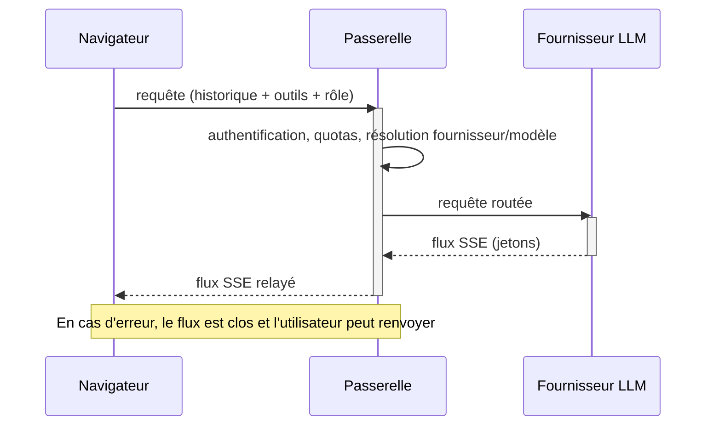
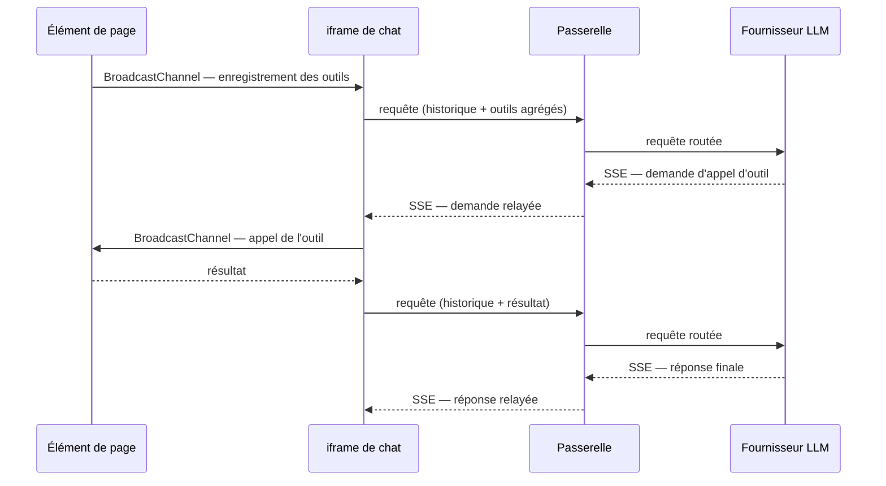

## Protocoles et flux de données

### Passerelle SSE compatible OpenAI

À chaque tour, l'assistant (ou un sous-agent) envoie à la passerelle une requête de complétion en *streaming* via Server-Sent Events : le navigateur reçoit les jetons au fil de leur production, pour un affichage progressif. La requête porte l'historique complet de la conversation — appels d'outils et résultats compris —, la liste des outils disponibles pour ce tour, et le rôle de modèle souhaité.

Le client demande un rôle fonctionnel (assistant, outils, résumeur, évaluateur), jamais un modèle nommé : la passerelle authentifie le jeton de session, vérifie les quotas, résout le couple (fournisseur, modèle) selon la configuration du compte, puis relaie le flux. Les clés d'API et les identifiants de modèles restent ainsi entièrement côté serveur. En cas d'erreur, la passerelle applique une politique d'échec rapide : le flux est clos sans reprise automatique ni bascule vers un fournisseur de secours, et l'utilisateur peut renvoyer son message.

### Déclaration des outils (WebMCP) et découverte par BroadcastChannel

Les outils sont déclarés selon le standard **WebMCP**, déclinaison web du *Model Context Protocol* (MCP), qui permet aux éléments d'une page d'exposer des outils à un agent. Par-dessus, le service ajoute une couche de transport fondée sur le **BroadcastChannel** natif du navigateur, qui partage et fait découvrir ces définitions d'outils entre contextes voisins de même origine (frames ou onglets du même domaine) — ce que WebMCP seul, limité à une page, ne permet pas.

Au démarrage et à chaque changement de page, l'iframe émet un message de découverte ; les éléments de page actifs répondent avec leurs descripteurs (nom, description, schéma de paramètres), que l'iframe agrège. Les fournisseurs d'outils apparaissent et disparaissent au gré de la navigation : en quittant une page, ses éléments se désenregistrent et la liste est mise à jour au tour suivant. Lorsque le modèle décide d'appeler un outil, la passerelle relaie la demande d'appel, que l'iframe route vers le bon fournisseur d'outil avant de réintégrer le résultat dans l'historique.

