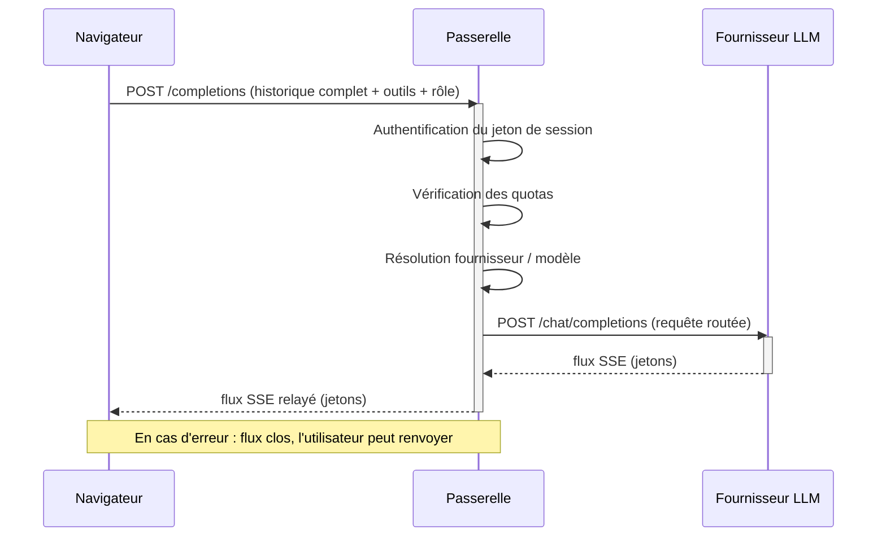
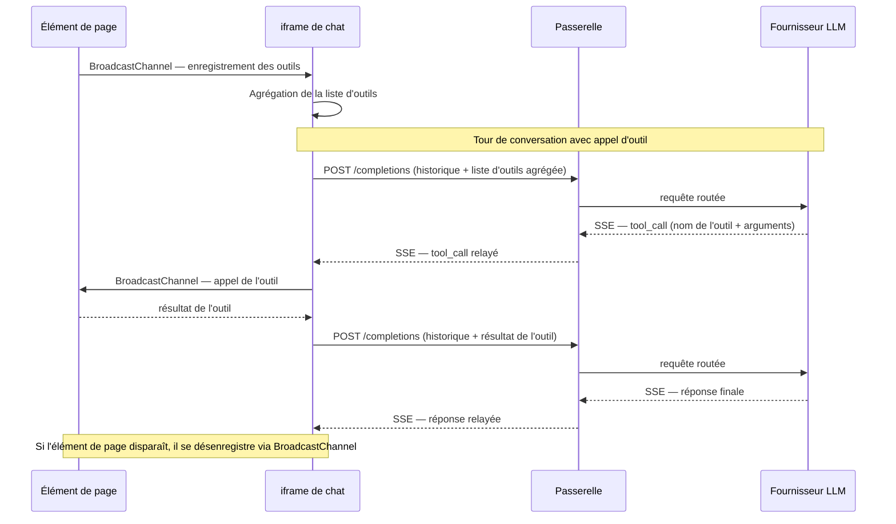

# Protocoles et flux de données

Ce chapitre décrit les protocoles concrets mis en œuvre entre les différents composants du service : comment les messages transitent, comment les outils sont découverts et invoqués, comment l'**iframe** de chat et l'application hôte se coordonnent, et comment une session démarre. L'objectif est de donner aux intégrateurs et aux experts en sécurité une vision précise des flux sans entrer dans le détail du code source.

## Passerelle SSE compatible OpenAI

L'**assistant global** (ou un sous-agent) émet, à chaque tour de conversation, une requête de complétion de chat en *streaming* vers la **passerelle**. Le protocole de transport utilisé est **Server-Sent Events (SSE)** : le navigateur ouvre une connexion HTTP longue durée et reçoit les jetons du modèle au fur et à mesure de leur production, ce qui permet un affichage progressif sans attendre la fin de la génération.

### Ce que le client envoie

Chaque requête contient :

- l'**historique complet** de la conversation (tous les tours, y compris les appels d'outils et leurs résultats) — aucun état n'est conservé côté serveur ;
- la **liste des outils disponibles** pour ce tour (fournie dynamiquement par les **éléments de page** actifs) ;
- le **rôle de modèle** souhaité (voir section suivante).

### Ce que la passerelle fait

Avant de relayer la requête au **fournisseur LLM**, la **passerelle** effectue, dans l'ordre :

1. **Authentification** : vérification du jeton de session de l'utilisateur ;
2. **Contrôle des quotas** : vérification que l'appelant n'a pas dépassé ses limites (globales, journalières, hebdomadaires, mensuelles) selon son rôle dans le compte ;
3. **Résolution du fournisseur et du modèle** : traduction du rôle fonctionnel en un couple (fournisseur concret, identifiant de modèle) selon la configuration du compte ;
4. **Relais du flux** : transmission de la requête au **fournisseur LLM** retenu et renvoi du flux SSE de jetons au navigateur.

### Comportement en échec rapide (*fail-fast*)

La **passerelle** n'effectue **aucune reprise automatique** ni **aucune bascule vers un fournisseur de secours** en cas d'erreur. Si le **fournisseur LLM** retourne une erreur ou si la connexion est interrompue, le flux SSE est immédiatement clos et un message d'erreur est transmis au navigateur. L'utilisateur peut alors renvoyer son message pour relancer un nouveau tour. Ce choix de conception garantit un comportement prévisible et évite toute ambiguïté sur l'état de la conversation.

### Diagramme de séquence

## Rôles de modèles plutôt que noms de modèles

Le navigateur ne connaît jamais les identifiants de modèles concrets ni les clés d'accès aux **fournisseurs LLM**. Il demande uniquement un **rôle fonctionnel** parmi les cinq définis :

| Rôle | Usage |
|---|---|
| **assistant** | Interface conversationnelle principale |
| **outils** | Exécution des chaînes d'appels d'outils par les sous-agents |
| **résumeur** | Distillation compacte des résultats de sous-agents |
| **évaluateur** | Vérification de la qualité et de la sécurité des sorties |
| **modérateur** | Classification des messages entrants (contenu, injection de prompt) |

La **passerelle** traduit ce rôle en un couple (fournisseur, modèle) côté serveur, selon la configuration du compte. Cette indirection présente plusieurs avantages pour les intégrateurs et les responsables sécurité :

- **Les clés d'API ne transitent jamais dans le navigateur.** Elles sont stockées chiffrées côté serveur et ne sont jamais exposées au client.
- **Les identifiants de modèles sont opaques pour le client.** Un changement de modèle ou de fournisseur ne nécessite aucune modification du code de l'application hôte.
- **Le contrôle reste côté administrateur.** La configuration des rôles appartient entièrement aux administrateurs du compte, pas aux développeurs des applications intégrées.

## Découverte d'outils via BroadcastChannel (inspiré de MCP)

Les outils disponibles pour l'**assistant global** et les **sous-agents** ne sont pas définis statiquement dans le service : ils sont fournis dynamiquement par les **éléments de page** de l'application hôte qui s'exécutent dans des contextes voisins de même origine (frames ou onglets du même domaine).

### Mécanisme de découverte

Le canal de communication utilisé est le **BroadcastChannel** du navigateur, un mécanisme natif permettant aux contextes d'exécution de même origine de s'échanger des messages sans coordination centrale. Ce mécanisme s'inspire des principes du protocole MCP (*Model Context Protocol*) pour la description structurée des outils.

Au démarrage — et à chaque changement de page dans l'application hôte —, l'**iframe** de chat émet un message de découverte. Les **éléments de page** actifs répondent en envoyant leurs descripteurs d'outils : nom, description sémantique et schéma des paramètres. L'iframe agrège ces réponses en une liste unifiée, qui est transmise à chaque requête vers la **passerelle**.

Les fournisseurs d'outils peuvent **apparaître et disparaître dynamiquement** : lorsqu'un utilisateur navigue vers une autre page de l'application hôte, les anciens **éléments de page** se désenregistrent et les nouveaux s'enregistrent. La liste d'outils est mise à jour en conséquence lors du prochain tour de conversation.

### Appel d'un outil

Lorsque le modèle décide d'invoquer un outil, la **passerelle** renvoie un message SSE de type `tool_call`. L'**iframe** route cet appel vers le **fournisseur d'outil** approprié (identifié par le préfixe du nom de l'outil), attend le résultat, puis le réintègre dans l'historique de conversation avant d'envoyer le tour suivant à la **passerelle**.

### Diagramme de séquence

## Communication iframe / postMessage

L'**iframe** de chat et l'application hôte échangent des messages de service via l'API `window.postMessage`, restreinte à l'origine du domaine déclaré. Ces messages ne portent pas de données de conversation ; ils servent uniquement à la coordination de l'interface :

- **Statut de l'assistant** : l'**iframe** notifie l'application hôte lorsque l'assistant passe en mode actif (génération en cours) ou revient à l'état inactif. L'hôte peut ainsi mettre à jour ses indicateurs visuels (bouton d'ouverture, icône de chargement) de façon cohérente avec l'état réel de la conversation.
- **Indicateur de messages non lus** : lorsqu'un nouveau message est disponible dans l'**iframe** mais que celle-ci n'est pas visible (fenêtre réduite ou masquée), un compteur est transmis à l'hôte pour alerter l'utilisateur.
- **Notification de changement d'outils** : lorsque la liste d'outils change (nouvel **élément de page** enregistré ou désenregistré), l'**iframe** en informe l'application hôte afin que celle-ci puisse, si nécessaire, adapter son interface ou ses interactions avec l'assistant.

Tous ces échanges sont unidirectionnels ou en requête-réponse simple, et ne transportent jamais de données sensibles (historique de conversation, clés, tokens).

## Cycle de vie de session

### Démarrage de session

Lorsque l'application hôte intègre l'**iframe** de chat, elle peut lui transmettre un **prompt système** personnalisé et un **titre de chat** propres au contexte courant de la page (par exemple : « Assistant du jeu de données X », avec des instructions spécifiques au contexte métier).

### Transmission par sessionStorage

Ces paramètres d'initialisation **ne transitent pas par l'URL** de l'iframe. Ils sont écrits par l'application hôte dans le `sessionStorage` du navigateur, sur une clé partagée connue des deux contextes (même origine). L'**iframe** lit ces valeurs au chargement, les consomme, puis initialise sa session avec le prompt système et le titre fournis.

Ce mécanisme présente des avantages importants pour la sécurité et la confidentialité :

- **Hors journaux** : les prompts systèmes — qui peuvent contenir des instructions sensibles ou des données métier — n'apparaissent jamais dans les journaux d'accès HTTP ni dans les URL loguées par les proxies intermédiaires.
- **Hors historique de navigation** : les données ne sont pas inscrites dans l'URL, donc absentes de l'historique du navigateur et des en-têtes `Referer` transmis à des ressources tierces.
- **Portée limitée** : le `sessionStorage` est limité à l'onglet courant et est effacé à la fermeture. Les données d'initialisation ne persistent pas au-delà de la session.

### Réinitialisation

La conversation peut être réinitialisée par l'application hôte (changement de contexte, déconnexion) en effaçant le `sessionStorage` et en rechargeant l'**iframe**. Aucun état côté serveur n'est à purger, puisque la **passerelle** est sans état.
