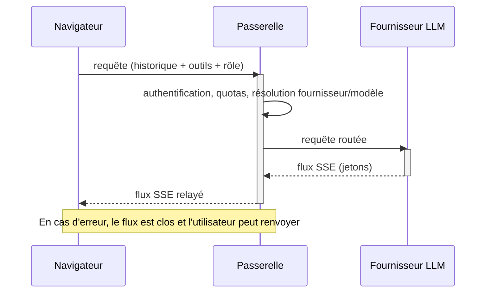
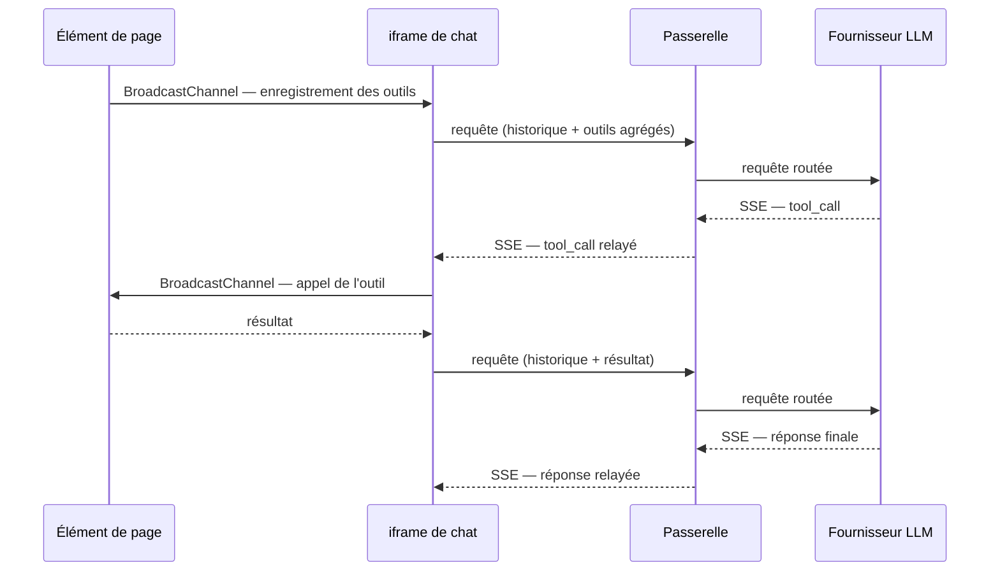

## Protocoles et flux de données

### Passerelle SSE compatible OpenAI

À chaque tour, l'assistant (ou un sous-agent) envoie à la passerelle une requête de complétion en *streaming* via Server-Sent Events : le navigateur reçoit les jetons au fil de leur production, pour un affichage progressif. La requête porte l'historique complet de la conversation — appels d'outils et résultats compris —, la liste des outils disponibles pour ce tour, et le rôle de modèle souhaité.

Le client demande un rôle fonctionnel (assistant, outils, résumeur, évaluateur, modérateur), jamais un modèle nommé : la passerelle authentifie le jeton de session, vérifie les quotas, résout le couple (fournisseur, modèle) selon la configuration du compte, puis relaie le flux. Les clés d'API et les identifiants de modèles restent ainsi entièrement côté serveur. En cas d'erreur, la passerelle applique une politique d'échec rapide : le flux est clos sans reprise automatique ni bascule vers un fournisseur de secours, et l'utilisateur peut renvoyer son message.

### Découverte d'outils par BroadcastChannel

Les outils sont fournis par les éléments de page qui s'exécutent dans des contextes voisins de même origine (frames ou onglets du même domaine). Le canal utilisé est le BroadcastChannel natif du navigateur, qui laisse ces contextes échanger sans coordination centrale ; la description structurée des outils s'inspire du protocole MCP (*Model Context Protocol*).

Au démarrage et à chaque changement de page, l'iframe émet un message de découverte ; les éléments de page actifs répondent avec leurs descripteurs (nom, description, schéma de paramètres), que l'iframe agrège. Les fournisseurs d'outils apparaissent et disparaissent au gré de la navigation : en quittant une page, ses éléments se désenregistrent et la liste est mise à jour au tour suivant. Lorsque le modèle décide d'appeler un outil, la passerelle renvoie un message `tool_call` que l'iframe route vers le bon fournisseur, avant de réintégrer le résultat dans l'historique.

### Coordination de l'interface et cycle de session

L'iframe et l'application hôte échangent des messages de service par `window.postMessage`, restreint à l'origine déclarée. Ces messages ne portent aucune donnée de conversation : ils signalent le statut de l'assistant (génération en cours ou inactif), un compteur de messages non lus quand l'iframe n'est pas visible, et les changements de liste d'outils.

Au démarrage d'une session, l'hôte peut fournir un prompt système et un titre propres au contexte de la page. Ces paramètres ne transitent pas par l'URL : ils sont écrits dans le `sessionStorage` (partagé entre contextes de même origine), lus puis consommés par l'iframe. Les instructions sensibles restent ainsi hors des journaux HTTP, hors de l'historique de navigation et des en-têtes `Referer`, et limitées à l'onglet courant. Réinitialiser une conversation revient à effacer ce stockage et recharger l'iframe ; il n'y a aucun état serveur à purger.
