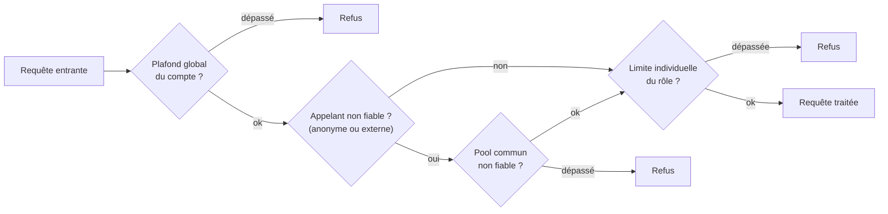
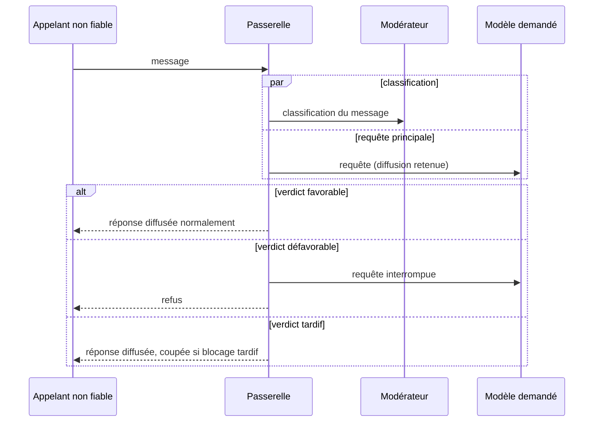
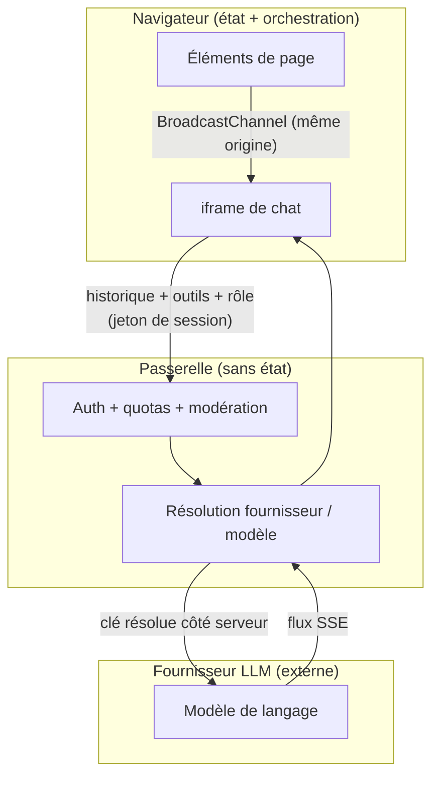

## Sécurité

Cette section décrit les contrôles en place et énonce leurs limites, pour permettre une évaluation sur pièces.

### Modèle de menace

Le service présente quatre surfaces d'entrée : les messages utilisateur (vecteur d'injection de prompt directe), le contenu des jeux de données interrogés (injection indirecte, réintroduite dans le contexte par les outils), les éléments de page de même origine qui enregistrent des outils, et les appels directs à la passerelle hors de l'interface de chat. Les contrôles ci-dessous répondent à ces surfaces avec des garanties inégales, détaillées à chaque fois.

### Authentification, rôles et quotas

La passerelle détermine à chaque requête l'identité et les droits de l'appelant, sans état de session serveur. Le rôle effectif est l'un de : anonyme, propriétaire du compte, membre de l'organisation, ou utilisateur externe. Les appels anonymes ne sont pas rejetés d'office mais exigent un jeton d'action dédié, distinct d'un jeton de session et révocable indépendamment.

Les quotas de jetons s'appliquent à deux niveaux : un plafond global au compte, et des limites par rôle (mensuelles, hebdomadaires, journalières) calculées par ratio. En complément, les appelants non fiables (anonymes et externes) partagent un pool de quota commun, qui empêche ce trafic, pris collectivement, d'épuiser la capacité du compte même lorsque chaque appelant reste sous sa propre limite.

### Chiffrement des clés d'API

Les clés des fournisseurs sont chiffrées au repos (AES-256) et ne sont jamais renvoyées en clair : l'API de configuration retourne une valeur masquée. Le navigateur n'est jamais exposé aux clés ni aux identifiants de modèles concrets : il ne transmet qu'un rôle fonctionnel, la passerelle résolvant le fournisseur côté serveur. La compromission du navigateur ou d'un script tiers ne donne donc pas accès aux clés.

### Modération des entrées

La modération protège la plateforme contre les abus du **trafic non fiable** (visiteurs anonymes et utilisateurs externes) : grossièretés, tentatives d'injection de prompt, usurpation de l'identité de l'assistant, tâches lourdes sans rapport avec la plateforme. Les membres authentifiés du compte n'y sont pas soumis — aucun surcoût ni délai pour eux. Le contrôle est appliqué par la passerelle elle-même, et non par l'interface de chat : un appel direct y est soumis au même titre qu'un message saisi dans le chat.

Pour préserver la latence, la passerelle lance la classification et la requête principale en parallèle et retient la diffusion de la réponse jusqu'au verdict, quelques secondes au plus. Un verdict défavorable interrompt la requête et renvoie un refus ; un verdict trop tardif laisse passer la réponse, la disponibilité étant prioritaire. Après cinq blocages en vingt-quatre heures, l'appelant est écarté une heure, ses messages refusés sans solliciter aucun modèle. Chaque décision est consignée trente jours, et un tableau de bord administrateur expose le volume de contrôles, la part de verdicts tardifs (avec alerte au-delà d'un seuil) et un test en direct du filtre.

La modération privilégie donc la disponibilité — en cas de doute, le message passe — et ne porte que sur le message entrant ; ses angles morts (sorties du modèle, injection indirecte, attaques multi-tours) sont traités plus bas, à la lumière du périmètre d'outils qui en borne l'impact. Le maintien des réponses dans le thème attendu ne repose d'ailleurs pas sur un filtrage des sorties, mais sur la restriction **en amont** du périmètre accessible : jeux de données focalisés et outils ciblés bornent ce que l'assistant peut interroger, la modération écartant en entrée les requêtes manifestement hors sujet.

### Périmètre et exécution des outils

C'est le contrôle le plus structurant de l'ensemble, car il borne l'impact de toutes les attaques évoquées ici. Les outils ne s'exécutent **jamais côté serveur** : ils tournent dans le navigateur, au sein de la session de l'utilisateur courant et avec exactement ses droits. Un outil ne peut donc accomplir aucune opération que l'utilisateur n'est pas déjà autorisé à effectuer : aucune injection de prompt ni aucun détournement ne permet une élévation de privilèges ou l'accès à des ressources interdites. Le mieux qu'une attaque réussie puisse obtenir, c'est l'usage du même périmètre d'outils, déjà accessible à l'utilisateur.

Ce périmètre est délibérément étroit. Le service n'expose **que des outils assistifs et non destructeurs**, définis et bornés : pas de client HTTP générique, pas d'exécuteur de code ou de JavaScript arbitraire, mais des actions précises portant sur le contenu de la page ou sur des points d'accès en lecture seule.

Surtout, **aucune écriture n'est effectuée par un outil**. Un outil peut au plus préparer une action, par exemple pré-remplir un formulaire, mais c'est toujours l'utilisateur qui valide et déclenche l'écriture réelle, l'interface mettant clairement en évidence les modifications sur le point d'être enregistrées. L'utilisateur garde ainsi la main sur tout effet persistant.

### Isolation et confidentialité des données

L'iframe de chat est isolée du DOM de l'hôte par le mécanisme natif du navigateur, et le canal de découverte d'outils est restreint à la même origine : un contexte d'une autre origine ne peut ni enregistrer d'outils ni recevoir les messages de découverte : la frontière de confiance est la *Same-Origin Policy*. Les prompts système, qui peuvent contenir des consignes sensibles, sont transmis hors de l'URL : ils n'apparaissent donc ni dans les journaux HTTP, ni dans l'historique de navigation, ni dans les en-têtes `Referer`.

À chaque tour, le navigateur envoie à la passerelle l'historique reconstruit, les descripteurs d'outils actifs, les extraits de données nécessaires et le jeton de l'appelant. Le fonctionnement de la passerelle ne repose sur aucune conversation conservée côté serveur : l'historique vit dans le navigateur (l'enregistrement de traces décrit plus bas est une fonction distincte et optionnelle). Les données sont ensuite relayées au fournisseur retenu, dont les conditions (rétention, journalisation, entraînement) régissent leur traitement ; le choix d'un fournisseur compatible avec les obligations réglementaires de l'opérateur (RGPD, contraintes sectorielles) relève de sa responsabilité.

### Traçabilité

La traçabilité repose sur un enregistrement **côté serveur, désactivé par défaut**. Il n'existe plus d'enregistreur « live » dans le navigateur : la passerelle consigne une entrée par requête physique adressée au fournisseur, et ces requêtes constituent la source unique de vérité : la trace complète d'une conversation est reconstruite à la consultation, sans double envoi.

L'enregistrement n'a lieu que si deux conditions sont réunies : un administrateur l'a activé au niveau du compte, et l'utilisateur concerné a donné un consentement explicite. Sans cela, rien n'est stocké. Les traces conservées sont automatiquement supprimées après 30 jours, leur lecture est réservée aux administrateurs, et chaque utilisateur peut demander l'effacement des siennes, dans une conception orientée RGPD (consentement, finalité d'administration, rétention bornée, droit à l'effacement). Le journal de modération évoqué plus haut est tenu séparément et fait foi pour les décisions de filtrage, y compris celles qui ne figurent pas dans les traces. La capacité d'audit des conversations dépend ainsi de l'activation de cet enregistrement et reste bornée à 30 jours.

### Limites face à l'injection de prompt

La modération réduit le risque d'**injection directe** sans l'éliminer : elle privilégie la disponibilité et ne contrôle que le trafic non fiable. L'**injection indirecte** via les données n'est pas couverte : le contenu d'un jeu de données réintégré dans le contexte peut contenir des instructions adversariales. Les **descripteurs d'outils** fournis par un élément de page de même origine sont transmis tels quels au modèle, et un élément compromis pourrait tenter de l'influencer. Enfin, une attaque **étalée sur plusieurs tours** n'est pas détectée, chaque message étant évalué isolément.

Ces limites doivent toutefois se lire à la lumière du périmètre d'exécution des outils (voir plus haut) : même une injection réussie reste confinée à des outils restreints et non destructeurs, exécutés avec les seuls droits de l'utilisateur, sans écriture automatique. Le risque résiduel porte donc surtout sur la confidentialité (une lecture exfiltrée) et sur l'orientation des réponses, plutôt que sur une action destructrice ou une élévation de privilèges. Pour un déploiement traitant des données sensibles, les mesures complémentaires utiles restent le contrôle de l'origine des jeux de données accessibles, la revue des outils exposés et l'accès au moindre privilège.
