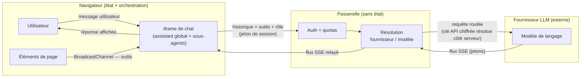

# Sécurité

Ce chapitre est destiné aux experts sécurité évaluant le service avant tout déploiement en production. Il identifie les surfaces d'attaque, décrit les contrôles mis en place et, surtout, formule honnêtement leurs limites. L'objectif n'est pas de vendre une posture de sécurité, mais de donner les éléments factuels nécessaires à une évaluation rigoureuse.

## Modèle de menace et surface d'attaque

Le service présente quatre surfaces d'entrée principales.

**Messages utilisateur.** Toute entrée en langage naturel soumise par un utilisateur authentifié ou anonyme constitue un vecteur d'injection de prompt. Un acteur malveillant peut tenter de détourner le comportement de l'**assistant global** ou des **sous-agents** en formulant des instructions déguisées en requêtes légitimes.

**Contenu des jeux de données interrogés.** Lorsqu'un **sous-agent** interroge un jeu de données via un outil, les extraits renvoyés sont réintégrés dans le contexte de la conversation avant d'être envoyés au **fournisseur LLM**. Un jeu de données dont le contenu a été préalablement pollué (injection indirecte, *prompt injection* via des données) peut donc influencer le comportement du modèle sans que l'utilisateur n'en soit conscient.

**Éléments de page de même origine.** Les **éléments de page** communiquent avec l'**iframe** de chat via un `BroadcastChannel` restreint à la même origine. Tout contexte de navigation partageant cette origine peut potentiellement enregistrer des outils ou envoyer des messages sur ce canal. La frontière d'isolation repose donc sur la politique de même origine du navigateur (*Same-Origin Policy*), pas sur un mécanisme d'authentification applicatif supplémentaire.

**Appels directs à la passerelle hors interface.** La **passerelle** expose une interface HTTP compatible OpenAI. N'importe quel client HTTP disposant d'un jeton de session valide peut l'adresser directement, sans passer par l'**iframe** de chat. Ce cas d'usage est légitime (intégration programmatique), mais il contourne entièrement la couche de modération décrite plus loin. La gouvernance repose alors exclusivement sur l'authentification et les quotas.

## Authentification et autorisation

L'identité et les droits de l'appelant sont déterminés à chaque requête par la **passerelle**, sans dépendance à un état de session côté serveur.

### Rôles effectifs

Cinq niveaux d'accès sont reconnus :

| Rôle | Description |
|---|---|
| **Anonyme** | Utilisateur non authentifié |
| **Propriétaire du compte** | Administrateur du compte (utilisateur individuel ou organisation) |
| **Membre de l'organisation** | Contributeur ou utilisateur simple rattaché à une organisation |
| **Utilisateur externe** | Utilisateur ayant un accès restreint au compte |
| **Application cliente** | Appelant programmatique muni d'un jeton d'action dédié |

Les appels anonymes à la **passerelle** ne sont pas rejetés par défaut : ils sont soumis aux quotas configurés pour le rôle anonyme. Toutefois, pour qu'un appel anonyme soit traité, un **jeton d'action dédié** doit être fourni. Ce jeton est distinct d'un jeton de session utilisateur ; il est émis et révocable indépendamment.

### Quotas à deux niveaux

Les quotas de jetons sont appliqués à deux niveaux complémentaires :

1. **Quota global du compte** : plafond mensuel agrégé toutes requêtes confondues pour le compte. Il protège contre une consommation excessive quelle qu'en soit la source.
2. **Quota par rôle** : chaque rôle (anonyme, externe, utilisateur, contributeur, administrateur) dispose de ses propres limites mensuelles, hebdomadaires et journalières, calculées par ratio à partir du plafond mensuel.

En complément, les appelants **« non fiables »** — utilisateurs anonymes **et** externes — partagent un **pool de quota commun**. Cette mutualisation vise à empêcher que le trafic non authentifié ou externe, pris collectivement, n'épuise la capacité du compte, même lorsque chaque appelant pris isolément reste sous sa propre limite.

La tarification interne tient compte du ratio de coût par rôle de modèle, permettant une allocation économique différenciée selon la criticité de la tâche.

## Chiffrement des clés d'API au repos

Les clés d'accès aux **fournisseurs LLM** sont chiffrées au repos en **AES-256-CBC** avant d'être persistées. Elles ne sont jamais renvoyées en clair par l'API de configuration : les réponses retournent une valeur obfusquée (chaîne de caractères `*`) à la place de la clé réelle.

Le navigateur n'est jamais exposé aux clés ni aux identifiants de modèles concrets. Il transmet uniquement un **rôle fonctionnel** (assistant, outils, résumeur, évaluateur, modérateur) ; la **passerelle** résout elle-même le couple (fournisseur, modèle) côté serveur selon la configuration du compte.

Cette indirection garantit que la compromission du navigateur ou d'un script tiers injecté dans la page ne donne pas accès aux clés d'API.

## Modération des entrées

Chaque nouveau message utilisateur est soumis à une **garde de modération** avant que l'**assistant global** ne le traite. Cette garde invoque le modèle affecté au rôle **modérateur** pour classifier le message selon quatre dimensions : grossièretés, tentative d'injection de prompt, usurpation de persona ou d'identité, demande hors périmètre.

### Ce que la modération offre

La modération est **toujours active** pour les messages passant par l'interface de chat. En cas de classification défavorable, un message de refus fixe et localisé est renvoyé à l'utilisateur ; la requête n'est pas transmise au modèle principal.

### Ce que la modération ne garantit pas — points cruciaux

Il est essentiel de comprendre les limites structurelles de ce mécanisme avant tout déploiement.

**Nature consultative, pas barrière de sécurité.** La modération est de nature *advisory* : elle augmente le coût d'une attaque réussie, mais n'offre pas de garantie d'imperméabilité. Elle ne remplace pas une politique de sécurité sur les données ni un contrôle d'accès robuste.

**Comportement *fail-open*.** La garde est conçue pour préférer la disponibilité à la restriction en cas d'incident technique. Si le délai d'attente de réponse du modérateur est dépassé (environ 1,5 seconde), si une erreur de transport ou HTTP survient, ou si la sortie du modèle n'est pas interprétable, le verdict par défaut est **« autoriser »**. La conversation continue comme si la modération n'existait pas.

**Contournement par appel direct.** Un appel direct à la **passerelle** sur le rôle `assistant` contourne entièrement la modération — par conception. La passerelle n'interpose pas de garde automatique sur les requêtes programmatiques. La gouvernance repose alors sur l'authentification et les quotas uniquement.

**Périmètre limité à l'entrée utilisateur (v1).** La modération porte exclusivement sur le message entrant de l'utilisateur. Les éléments suivants ne sont pas couverts dans la version actuelle :
- sorties du modèle principal (pas de modération de sortie) ;
- résultats des appels d'outils réintégrés dans le contexte ;
- contenu des jeux de données renvoyé par les **sous-agents** (vecteur d'injection indirecte) ;
- détection d'attaque multi-tours (jailbreak progressif étalé sur plusieurs messages).

**Effets de bord non annulables.** Si la première action décidée par un tour de conversation est un appel d'outil, l'outil peut avoir commencé son exécution avant que le verdict de modération du message déclencheur ne soit disponible. Il n'existe pas de mécanisme d'annulation des effets de bord déjà produits.

## Isolation

### Interface en iframe

L'**iframe** de chat est isolée du DOM de l'application hôte par le mécanisme natif d'isolation des iframes du navigateur. L'application hôte ne peut pas lire ni modifier l'état interne de l'**iframe**, et réciproquement. Toute coordination passe par des canaux de messages explicitement définis (`postMessage`, `BroadcastChannel`).

### Canal de découverte d'outils restreint à la même origine

Le `BroadcastChannel` utilisé pour la découverte dynamique des outils est, par nature, restreint aux contextes de navigation partageant la même origine. Un iframe ou un onglet d'une origine différente ne peut pas enregistrer d'outils ni recevoir les messages de découverte. La frontière de confiance est celle de la *Same-Origin Policy* du navigateur.

### Prompt système hors URL

Le prompt système transmis par l'application hôte à l'**iframe** au démarrage de session transite par le `sessionStorage`, pas par l'URL. Cette décision de conception garantit que les instructions potentiellement sensibles n'apparaissent ni dans les journaux d'accès HTTP des proxies intermédiaires, ni dans l'historique de navigation du navigateur, ni dans les en-têtes `Referer` envoyés à des ressources tierces.

## Confidentialité et flux de données

### Ce qui quitte le navigateur

À chaque tour de conversation, le navigateur envoie à la **passerelle** :
- l'intégralité de l'historique de conversation reconstruit (messages utilisateur, réponses du modèle, appels d'outils et leurs résultats) ;
- les descripteurs des outils disponibles (noms, descriptions, schémas de paramètres fournis par les **éléments de page** actifs) ;
- les extraits de données nécessaires à la tâche (renvoyés par les outils lors des tours précédents) ;
- le jeton de session ou d'action de l'appelant.

### Absence de stockage serveur des conversations

La **passerelle** est sans état : elle ne conserve aucun historique de conversation. Chaque requête est traitée de manière autonome et aucune donnée de conversation n'est persistée côté serveur entre deux requêtes. L'historique vit exclusivement dans la mémoire du navigateur de l'utilisateur.

### Responsabilité du fournisseur LLM

Les données transmises à la **passerelle** sont relayées au **fournisseur LLM** sélectionné par le compte. Le traitement de ces données par le fournisseur — rétention, journalisation, utilisation pour l'entraînement — relève des conditions générales de ce fournisseur, pas du service data-fair/agents. Les opérateurs sont responsables du choix d'un fournisseur dont les engagements contractuels sont compatibles avec leurs obligations réglementaires (RGPD, sectorielles, etc.).

## Traçabilité

### Architecture actuelle : traçage côté serveur, désactivé par défaut

La traçabilité repose désormais sur un enregistrement **côté serveur**. Il n'existe plus d'enregistreur de trace « live » côté navigateur : c'est la **passerelle** qui consigne, pour chaque requête physique adressée au **fournisseur LLM**, une entrée correspondante. Ces requêtes physiques stockées constituent la **source unique de vérité**.

Cet enregistrement est **désactivé par défaut**. Il n'a lieu que si **deux conditions** sont réunies simultanément :

1. un administrateur a explicitement activé le réglage « enregistrement des traces » au niveau du compte ou de l'organisation ;
2. l'utilisateur concerné a donné un **consentement explicite**, via un mécanisme de consentement par utilisateur.

Tant que ces deux conditions ne sont pas remplies, **rien n'est stocké côté serveur**. Cette conception traduit une posture de confidentialité raisonnable : aucune conservation serveur par défaut, activation explicite et consentement requis, et rétention bornée.

### Rétention, accès et effacement

Les traces stockées sont soumises à une **rétention bornée** : elles sont automatiquement supprimées au bout de **30 jours** (mécanisme de TTL). L'accès en lecture est **réservé aux administrateurs**, et chaque utilisateur peut demander l'**effacement** de ses propres traces. L'ensemble suit une conception orientée RGPD : consentement explicite, finalité circonscrite (relecture d'administration), rétention limitée et droit à l'effacement.

La trace complète d'une conversation n'est pas stockée telle quelle : elle est **reconstruite au moment de la consultation** à partir des requêtes physiques enregistrées. Il n'y a donc pas de double envoi ni de journal de conversation distinct des appels réellement émis.

### Nuance de fidélité

Une décision de modération **« ignorée »** (comportement *fail-open*, sans appel de modèle effectif) ne génère **aucune requête physique** vers le **fournisseur LLM**. Un tel événement n'apparaît donc pas dans une trace stockée. Les opérateurs doivent garder à l'esprit que la trace serveur reflète les requêtes physiques émises, et non l'intégralité des décisions internes prises en amont.

Pour les déploiements soumis à des exigences d'audit ou de traçabilité réglementaire, la capacité d'audit dépend de l'activation explicite de cet enregistrement et reste bornée à la fenêtre de rétention de 30 jours.

## Injection de prompt — limites récapitulatives

La surface d'exposition aux attaques par injection de prompt mérite un récapitulatif explicite, sans euphémismes.

**Injection directe (message utilisateur).** La garde de modération réduit le risque sans l'éliminer. Elle est *fail-open* et contournable par appel direct à la **passerelle**.

**Injection indirecte (via les données).** Le contenu des jeux de données renvoyé par les outils des **sous-agents** est réintégré dans le contexte de la conversation sans filtrage. Un jeu de données contenant des instructions adversariales peut influencer le comportement de l'**assistant global** ou des **sous-agents**. Ce vecteur n'est pas couvert par la modération en v1.

**Injection via les descripteurs d'outils.** Les noms et descriptions d'outils fournis par les **éléments de page** sont transmis tels quels au modèle. Un **élément de page** malveillant ou compromis partageant la même origine pourrait tenter d'influencer le comportement du modèle via ces descripteurs.

**Attaques multi-tours.** La modération évalue chaque message indépendamment. Une stratégie d'attaque étalée sur plusieurs tours pour contourner les filtres n'est pas détectée.

Pour un déploiement traitant des données sensibles, ces limitations imposent des mesures complémentaires : contrôle strict de l'origine des jeux de données accessibles, revue des outils exposés par les **éléments de page**, et politique d'accès minimale au principe de moindre privilège.
