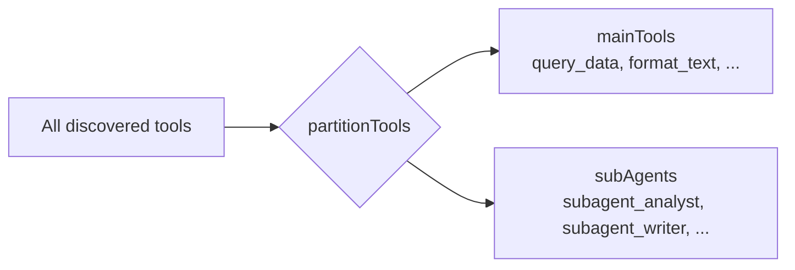
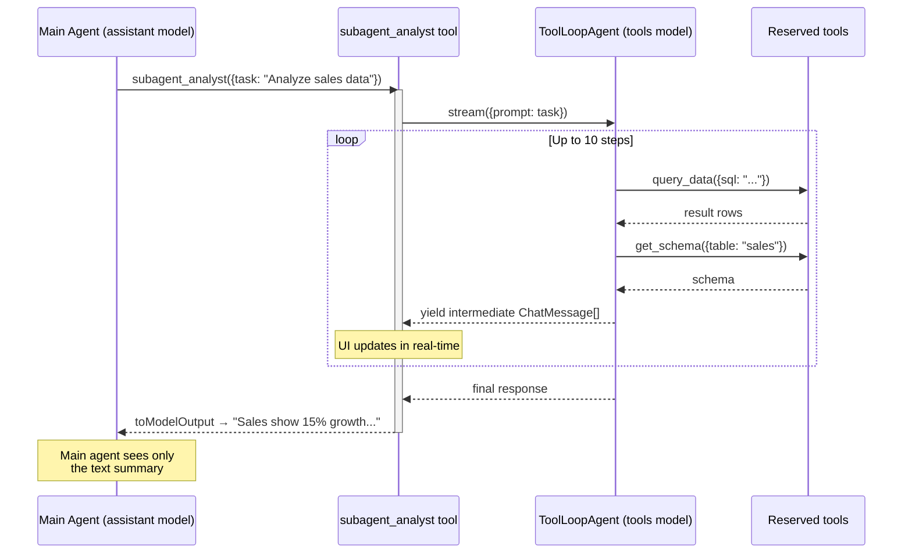
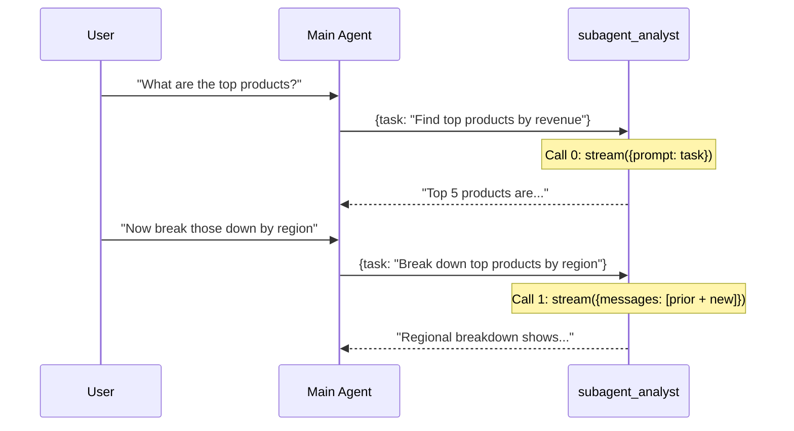

# Sub-Agent Orchestration

The orchestrator-worker pattern runs **entirely in the browser**. The main agent delegates tasks to specialized sub-agents via pseudo-tools (`subagent_*`), each backed by a `ToolLoopAgent` from Vercel AI SDK v6.

---

## 1. Registration

Host application components declare sub-agents using `useAgentSubAgent()`:

```typescript
useAgentSubAgent({
  name: 'analyst',
  title: 'Data Analyst',
  description: 'Analyzes datasets and produces insights',
  prompt: 'You are a data analyst. Use the provided tools to query and analyze data.',
  tools: ['query_data', 'get_schema'],
  model: 'tools'  // optional, defaults to 'tools'
})
```

This registers a pseudo-tool named `subagent_analyst` via `useAgentTool()`. The tool's `execute()` function returns a static JSON config:

```json
{ "prompt": "You are a data analyst...", "tools": ["query_data", "get_schema"], "model": "tools" }
```

The config is not used directly by the LLM — it is consumed by the orchestration layer to bootstrap the sub-agent at runtime.

**Key file:** `lib-vue/use-agent-sub-agent.ts`

---

## 2. Tool Partitioning

Before each LLM call, `partitionTools()` splits the aggregated tool map into two sets:



Rules:
- Tools whose name starts with `subagent_` go to the sub-agent set
- All other tools go to `mainTools` initially

Then `resolveSubAgents()` refines the partition:
1. Calls each sub-agent's `execute({task: ''})` to retrieve its config
2. Parses the JSON to extract `{ prompt, tools, model }`
3. **Removes reserved tools** from `mainTools` — tools listed in a sub-agent's `tools` array become exclusive to that sub-agent

```
Before resolveSubAgents:
  mainTools: [query_data, get_schema, format_text, set_display]
  subAgents: [subagent_analyst (config: null)]

After resolveSubAgents:
  mainTools: [format_text, set_display]           ← query_data, get_schema removed
  subAgents: [subagent_analyst (config: {tools: [query_data, get_schema], ...})]
```

This ensures the main agent cannot call tools that belong to a sub-agent, enforcing delegation.

**Key file:** `ui/src/composables/use-agent-chat.ts:82-112` (partitionTools), `:259-286` (resolveSubAgents)

---

## 3. ToolLoopAgent Wrapping

For each sub-agent, the orchestrator creates a `ToolLoopAgent` instance and wraps it as an async generator tool visible to the main LLM:



Each `ToolLoopAgent` is configured with:
- **model** — resolved from `provider.chat(config.model ?? 'tools')`
- **instructions** — the sub-agent's system prompt
- **tools** — the reserved tool set (only tools listed in `config.tools`)
- **stopWhen** — `stepCountIs(10)` (max 10 autonomous steps)

**Key file:** `ui/src/composables/use-agent-chat.ts:396-494`

---

## 4. Async Generator Streaming

The sub-agent tool uses `async function*` to yield intermediate results while the sub-agent is still working:

```typescript
execute: async function* (args, { abortSignal }) {
  const subResult = await subAgent.stream({ prompt: args.task, abortSignal })
  
  for await (const uiMessage of readUIMessageStream({ stream: subResult.toUIMessageStream() })) {
    const chatMessages = uiMessageToChatMessages(uiMessage)
    currentAssistantMessage.subAgentMessages = chatMessages  // UI updates live
    yield chatMessages  // AI SDK marks these as "preliminary" tool results
  }
}
```

Each `yield` emits a **preliminary** tool result. The AI SDK streams these to the main agent's `fullStream` with `preliminary: true`, which the UI uses to show real-time sub-agent progress without marking the tool invocation as done.

The `uiMessageToChatMessages()` converter transforms AI SDK `UIMessage` parts into the app's `ChatMessage[]` format, handling:
- `text` parts → assistant message content
- `dynamic-tool` / `tool-*` parts → tool invocation entries
- `step-start` parts → message boundaries

---

## 5. Multi-Turn State

Sub-agents maintain conversation history across multiple invocations within the same user session:



Two `Map` structures track state per sub-agent:
- **`subAgentHistory: Map<name, ModelMessage[]>`** — accumulated conversation messages. First call uses `stream({prompt})`, subsequent calls use `stream({messages: [...prior, newUserMessage]})`
- **`subAgentCallCount: Map<name, number>`** — call index, stored on `ChatMessage.subAgentTurn` for the UI to display turn numbers

History is accumulated after each call:
```typescript
subAgentHistory.set(name, [
  ...priorMessages,
  { role: 'user', content: args.task },
  ...subResponse.messages
])
```

---

## 6. Context Reduction

The main agent never sees the full sub-agent trace. `toModelOutput()` extracts only the last assistant message's text:

```typescript
toModelOutput: ({ output }) => {
  const lastMsg = Array.isArray(output) ? output[output.length - 1] : null
  return {
    type: 'text',
    value: (lastMsg as ChatMessage | null)?.content || 'Task completed.'
  }
}
```

This keeps the main agent's context window lean — a sub-agent that made 8 tool calls across 5 steps produces a single paragraph of text in the main conversation. The full trace is visible in the UI via `ChatMessage.subAgentMessages`.

This also reduces pressure on the 24,000-character compaction threshold.

---

## 7. Telemetry

When a `SessionRecorder` is provided, the orchestrator records:

| Event | Data |
|-------|------|
| `startSubAgent` | parent tool call ID, display name, system prompt, task, tool snapshots, call index |
| `addSubAgentStepMessages` | response messages, token usage |

This enables full trace reconstruction in the debug dialog, showing each sub-agent's reasoning and tool calls alongside the main agent's flow.

---

## Data Structures

```typescript
// Sub-agent config (returned by pseudo-tool execute)
interface SubAgentConfig {
  prompt: string       // system prompt for the sub-agent
  tools: string[]      // tool names reserved for this sub-agent
  model?: string       // model role ('tools', 'assistant', etc.)
}

// Chat message with sub-agent support
interface ChatMessage {
  role: 'user' | 'assistant'
  content: string
  toolInvocations?: Array<{
    toolCallId: string
    toolName: string
    state: 'pending' | 'done'
  }>
  subAgentMessages?: ChatMessage[]  // full sub-agent trace for UI
  subAgentTurn?: number             // call index (0-based)
}

// Debug partition info (exposed via resolvedPartition ref)
interface DebugToolsPartition {
  mainTools: ToolInfo[]
  subAgents: SubAgentInfo[]
}
```

---

## Key Files

| File | Role |
|------|------|
| `lib-vue/use-agent-sub-agent.ts` | Registration composable — declares sub-agents as pseudo-tools |
| `ui/src/composables/use-agent-chat.ts:82-112` | `partitionTools()` — separates main and sub-agent tools |
| `ui/src/composables/use-agent-chat.ts:259-286` | `resolveSubAgents()` — fetches configs, reserves tools |
| `ui/src/composables/use-agent-chat.ts:396-494` | `ToolLoopAgent` wrapping, async generator, multi-turn state |
| `ui/src/composables/use-agent-chat.ts:292-316` | `uiMessageToChatMessages()` — UIMessage → ChatMessage conversion |
