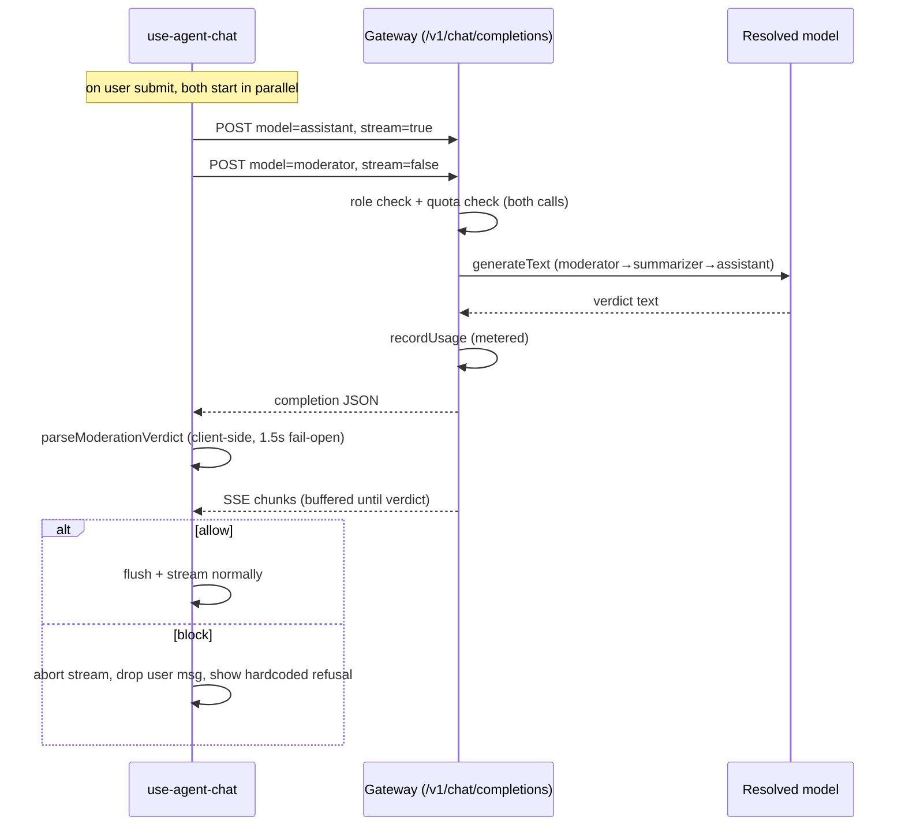

# Moderation: fold into the gateway, always-on

**Date:** 2026-06-04
**Branch:** feat-moderation
**Status:** approved, pre-implementation

## Context

The `feat-moderation` branch added an input-moderation guard for the UI-integrated
assistant. As shipped on the branch it has a dedicated `/api/moderation` endpoint
(`GET` enabled-flag + `POST` verdict), a server-side moderation service (prompt
building, verdict parsing, 1.5s fail-open timeout, model resolution), a toggle
(`moderation.enabled`) and a configurable refusal message in settings.

Two problems motivated this redesign:

1. **Auth/quota bypass.** The `/api/moderation` endpoint only called `reqSession`
   — no role check, no quota check, no usage recording — unlike the gateway and
   summary routers. Any session (including anonymous) could invoke any owner's
   configured model against arbitrary text, consuming their provider budget,
   ungated.
2. **Redundant machinery.** The separate endpoint reimplements model resolution
   and a model call that the gateway already does well — including a built-in
   `role → assistant` fallback (`getModelConfig`) and full quota/usage accounting.

## Decisions

- **Moderation is always active.** Remove the `enabled` toggle.
- **The moderator model is always available** via fallback chain
  **moderator → summarizer → assistant**.
- **Reuse the gateway** instead of a dedicated endpoint. The client calls the
  gateway non-streaming with `model: 'moderator'` and parses the verdict
  client-side.
- **Moderation counts toward quota/usage** (uniform metering). Every user message
  now makes two metered gateway calls: moderation + assistant. This is what fixes
  the auth/quota bypass — moderation now flows through the gateway's role + quota
  + `recordUsage` path.
- **The refusal message is hardcoded** (no longer configurable), but localized
  (en/fr) via the chat component's i18n, reusing the old English default text.
- **Moderation remains advisory / client-orchestrated**, never a security
  boundary. A direct/anonymous gateway call still bypasses moderation by design;
  that is governed by auth/quotas. Moving the moderation prompt + parser into the
  browser is therefore acceptable.

## Architecture

The client, on user submit, fires two gateway calls concurrently:

1. `model: 'assistant'`, streaming — the assistant turn (unchanged).
2. `model: 'moderator'`, non-streaming — the moderation verdict.

The client withholds the first visible byte of (1) until (2) resolves (or its
client-side 1.5s timeout fires → fail open). On a block verdict it aborts (1),
drops the user message from model context, and shows the hardcoded refusal.

## Changes

### Server

- **`api/src/gateway/router.ts`**
  - Add `'moderator'` to `MODEL_IDS` (currently rejected with 400).
  - Extend `getModelConfig` so the `moderator` role resolves
    **moderator → summarizer → assistant**; other roles keep their existing
    `role → assistant` fallback. Pricing (`inputPricePerMillion` /
    `outputPricePerMillion`) follows whichever entry actually resolved.
- **Delete `api/src/moderation/`** entirely (`router.ts`, `service.ts`,
  `operations.ts`) and remove the `app.use('/api/moderation', …)` wiring + import
  in `api/src/app.ts`.
- **`api/src/models/mock-model.ts`**: keep the `mock-moderator` case and
  `processMockModeratorPrompt` unchanged — it is now exercised through the gateway
  (the gateway calls `createModel(provider, 'mock-moderator')`).

### Settings

- **`api/types/settings/schema.js`**: remove the entire `moderation` block
  (`enabled`, `refusalMessage`). **Keep** the `moderator` model slot.
- **`api/src/settings/router.ts`**: remove `defaultModeration` and the
  `moderation` field from the persisted settings object and from `emptySettings`.
- Regenerate types / vjsf / doc via `npm run build-types`.

### Client (`ui/src/composables/use-agent-chat.ts`)

- Remove `moderationBase`, `loadModerationConfig`, `moderationConfigPromise`, and
  the pre-warm call (no `/moderation` endpoint, no enabled flag).
- New pure module **`ui/src/composables/moderation.ts`** (no Vue imports, so the
  unit project can import it directly): `buildModerationSystemPrompt(mission)` and
  `parseModerationVerdict(text)`, moved verbatim from the deleted server
  `operations.ts`, plus the hardcoded refusal default.
- `moderate(msg)`:
  `generateText({ model: provider('moderator'), system: buildModerationSystemPrompt(options.systemPrompt), messages: [{ role: 'user', content: msg }] })`,
  wrapped in a client-side 1.5s `AbortController` timeout. Fail open
  (`{ action: 'allow', skipped: true }`) on timeout, network/HTTP error, or
  unparseable output. Always runs (no enabled gate). Verdict parsed from
  `result.text`.
- Block path unchanged: abort the assistant stream, `history.pop()`, push the
  refusal assistant message, `recorder.recordModerationDecision(verdict)`. The
  refusal text is a localized hardcoded string (en/fr) via the component i18n,
  reusing the old English default
  (`"This request can't be processed as it falls outside what this assistant is meant to help with."`).
- Trace recording and the dedicated trace renderer
  (`AgentChatDebugDialog.vue`, `session-recorder.ts`) are unchanged.

## Error handling / fail-open

Every failure mode resolves to `allow`:

- moderation model call times out (1.5s, client-side) → allow/skip
- network or non-OK gateway response (incl. quota 429 on the moderation call) → allow/skip
- model output not parseable as a verdict (e.g. fallback assistant model returns prose) → allow

Quota note: both gateway calls check quota at start and record usage at finish, so
a user exactly at the limit could exceed by one moderation call. Accepted as
negligible.

## Tests

- **Unit (`tests/features/moderation/1.moderation.unit.spec.ts`)**: repoint imports
  to `ui/src/composables/moderation.ts`; keep the prompt + verdict-parser tests;
  drop the `resolveModerationModelId` tests (the function is gone — fallback now
  lives in the gateway's `getModelConfig`).
- **API (`tests/features/moderation/2.moderation.api.spec.ts`)**: rewrite against
  `POST /api/gateway/:type/:id/v1/chat/completions` with `model: 'moderator',
  stream: false`. Assert: `model: 'moderator'` is accepted (no longer 400); a
  jailbreak message yields completion content containing the block verdict; a
  benign message yields the allow verdict; the summarizer/assistant fallback
  resolves when no `moderator` model is configured.
- **E2E (`tests/features/moderation/3.moderation.e2e.spec.ts`)**: remove the
  `moderation` block from `settingsData`; update refusal assertions to the
  hardcoded text. Trace-renderer test unchanged.

## Docs

- **`docs/architecture.md` §8**: rewrite for always-on, gateway-reused, hardcoded
  refusal, metered usage, and the moderator → summarizer → assistant fallback.
  Remove the GET/enabled-flag and separate-endpoint description.

## Out of scope

- Output moderation, tool-result / indirect-injection coverage, multi-turn
  jailbreak detection (unchanged from v1 — still input-only).
- Making moderation a real (non-bypassable) security boundary.
